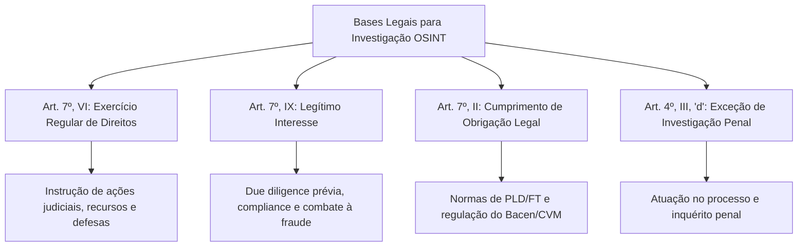

# Capítulo 02: Proteção de Dados e Investigação: Matriz de Aplicação da LGPD, Marco Civil e LAI

## 1. A Falácia da Imunidade em Fontes Abertas

Um dos equívocos mais perniciosos na prática investigativa contemporânea é a crença de que *"se a informação está pública na internet, a LGPD não se aplica"*. Essa interpretação simplista foi rechaçada tanto pela doutrina especializada quanto pelos pronunciamentos normativos da Autoridade Nacional de Proteção de Dados (ANPD).

A Lei Geral de Proteção de Dados Pessoais (Lei nº 13.709/2018) estabelece em seu art. 3º que se aplica a qualquer operação de tratamento de dados pessoais realizada em território nacional, independentemente do meio, do país de sua sede ou do país onde estejam localizados os dados. **Tratamento**, pelo rol exaustivo do art. 5º, X, abrange a coleta, produção, recepção, classificação, utilização, reprodução, transmissão, processamento, arquivamento, armazenamento e eliminação de dados.

Portanto, o ato de pesquisar, compilar e juntar dados de um indivíduo em um relatório forense é, por definição legal, uma operação de tratamento de dados pessoais sujeita a controle e responsabilidade.

---

## 2. O Regime dos "Dados Manifestamente Públicos" (Art. 7º, §§ 3º e 4º)

O art. 7º, § 4º, da LGPD enuncia:
> *"É dispensada a exigência do consentimento para os dados tornados manifestamente públicos pelo titular, resguardados os direitos do titular e os princípios previstos nesta Lei."*

A correta exegese desse dispositivo impõe três conclusões inescapáveis:
1. **A dispensa é apenas de consentimento**: Ela não dispensa a existência de uma finalidade legítima e vinculada.
2. **Submissão aos princípios informadores (Art. 6º)**: O tratamento deve respeitar a **finalidade** (propósito legítimo e informado), a **adequação** (compatibilidade com o contexto), a **necessidade** (limitação ao mínimo indispensável para atingir o objetivo) e a **segurança**.
3. **Vedação à finalidade incompatível**: Não é lícito utilizar um dado pessoal tornado público para fins de contato profissional ou cadastro social para alimentar listas de constrangimento, perfilização discriminatória ou comercialização de cadastros.

---

## 3. As Bases Legais da Investigação Forense

O advogado não depende do consentimento do investigado para realizar OSINT; ao contrário, deve amparar sua atuação em bases legais autônomas:

### 3.1. Exercício Regular de Direitos em Processo Judicial (Art. 7º, VI)
É a base mais sólida e inatacável para a advocacia contenciosa. Autoriza a coleta e guarda de todas as evidências estritamente necessárias para demonstrar fatos controvertidos em juízo arbitral, judicial ou administrativo.

### 3.2. Legítimo Interesse do Controlador ou de Terceiro (Art. 7º, IX e Art. 10)
Aplicável principalmente na advocacia corporativa preventiva (*due diligence*, auditorias internas e avaliação de idoneidade de parceiros de negócios). Exige a aplicação do **Teste de Ponderação de Legítimo Interesse (*LIA - Legitimate Interests Assessment*)**:
- **Legitimidade**: Há uma finalidade empresarial concreta, lícita e ética?
- **Necessidade**: O objetivo poderia ser atingido por meios menos invasivos à privacidade?
- **Balanceamento**: Os direitos e liberdades fundamentais do titular foram preservados?
- **Salvaguardas**: Os dados serão mantidos em ambiente seguro e descartados após a apuração?

### 3.3. O Tratamento de Dados Sensíveis (Art. 11) e Dados de Menores (Art. 14)
- **Dados Sensíveis**: Origem racial, convicção religiosa, opinião política, filiação sindical, dados de saúde ou vida sexual. **Não admitem a base do legítimo interesse**. Sua coleta em OSINT é restrita ao exercício de direitos expressamente previsto em lei (ex.: provar dano à saúde em ação de erro médico) ou obrigação legal.
- **Crianças e Adolescentes**: Prevalece a doutrina da proteção integral (art. 227 da CF e art. 14 da LGPD). A coleta de dados e imagens de menores é vedada em pesquisas de inteligência, salvo em processos de guarda, acolhimento institucional e alimentos, devendo correr sob segredo absoluto de justiça.

---

## 4. A Interface com a LAI e o Marco Civil da Internet

- **Lei de Acesso à Informação (Lei 12.527/2011)**: Estabelece a publicidade como preceito geral e o sigilo como exceção (art. 3º). O advogado deve utilizar os Serviços de Informação ao Cidadão (e-SIC/Fala.BR) para requerer contratos públicos, processos administrativos e relatórios de fiscalização, os quais constituem fontes abertas de Nível A.
- **Marco Civil da Internet (Lei 12.965/2014)**: Garante a inviolabilidade e sigilo das comunicações (art. 7º). Disciplina a obrigação de guarda de registros de conexão (provedores de acesso por 1 ano - art. 13) e registros de acesso a aplicações (redes sociais/sites por 6 meses - art. 15). O art. 22 fixa que a quebra desse sigilo é matéria de reserva de jurisdição.

---

## 5. Boxes Didáticos do Capítulo

> [!WARNING]
> ### ⚖️ Limite Jurídico: O Princípio da Minimização em Execuções
> Ao investigar o patrimônio de um executado, é ilícito e contrário à LGPD anexar aos autos do processo faturas de cartão de crédito, prontuários de consultas médicas de familiares ou históricos de navegação. A coleta deve limitar-se aos bens, cotas societárias e vínculos financeiros com nexo causal direto com a dívida exequenda. O excesso de dados pode gerar condenação por danos morais contra o credor.

> [!NOTE]
> ### 🧪 Verificação: Como Formular Pedido Válido via LAI
> Ao redigir requerimento de LAI para instruir investigação:
> 1. Não fundamente o pedido em interesse pessoal (a LAI veda a exigência dos motivos determinantes da solicitação de informações públicas - art. 10, § 8º);
> 2. Delimite o órgão, o período temporal e o número do contrato ou licitação;
> 3. Caso o órgão negue acesso alegando "dados pessoais", invoque o art. 31, § 3º, V, que autoriza o acesso quando necessário à proteção do interesse público e geral preponderante.

> [!TIP]
> ### 🇧🇷 Fonte Brasileira: Plataforma Integrada de Ouvidoria e Acesso à Informação (Fala.BR)
> A plataforma centralizada do Governo Federal (`falabr.cgu.gov.br`), gerenciada pela CGU, permite protocolar pedidos formais de acesso à informação perante mais de 300 órgãos e autarquias federais em um único painel auditável, com prazo legal de resposta de 20 dias prorrogáveis por 10.
