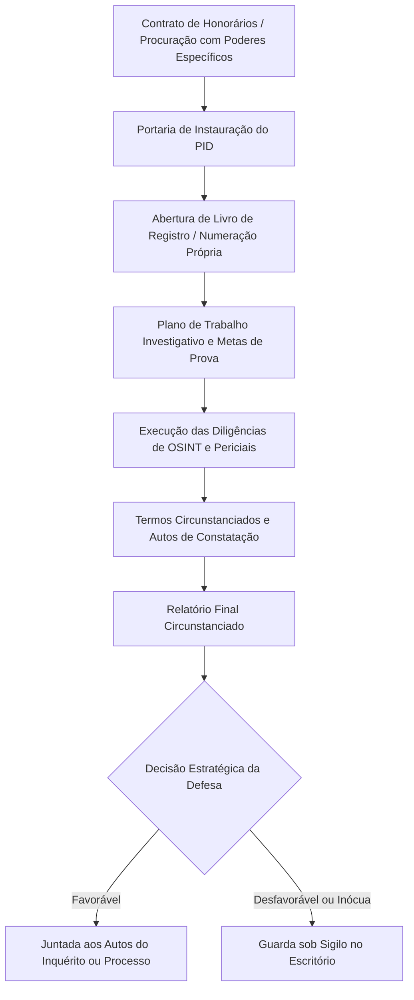

# Capítulo 03: Investigação Defensiva na Prática: Operacionalizando o Provimento 188/2018 do CFOAB

## 1. Fundamentos Constitucionais e a Paridade de Armas

Historicamente, o processo penal brasileiro consagrou uma assimetria estrutural profunda: de um lado, o Estado-acusador aparelhado com polícias judiciárias, órgãos de inteligência (COAF, ABIN, DIP), peritos oficiais e o Ministério Público; de outro, a defesa técnica confinada à reação passiva sobre os elementos carreados pelo inquérito policial.

A publicação do **Provimento nº 188/2018 pelo Conselho Federal da OAB (CFOAB)** alterou esse paradigma, regulamentando a **investigação defensiva** como prerrogativa profissional do advogado:
> *"Compreende-se por investigação defensiva o complexo de atividades de natureza investigatória desenvolvido pelo advogado, com ou sem assistência de consultor técnico e detetive particular, em qualquer fase da persecução penal, para a obtenção de elementos de convicção em prol da defesa do constituinte."* (Art. 1º).

Apoiada nos postulados constitucionais da **ampla defesa**, do **contraditório substantivo** e da **paridade de armas** (art. 5º, LV, da CF/88 c/c art. 8.2 da Convenção Americana sobre Direitos Humanos), a investigação defensiva confere ao defensor a faculdade de buscar ativamente a contraprova, identificar linhas de álibi, apontar suspeitos alternativos e demonstrar vícios na atuação estatal.

---

## 2. A Formalização do Procedimento Investigatório Defensivo (PID)

A atividade de inteligência e coleta de provas pelo advogado não deve ser realizada de forma avulsa ou informal. A credibilidade e a força probatória do trabalho defensivo perante a autoridade policial e os juízos criminais decorrem diretamente de sua **formalização e rastreabilidade**:

### Elementos Obrigatórios da Portaria de Instauração:
1. **Identificação do constituinte** e indicação do número do procedimento criminal formal correspondente (se já existente).
2. **Objeto e escopo delimitado da apuração** (ex.: comprovar que o cliente estava em localidade distinta no horário do fato apurado).
3. **Designação expressa de assistentes técnicos**, peritos computacionais ou colaboradores vinculados por termo de confidencialidade.
4. **Reserva expressa de sigilo profissional** (art. 7º, II e XIX, do Estatuto da Advocacia - Lei 8.906/94).

---

## 3. O Cardápio de Diligências Autorizadas (Art. 4º)

O Provimento 188/2018 autoriza expressamente um rol abrangente de diligências investigativas:

1. **Pesquisa em Fontes Abertas (OSINT)**: Levantamento de dados públicos em diários oficiais, registros de imagens de satélite, dados meteorológicos da data do fato, notícias e publicações em redes sociais que corroborem o álibi.
2. **Entrevistas Consentidas**: Oitiva voluntária de pessoas que possam prestar esclarecimentos relevantes. A entrevista deve ser gravada em áudio/vídeo mediante expressa anuência da testemunha e reduzida a termo circunstanciado formal assinado pelas partes presentes.
3. **Obtenção de Documentos e Certidões**: Requerimento de gravações de câmeras de segurança públicas ou privadas (estabelecimentos comerciais, postos de combustível, condomínios) antes de sua eliminação por ciclo de regravação.
4. **Autos de Constatação e Reconstituição Privada**: O advogado ou perito assistente comparece ao local do crime para medir distâncias, testar ângulos de visão, verificar iluminação pública e checar tempo real de deslocamento no mesmo horário do fato.
5. **Perícias e Laudos Independentes**: Emissão de pareceres técnicos emitidos por peritos forenses digitais sobre a integridade de dados telemáticos apresentados pela acusação.

---

## 4. Limites Éticos, Deontológicos e Penais Insuperáveis

A investigação defensiva não outorga ao advogado poderes de autoridade policial. Há limites legais estritos que, se ultrapassados, geram nulidade e persecução penal contra o profissional:

| Conduta Legítima e Autorizada | Conduta Vedada / Ilícito Penal e Ético |
| :--- | :--- |
| Entrevistar testemunha de forma voluntária e consentida. | Constranger, ameaçar ou remunerar testemunha para alterar depoimento (Falso testemunho e coação no curso do processo - arts. 342 e 344 do CP). |
| Constatar visibilidade e condições físicas de via pública. | Ingressar clandestinamente em propriedade privada fechada sem consentimento (Violação de domicílio - art. 150 do CP). |
| Requerer cópia voluntária de imagens de CFTV de comércio. | Simular ordem judicial ou atuar como se policial fosse (Usurpação de função pública - art. 328 do CP). |
| Pesquisar dados abertos na internet e registros públicos. | Utilizar ferramentas invasivas para interceptar comunicações telemáticas ou invadir dispositivos (art. 154-A do CP). |

---

## 5. A Prerrogativa de Não Autoincriminação e Sigilo da Peça

Diferentemente do inquérito policial presidido pelo delegado de polícia — regido pelo princípio da impessoalidade e dever de buscar a verdade real —, a investigação defensiva é conduzida **sob o manto do sigilo profissional e da parcialidade legítima da defesa técnica**.

O advogado **não é obrigado a juntar aos autos elementos desfavoráveis que venha a descobrir durante a investigação**. O material probatório coletado no PID permanece sob custódia sigilosa no escritório, competindo unicamente ao defensor decidir o momento tático e a conveniência de carrear o relatório final aos autos do inquérito ou da ação penal (art. 6º do Provimento 188/2018).

---

## 6. Boxes Didáticos do Capítulo

> [!WARNING]
> ### ⚖️ Limite Jurídico: O Risco de Indução no Termo de Entrevista
> Ao colher o depoimento consentido de uma testemunha no escritório, o advogado deve conduzir a oitiva com perguntas abertas e neutras, registrando integralmente a gravação audiovisual em mídia não editada. Qualquer tentativa de "orientar" o que a testemunha deve dizer, além de configurar infração ético-disciplinar gravíssima perante o Tribunal de Ética da OAB, abre margem para a instauração de inquérito policial por induzimento a falso testemunho (art. 342 c/c art. 29 do CP).

> [!TIP]
> ### 🔎 Pivô: Registro Meteorológico Oficial como Contraprova de Reconhecimento
> Em crimes patrimoniais ocorridos à noite onde a acusação se apoia em "reconhecimento visual a 50 metros de distância", consulte os dados meteorológicos históricos do Instituto Nacional de Meteorologia (INMET). A comprovação de tempestade severa, nevoeiro denso ou ausência total de iluminação lunar desqualifica a confiabilidade perceptual da testemunha presencial.

> [!NOTE]
> ### 🧪 Verificação: A Rastreabilidade do Auto de Constatação
> Para que o auto de constatação lavrado pelo advogado ou perito tenha força probatória em juízo, anexe:
> 1. As coordenadas geográficas exatas registradas pelo GPS do dispositivo;
> 2. Fotografias panorâmicas em alta resolução com os metadados EXIF intactos;
> 3. Cronômetro digital aferido para comprovar o tempo mínimo de tráfego entre dois pontos.
