# Capítulo 05: O Ciclo Investigativo em 10 Etapas: Do Mandato à Conclusão Proporcional

## 1. Da Investigação Intuitiva ao Raciocínio Estruturado

A maior vulnerabilidade do profissional de Direito ao tentar utilizar a internet como fonte probatória reside no **amadorismo procedimental**. O operador comum abre o navegador, digita o nome do executado no Google de forma assistemática, clica aleatoriamente em links de redes sociais, tira prints desconexos de postagens antigas e, em seguida, peticiona ao juízo fazendo afirmações categóricas desprovidas de suporte empírico.

Esse modus operandi gera três consequências desastrosas:
1. Perda irreparável de vestígios por alteração inadvertida do ambiente investigado;
2. Suscitação de nulidades processuais e impugnações acolhidas pela parte adversa;
3. Risco de cometimento de ilícitos éticos ou violações à LGPD por devassa imotivada na intimidade de terceiros.

A investigação forense moderna exige a adoção de um **ciclo metódico, iterativo e reprodutível**, sintetizado nas **10 Etapas Fundamentais do OSINT Jurídico**.

---

## 2. As 10 Etapas Explicadas Operacionalmente

```mermaid
flowchart LR
    subgraph Fase_Preparatoria [1. Preparação e Enquadramento]
        E1[1. Mandato e Escopo] --> E2[2. Identificadores Iniciais]
        E2 --> E3[3. Formulação de Hipóteses]
    end
    subgraph Fase_Operacional [2. Coleta e Preservação]
        E3 --> E4[4. Mapa de Pivôs]
        E4 --> E5[5. Coleta e Diário de Buscas]
        E5 --> E6[6. Verificação e Triangulação]
        E6 --> E7[7. Preservação Forense com Hash]
    end
    subgraph Fase_Analitica [3. Síntese e Aplicação]
        E7 --> E8[8. Matriz de Evidências]
        E8 --> E9[9. Identificação de Lacunas]
        E9 --> E10[10. Relatório e Petição]
    end
```

### Etapa 1 — Fixação do Mandato e da Pergunta Investigativa
Antes de qualquer consulta, defina formalmente:
- **O Cliente e a Legitimidade**: Qual a relação contratual ou procuratória que autoriza a atuação?
- **A Causa de Pedir**: Qual alegação fática controvertida precisa ser provada? (Ex.: insolvência fraudulenta, paternidade socioafetiva, descumprimento de cláusula de não concorrência).
- **A Pergunta de Inteligência**: Formule uma pergunta objetiva e delimitada. Evite generalidades como *"Quero saber tudo sobre o Fulano"*. Prefira: *"Quais bens imóveis ou móveis foram alienados pelo devedor nos 12 meses anteriores à citação?"*.

### Etapa 2 — Inventário de Identificadores Iniciais (*Seeds*)
Organize em planilha os pontos de partida documentados:
- Nome completo e variações grafadas;
- CPF / CNPJ e dados de registro civil ou comercial;
- E-mails, números telefônicos, nomes de usuários conhecidos;
- Endereços pretéritos e atuais;
- Placas de automóveis, números de matrícula imobiliária ou processos judiciais em curso.

### Etapa 3 — Formulação e Teste de Hipóteses Concorrentes
Adote o método da Análise de Hipóteses Concorrentes (*ACH - Analysis of Competing Hypotheses*):
- **$H_1$ (Hipótese de Fraude/Ilícito)**: O alvo atua por interposta pessoa para ocultar ativos.
- **$H_2$ (Hipótese de Inocência/Legitimidade)**: A terceira pessoa possui capacidade financeira autônoma comprovada e atua legitimamente no mercado.
- **Critério de Refutação**: O investigador deve buscar ativamente dados que demonstrem a autonomia da empresa antes de postular sua desconsideração em juízo.

### Etapa 4 — Engenharia da Cadeia de Pivôs
Mapeie a trajetória esperada de saltos lógicos: cada dado obtido em uma fonte confiável transforma-se no input para a etapa seguinte, expandindo a malha relacional sem perder a rastreabilidade.

### Etapa 5 — Coleta Metódica e o Diário de Buscas
O **Diário de Buscas** é o registro histórico das consultas. Deve registrar data, horário exato, operador, URL, parâmetro técnico pesquisado e resultado devolvido (inclusive os resultados negativos, fundamentais para provar que uma diligência esgotou os meios conhecidos).

### Etapa 6 — Verificação, Triangulação e Desambiguação
Nenhum dado é aceito isoladamente. Aplique o teste da **triangulação independente**: para considerar um indício forte, ele deve ser corroborado por pelo menos duas fontes autônomas e desvinculadas entre si.

### Etapa 7 — Preservação Técnica e Cadeia de Custódia
O vestígio deve ser fixado e acondicionado mediante extração completa (HTML/WARC/PDF estruturado), cálculo imediato de hash SHA-256 e gravação de metadados em ambiente auditável.

### Etapa 8 — Preenchimento da Matriz de Evidências
Catalogação de cada achado individualmente na Matriz de 12 Campos (ID, fato, fonte, data, confiabilidade, limitações, etc.), graduando a força probatória pela Escala Epistemológica de Certeza.

### Etapa 9 — Identificação de Lacunas e Limites de Acesso
Discernir com transparência a fronteira entre:
- A informação inexistente nos bancos de dados;
- A informação protegida por sigilo constitucional indevassável via OSINT (que exige provocação judicial formal via SISBAJUD, SNIPER ou MCI art. 22).

### Etapa 10 — O Relatório Final e a Minuta Jurídica
Tradução dos achados em peça processual límpida, concatenada e dotada de anexos periciais numerados, pronta para o convencimento do julgador.

---

## 3. Boxes Didáticos do Capítulo

> [!TIP]
> ### 🔎 Pivô: O Diário de Buscas como Prova Negativa
> Em execuções em que o devedor alega que o credor *"não fez esforço para localizá-lo"*, junte aos autos o extrato do seu Diário de Buscas. A comprovação de que foram consultadas 15 bases públicas em 4 estados diferentes demonstrando a inexistência de bens registrados comprova o esgotamento das vias ordinárias, autorizando de plano o arresto online e a citação por edital.

> [!CAUTION]
> ### ⚠️ Não Conclua Ainda: A Falácia da Proximidade Social
> Ver duas pessoas juntas em fotos em redes sociais prova que elas se conhecem ou estiveram no mesmo ambiente, mas **não prova que são sócias ocultas, cúmplices de fraude ou que uma é laranja da outra**. A relação jurídica exige comprovação de fluxo financeiro, atos de gestão formal ou procurações com poderes de disposição patrimonial.

> [!IMPORTANT]
> ### 🏛️ Medida Judicial: A Passagem da Coleta à Coerção
> Quando a cadeia de pivôs atinge uma barreira de sigilo (ex.: identificou-se uma conta bancária com movimentação suspeita, mas o extrato é protegido por sigilo bancário sob a LC 105/2001), o OSINT cumpriu sua missão. A próxima etapa é formular petição ao juiz requerendo a quebra do sigilo fundamentada nos indícios colhidos.
