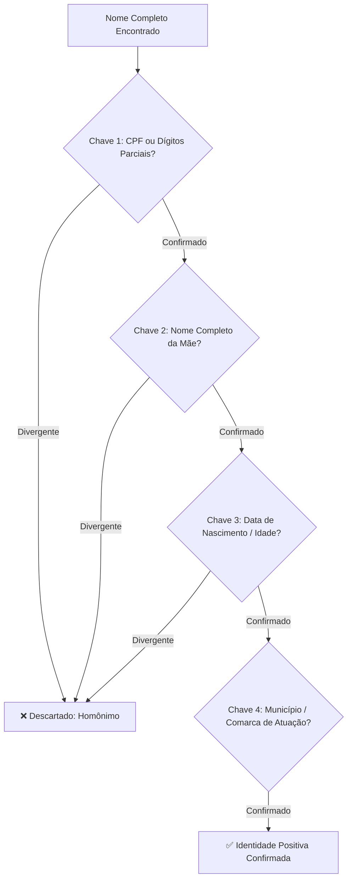

# Capítulo 09: Investigação de Pessoas Naturais: Desambiguação de Homônimos, CPF e Rastros Públicos

## 1. O Ecossistema de Identificação Civil no Brasil e a Lei 14.534/2023

Historicamente, o Brasil conviveu com um modelo caótico e fragmentado de identificação de pessoas naturais: cada um dos 27 estados federados possuía seu próprio Instituto de Identificação emitindo números de Registro Geral (RG) independentes, viabilizando que uma mesma pessoa portasse legalmente múltiplos RGs distintos no território nacional.

Esse cenário foi profundamente alterado com a promulgação da **Lei nº 14.534/2023**, que estabeleceu o **Cadastro de Pessoas Físicas (CPF)** como número único e suficiente de identificação do cidadão nos bancos de dados de serviços públicos em todo o país.

Para a investigação OSINT jurídica, o CPF é a **chave primária unificadora (*Master Key*)**, a partir da qual convergem certidões de nascimento, casamento, registros imobiliários, cadastros eleitorais, vínculos societários e distribuições judiciais.

---

## 2. O Protocolo de Desambiguação de Homônimos em 4 Chaves

No Brasil, milhares de cidadãos compartilham exatamente o mesmo nome civil (ex.: *"Carlos Alberto da Silva"*, *"Juliana Mendes Ferreira"*). A atribuição errônea de uma dívida, processo criminal ou propriedade a um homônimo constitui o erro técnico mais grave que um investigador pode cometer, gerando responsabilidade civil imediata (CPC, art. 77, II c/c art. 186 do Código Civil).

Para afastar categoricamente o risco de homonímia, o analista deve aplicar o **Protocolo de Validação em 4 Chaves Cruzadas**:

---

## 3. Fontes Primárias para Rastreamento de Indivíduos

### 3.1. Receita Federal do Brasil (Situação Cadastral no CPF)
A consulta ao portal oficial da Receita Federal devolve o nome completo oficializado no cadastro fazendário e a sua situação jurídica:
- **Regular**: CPF sem pendências eleitorais ou cadastrais imediatas.
- **Suspensa**: Cadastro incorreto ou omissão de declarações de ajuste anual.
- **Cancelada**: Duplicidade constatada ou decisão judicial transitada em julgado.
- **Nula**: Constatada fraude na inscrição.
- **Titular Falecido**: Atesta o óbito civil do indivíduo perante a União.
  > *Utilidade Jurídica*: O status "Titular Falecido" impõe a imediata suspensão do processo para citação do espólio ou habilitação dos herdeiros (CPC, arts. 313, I e 689).

### 3.2. Justiça Eleitoral (TSE / DivulgaCandContas)
Cidadãos que concorreram a qualquer cargo eletivo (vereador, prefeito, deputado) possuem registros perpétuos no portal `divulgacandcontas.tse.jus.br`, contendo:
- Declaração de bens detalhada (imóveis com endereço, veículos, ações, contas bancárias e dinheiro em espécie);
- Limite de gastos e doações eleitorais efetuadas;
- Certidões de quitação eleitoral e eventuais processos de inelegibilidade.

### 3.3. Conselhos Profissionais de Classe
Profissionais liberais regulamentados (médicos, advogados, engenheiros, corretores de imóveis, contadores) deixam rastros oficiais públicos nos cadastros nacionais de seus conselhos:
- **CNA (Cadastro Nacional dos Advogados - OAB)**: Informa seccional, número de inscrição, endereço profissional e foto oficial.
- **CFM / CRMs**: Informa especialidade médica, situação do registro e endereço de consultório.
- **CREA / CONFEA / CAU**: Informa Anotações de Responsabilidade Técnica (ARTs) e Registro de Responsabilidade Técnica (RRTs), que comprovam obras civis executadas recentemente pelo profissional.

---

## 4. Técnicas Éticas de Rastreamento de Telefones, E-mails e Usernames

### 4.1. Verificação de Chaves Pix em Ambiente Bancário
No sistema de pagamentos instantâneos brasileiro (Pix), o envio de transferência informando um número de telefone ou e-mail exibe na tela de confirmação do aplicativo bancário o **nome completo do titular e o CPF mascarado** (ex.: `***.123.456-**`). Essa consulta pública é o método mais ágil e confiável para confirmar a titularidade de um número telefônico celular sem incorrer em custos com serviços de terceiros.

### 4.2. Rastreamento Automatizado de Usernames (Sherlock / WhatsMyName)
Muitos indivíduos reutilizam o mesmo *username* (alcunha) em múltiplas plataformas ao longo dos anos. A utilização do script *Sherlock Project* ou do portal *WhatsMyName.app* permite varrer centenas de redes sociais (LinkedIn, GitHub, Reddit, TikTok, Pinterest) em segundos, localizando contas antigas onde o alvo pode ter deixado escapar dados de contato, currículos ou fotografias pessoais.

---

## 5. Boxes Didáticos do Capítulo

> [!WARNING]
> ### ⚖️ Limite Jurídico: Proibição dos "Painéis Puxa-Tudo" e Bases Vazadas
> Robôs no Telegram e sites comerciais clandestinos que prometem *"consultar CPF e puxar endereço, vizinhos, score e foto de CNH"* operam sobre bases de dados criminosamente vazadas de órgãos públicos (ex.: DETRAN, Serasa, SUS). O advogado que adquire ou utiliza relatórios desses painéis comete o crime de **receptação qualificada (art. 180 do CP)** e responde a processo disciplinar no Tribunal de Ética da OAB, contaminando qualquer prova juntada ao processo.

> [!TIP]
> ### 🔎 Pivô: Da Filiação no Processo Trabalhista à Matrícula do Imóvel
> Ao obter a certidão de nascimento ou o nome da mãe em uma petição de processo trabalhista arquivado, utilize esse nome de filiação para buscar inventários e partilhas nos Tribunais de Justiça estaduais. Comumente, o devedor que alega insolvência é herdeiro necessário de patrimônio imobiliário vultoso pendente de registro no RGI.

> [!NOTE]
> ### 🧪 Verificação: A Validação Fonética de Nomes no Brasil
> A língua portuguesa no Brasil apresenta vasta multiplicidade de grafias para o mesmo som (ex.: *Luiz / Luís, Souza / Sousa, Danielle / Daniele, Thiago / Tiago*). Ao pesquisar nomes em bases de dados abertas, aplique sempre o operador booleano `OR` cobrindo todas as variantes fonéticas possíveis para evitar que um registro relevante seja omitido por mero erro cartorário de digitação.
