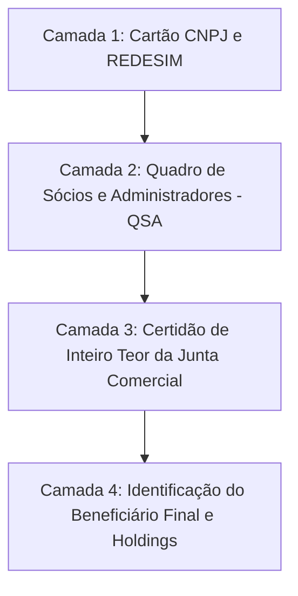

# Capítulo 10: Investigação Societária e Corporativa: CNPJ, QSA, Grupos Econômicos e Beneficiário Final

## 1. A Anatomia do CNPJ Brasileiro como Vetor Investigativo

O Cadastro Nacional da Pessoa Jurídica (CNPJ) é estruturado no formato `XX.XXX.XXX/YYYY-ZZ`, dividido em três blocos com alto significado para o analista forense:
1. **Raiz do CNPJ (Primeiros 8 dígitos - `XX.XXX.XXX`)**: Identifica a entidade jurídica unificada. **Todas as filiais de uma empresa compartilham rigorosamente a mesma raiz**.
   - *Aplicação Prática*: Ao pesquisar a raiz de 8 dígitos nos portais fazendários ou diários oficiais, o advogado descobre instantaneamente todas as filiais distribuídas pelo território nacional, viabilizando penhoras de estoques e faturamentos em outros estados.
2. **Número de Ordem (4 dígitos - `YYYY`)**: Indica a ordem sequencial de abertura. `0001` identifica a matriz; `0002`, `0003` identificam filiais sucessivas.
3. **Dígitos Verificadores (2 dígitos - `ZZ`)**: Garantem a integridade matemática do cadastro.

---

## 2. As Camadas da Informação Societária

A investigação societária deve avançar em quatro camadas concêntricas de profundidade probatória:

### Camada 1: O Cartão CNPJ da Receita Federal
Fornece os dados cadastrais básicos: razão social, nome fantasia, data de abertura, Classificação Nacional de Atividades Econômicas (CNAE principal e secundários), endereço cadastral formal e capital social declarado.
- *Ponto de Atenção*: Uma empresa que possui capital social de R$ 5.000.000,00 mas tem como sede uma sala de 15 m² em prédio residencial ou lote baldio apresenta disparidade estrutural grave que fundamenta pedido de constatação judicial.

### Camada 2: Quadro de Sócios e Administradores (QSA)
Revela a composição formal dos sócios, suas qualificações societárias (sócio pessoa física, administrador não sócio, procurador, sócio domiciliado no exterior) e a data de ingresso na sociedade.
- *Pivô Crítico*: Os nomes e CPFs parciais dos sócios extraídos do QSA tornam-se os novos identificadores para pesquisas pessoais em cartórios de imóveis e tribunais.

### Camada 3: As Certidões das Juntas Comerciais Estaduais
Apenas a certidão da Junta Comercial confere fé pública plena para fins de constrição judicial:
- **Certidão Simplificada**: Resume a situação atual da empresa, indicando os sócios vigentes e filiais ativas.
- **Certidão Específica**: Detalha eventos pontuais (ex.: todas as transferências de cotas ocorridas entre 2022 e 2026).
- **Certidão de Inteiro Teor (Cópia Autêntica)**: Reproduz a íntegra física dos contratos sociais, alterações contratuais, atas de assembleia, balanços arquivados e termos de posse. É indispensável para comprovar cessão fraudulenta de cotas e assinaturas.

### Camada 4: Rastreamento do Beneficiário Final (IN RFB nº 2.119/2022)
Comumente, o QSA de uma empresa no Brasil aponta como sócia outra pessoa jurídica (holding nacional) ou uma sociedade offshore sediada em paraíso fiscal (Delaware, Ilhas Virgens Britânicas, Uruguai, Panamá).

A Instrução Normativa RFB nº 2.119/2022 impõe a todas as empresas nacionais e estrangeiras a obrigação de declarar perante a Receita Federal a **pessoa natural que, em última análise, detém o controle efetivo da entidade (o Beneficiário Final)**.
- *Aplicação Forense*: Na consulta ao CNPJ de empresas estrangeiras operando no Brasil ou holdings com investimentos relevantes, verifique a declaração de beneficiário final arquivada na Receita Federal para desvendar o real patriarca do grupo econômico.

---

## 3. Identificação de Grupos Econômicos de Fato e Confusão Patrimonial

O art. 50 do Código Civil (com a redação da Lei de Liberdade Econômica nº 13.874/2019) e o art. 2º, § 2º, da CLT autorizam a desconsideração da personalidade jurídica e a responsabilização solidária quando demonstrada a existência de **grupo econômico de fato** ou **desvio de finalidade / confusão patrimonial**.

### A Matriz de Indicadores de Grupo Econômico Oculto:
1. **Identidade Societária e Familiar**: Sócios formais com grau de parentesco próximo (cônjuges, pais e filhos) que exercem a mesma atividade econômica.
2. **Identidade de Procuradores**: Terceiro com procuração ampla para movimentar contas bancárias em nome de três ou quatro empresas distintas do grupo.
3. **Compartilhamento de Infraestrutura Física**: Funcionamento no mesmo galpão, utilização da mesma linha telefônica, mesmos servidores de e-mail e mesmos veículos de carga.
4. **Comunhão de Empregados**: Funcionários contratados formalmente pela empresa insolvente prestando serviços cotidianos para a empresa lucrativa do grupo.
5. **Marca e Atendimento Unificados**: O website corporativo apresenta todas as empresas sob uma única identidade visual comercial ("Grupo X Logística").

---

## 4. Boxes Didáticos do Capítulo

> [!IMPORTANT]
> ### 🚩 Sinal de Atenção: O "Sócio Fantasma" com Endereço em Área Rural Remota
> Ao examinar a qualificação dos sócios em alteração contratual na Junta Comercial, verifique o endereço residencial declarado. A inserção de sócio majoritário com endereço em assentamentos rurais distantes, comunidades vulneráveis ou cidades a milhares de quilômetros da sede da empresa é o clássico indício de compra de CPF de pessoa em extrema vulnerabilidade ("laranja profissional") para blindar o verdadeiro operador da fraude.

> [!TIP]
> ### 🔎 Pivô: O E-mail do Domínio da Empresa como Vínculo Oculto
> Na Ficha Cadastral da Junta Comercial ou na consulta WHOIS do domínio da empresa insolvente, verifique o e-mail cadastrado. Se o e-mail da executada `Transportes Falida Ltda.` for `financeiro@holdingprospera.com.br`, você possui uma **prova documental direta de confusão administrativa e grupo econômico**, apta a subsidiar pedido liminar de arresto cautelar.

> [!WARNING]
> ### ⚖️ Limite Jurídico: A Mera Existência de Sócios em Comum Não Basta
> O art. 50, § 4º, do Código Civil prescreve categoricamente: *"A mera existência de grupo econômico sem a presença do desvio de finalidade ou da confusão patrimonial não autoriza a desconsideração da personalidade da pessoa jurídica"*. O advogado não pode limitar-se a mostrar que A e B são sócios em duas empresas; é obrigatório provar a promiscuidade financeira, circulação de ativos sem causa jurídica legítima ou fechamento fraudulento.
