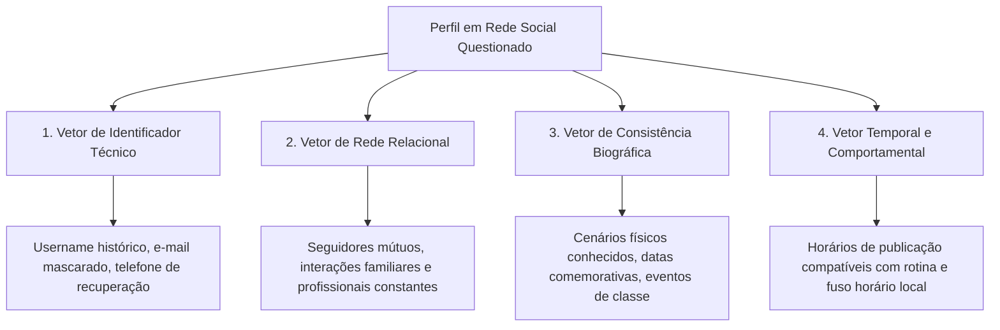

# Capítulo 12: Redes Sociais e Perfis Digitais: Atribuição de Identidade, Análise Temporal e Comportamental

## 1. SOCMINT no Ecossistema Jurídico

A inteligência aplicada a redes sociais (**SOCMINT** - *Social Media Intelligence*) representa uma das fontes mais ricas de informações circunstanciais no direito contemporâneo. No Brasil, plataformas como Instagram, LinkedIn, TikTok, Facebook, X (Twitter) e YouTube são amplamente utilizadas por cidadãos e empresas para comunicação pública e autopromoção.

Para o operador do Direito, o perfil em rede social não é entretenimento, mas um **repositório dinâmico de comportamentos, manifestações de vontade, relações intersubjetivas e sinais exteriores de capacidade financeira**.

Contudo, a utilização de dados de redes sociais em juízo exige extremo rigor metodológico: o analista deve superar a superficialidade do "print simples" e construir uma cadeia de atribuição robusta capaz de resistir ao contraditório judicial.

---

## 2. A Cadeia de Atribuição de Identidade Digital

A atribuição da titularidade de uma conta em rede social a uma pessoa física específica exige a convergência de múltiplos vetores independentes:

### 2.1. O Vetor de Identificador Técnico
Muitos usuários utilizam o mesmo *handle* em várias plataformas ou alteram o nome de exibição mantendo o ID numérico original da conta intacto. A consulta aos metadados da conta em ferramentas de inteligência permite extrair a data exata de criação do perfil e o histórico de alterações anteriores de nomes de usuário.

### 2.2. A Análise do "Grafo de Convivência" (Seguidores e Interações)
Um perfil anônimo ou institucional dificilmente opera no vácuo. Ao mapear as primeiras contas seguidas logo após a criação da página e os usuários que rotineiramente curtem, comentam e compartilham as publicações, o analista identifica o "núcleo de afinidade íntima" (familiares, assessores diretos, sócios ou funcionários de confiança).

### 2.3. Estilometria Forense e Análise Linguística
A estilometria forense estuda os padrões invariáveis da escrita individual:
- Uso repetido de expressões idiomáticas incomuns;
- Padrões atípicos de pontuação (ex.: uso sistemático de espaço antes da vírgula ou repetição de pontos de exclamação `!!!`);
- Erros ortográficos e concordâncias sintáticas singulares;
- Emprego de regionalismos geográficos específicos.

---

## 3. Análise Temporal Forense (*Timeline Analysis*)

As postagens em redes sociais carregam carimbos de tempo precisos armazenados nos servidores da plataforma (com fuso horário UTC). A tabulação da hora e dia das publicações ao longo de meses permite traçar:
- **Rotina de Sono e Atividade**: Horário habitual de despertar e encerramento de atividades;
- **Localização em Fuso Horário Diferenciado**: Publicações em tempo real durante a madrugada brasileira com iluminação solar indicam viagens internacionais não declaradas aos autos da execução;
- **Deslocamentos e Frequência**: Verificação de comparecimento rotineiro a determinadas academias, clubes esportivos, restaurantes e condomínios fechados.

---

## 4. O Confronto com a Prova da Posse vs. Mera Exibição

Nas ações de alimentos e execução cível, a defesa comumente alega que *"o veículo de luxo exibido na foto é de propriedade de um amigo que apenas emprestou para um passeio"*.

Para desconstituir essa escusa perante o juiz:
1. **Analise a Frequência Temporal**: Uma foto isolada pode ser empréstimo; 15 fotos tiradas ao longo de 18 meses em diferentes locais (garagem da residência, viagens de férias, supermercado) comprovam **uso contínuo e posse direta estável**;
2. **Observe os Detalhes Físicos**: Verifique chave do veículo sobre a mesa em reuniões, tags de pedágio eletrônico (Sem Parar/ConectCar) no para-brisa ou objetos de uso pessoal (mochilas, cadeirinhas infantis) instalados no interior do automóvel;
3. **Cruze com Infrações de Trânsito**: Se o veículo estiver em nome de terceiros, pesquise no diário oficial ou portal do DETRAN infrações de trânsito cometidas naquele automóvel na rota residencial habitual do devedor.

---

## 5. Boxes Didáticos do Capítulo

> [!WARNING]
> ### ⚖️ Limite Jurídico: A Proibição Deontológica do "Catfishing" pelo Advogado
> É terminantemente vedado ao advogado ou membro de sua equipe criar perfis falsos simulando mulher atraente, cliente em potencial ou fornecedor comercial com o objetivo de puxar conversa privada (*direct message*) com a parte contrária para extrair confissões ou dados sigilosos. Essa conduta viola a boa-fé processual, o Estatuto da Advocacia e configura falsidade ideológica (art. 299 do CP), tornando qualquer informação obtida imprestável em juízo.

> [!CAUTION]
> ### ⚠️ Não Conclua Ainda: A Defasagem Temporal de Stories e Destaques
> Usuários frequentemente postam imagens antigas como se fossem atuais (o conhecido *Throwback Thursday - #TBT* ou repostagem de viagens passadas para fingir status). Jamais afirme que o devedor está viajando no exterior hoje baseando-se unicamente em um post do feed. Verifique elementos externos contemporâneos: clima meteorológico da foto, notícias do dia exibidas em telas de fundo ou cruzamento com carimbos de tempo reais.

> [!TIP]
> ### 🔎 Pivô: A Análise de Reflexos em Óculos de Sol e Janelas
> Em investigações de alta complexidade, fotos em alta resolução onde o alvo usa óculos de sol espelhados ou posa ao lado de vitrines espelhadas frequentemente refletem o fotógrafo (revelando o acompanhante ou cúmplice), o ambiente de trabalho ou placas indicativas da localidade exata onde a imagem foi capturada.
