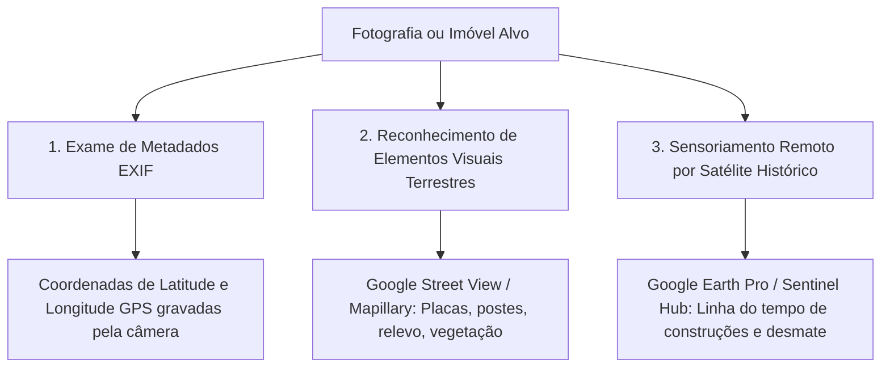

# Capítulo 13: Imagens, Vídeos e Geolocalização: Satélite, Registro Urbano e Busca Reversa

## 1. A Inteligência Geoespacial e Visual no Direito

A inteligência visual (**IMINT** - *Imagery Intelligence*) e a inteligência geoespacial (**GEOINT** - *Geospatial Intelligence*) tornaram-se ferramentas indispensáveis para o advogado contemporâneo. Fotografias publicadas na internet, vídeos gravados por câmeras de segurança e imagens de satélite contêm um manancial de informações empíricas que vão muito além do foco central da imagem.

No Direito brasileiro, a geolocalização e a análise de imagens aplicam-se decisivamente em:
- **Direito Ambiental**: Comprovação de desmatamento, queimadas ou intervenção em Área de Preservação Permanente (APP) ao longo dos anos;
- **Direito Imobiliário e Posse**: Demonstração de marcos temporais de ocupação, início de construções para ações de usucapião ou reintegração de posse;
- **Direito de Família e Alimentos**: Localização de residências de alto padrão e condomínios fechados habitados pelo alimentante;
- **Direito do Trabalho**: Reconstrução de trajetos de motoristas e constatação de condições de postos remotos de trabalho.

---

## 2. Busca Reversa de Imagens e Detecção de Proveniência

A técnica de busca reversa (*Reverse Image Search*) consiste em submeter uma fotografia a motores visuais especializados para identificar onde a mesma imagem (ou imagens visualmente semelhantes) já foi publicada na web:

| Motor de Busca Visual | Ponto Forte / Algoritmo Principal | Aplicação Forense Específica |
| :--- | :--- | :--- |
| **Google Lens** | Reconhecimento de produtos comerciais, logotipos corporativos, prédios públicos e monumentos. | Identificar a marca exata de um relógio/bolsa de luxo ou o hotel onde a foto foi tirada. |
| **Yandex Visual Search** | **O mais potente do mundo para reconhecimento facial e feições humanas**, mesmo com óculos, bonés ou poses em ângulos laterais. | Localizar outros perfis do mesmo indivíduo em redes sociais russas, europeias ou fóruns abertos. |
| **TinEye** | Rastreamento estrito de duplicidade exata e histórico de modificações da mesma imagem na internet. | Identificar a imagem original em alta resolução, comprovando quem a publicou primeiro na web. |
| **Bing Visual Search** | Excelente indexação para arquitetura de interiores, fachadas urbanas e elementos de design. | Identificar condomínios e edifícios residenciais a partir da moldura de varandas ou pisos. |

---

## 3. As Camadas de Investigação Geoespacial (GEOINT)

### 3.1. Metadados Geográficos (EXIF GPS)
Quando uma foto é tirada por smartphone ou câmera digital moderna com a localização ativada, o arquivo grava nos cabeçalhos EXIF as coordenadas exatas:
- `GPS Latitude`: `23° 34' 12.4" S`
- `GPS Longitude`: `46° 39' 50.1" W`
- `GPS Altitude`: `760 m`
- *Atenção Forense*: Redes sociais como Instagram, WhatsApp e Facebook removem os metadados EXIF no momento do upload por privacidade. Contudo, fotos enviadas como **arquivo/documento** em aplicativos de mensagens ou baixadas de sites corporativos, portais imobiliários e blogs frequentemente preservam os metadados intactos.

### 3.2. Google Earth Pro e a Linha do Tempo Histórica
O software gratuito para desktop *Google Earth Pro* possui a funcionalidade **"Imagens Históricas"**, que permite recuar no tempo e visualizar imagens aéreas e de satélite capturadas ao longo dos últimos 20 anos na mesma coordenada geográfica.
- *Aplicação em Usucapião e Ações Possessórias*: Comprove exatamente o ano e mês em que uma cerca foi erguida, uma casa foi construída ou uma plantação foi iniciada, desconstituindo depoimentos falsos de testemunhas sobre o lapso temporal de posse.

### 3.3. Análise de Sombras e Orientação Solar (SunCalc)
A ferramenta analítica *SunCalc* (`suncalc.org`) modela a trajetória do sol e o tamanho exato da sombra projetada por um objeto em qualquer latitude do planeta em uma data e hora específicas.
- *Aplicação Processual*: O réu alega que a foto apresentada pela acusação foi tirada às 11h da manhã (quando ele tinha um álibi), mas o comprimento e o ângulo da sombra do poste ou do prédio na imagem demonstram matematicamente que o sol estava poente às 17h45, desfazendo a farsa do álibi.

---

## 4. Boxes Didáticos do Capítulo

> [!TIP]
> ### 🇧🇷 Fonte Brasileira: O Cadastro Ambiental Rural (CAR) e Dados do INPE
> No Brasil, o Sistema de Cadastro Ambiental Rural (**SICAR** - `car.gov.br`) e os portais do Instituto Nacional de Pesquisas Espaciais (**INPE** - PRODES e DETER) disponibilizam dados geoespaciais abertos em arquivos vetoriais (*shapefiles*). O advogado pode sobrepor as coordenadas do imóvel rural no Google Earth para comprovar sobreposição de terras com reservas indígenas, áreas de preservação ou divisas fraudulentas.

> [!TIP]
> ### 🔎 Pivô: A Numeração Predial no Street View
> Ao localizar uma foto de devedor em frente a uma residência em rua residencial sem identificação, utilize o Google Street View para "caminhar" virtualmente pela rua até o poste ou esquina mais próxima para identificar a placa toponímica da via e o número do imóvel vizinho. De posse desse endereço físico, consulte a inscrição municipal de IPTU e solicite a certidão no Registro de Imóveis.

> [!NOTE]
> ### 🧪 Verificação: O Efeito Espelho de Câmeras Frontais
> Cuidado ao analisar fotos tiradas com a câmera de selfie do celular: a imagem comumente é invertida horizontalmente (efeito espelho). Textos em camisetas, placas de trânsito ou volantes de automóveis aparecem invertidos, podendo induzir o analista a acreditar que o veículo possui direção inglesa ou que o motorista estava do lado do passageiro. Sempre inverta a foto horizontalmente antes da análise pericial.
