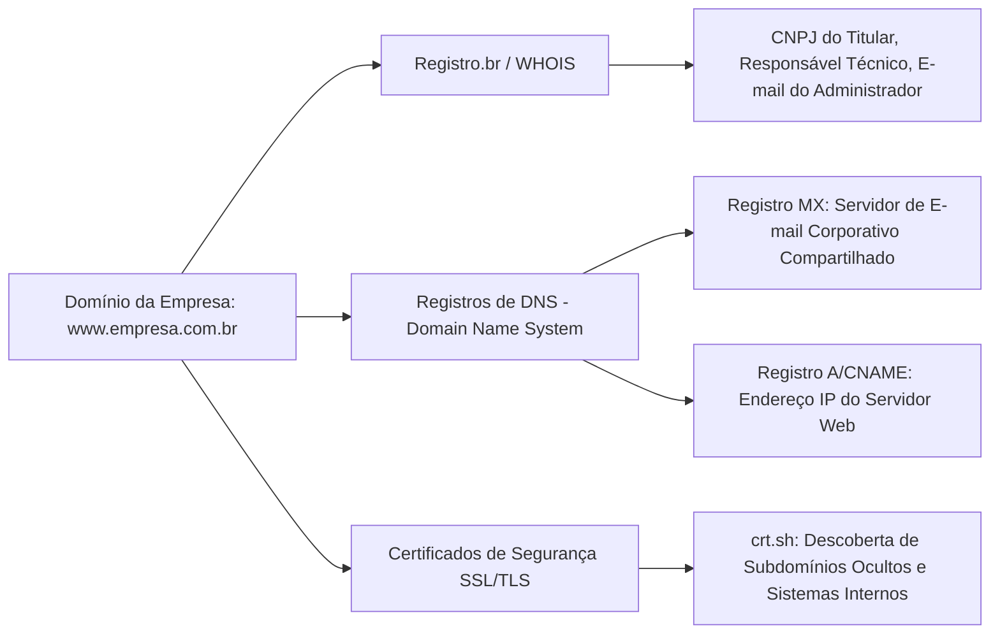

# Capítulo 14: Web Histórica e Infraestrutura Técnica: Arquivos Digitais, WHOIS, DNS e Registros de Rede

## 1. A Memória Imutável da Internet

É um axioma da computação forense que *"a internet nunca esquece definitivamente"*. Empresas e indivíduos envolvidos em litígios ou fraudes frequentemente tentam apagar seus rastros alterando páginas corporativas, excluindo nomes de fundadores da aba "Quem Somos", modificando contratos de adesão online ou retirando websites inteiros do ar.

A investigação em **Web Histórica** (*Internet Archiving*) e **Infraestrutura Técnica de Redes** permite ao operador do Direito resgatar versões pretéritas de páginas web e analisar a estrutura de servidores e domínios, desmascarando tentativas de fraude probatória.

---

## 2. Rastreamento e Resgate na Web Histórica

| Plataforma de Arquivamento | Características Técnicas | Aplicação Forense Principal |
| :--- | :--- | :--- |
| **Wayback Machine (Archive.org)** | Maior acervo histórico digital do mundo (bilhões de páginas rastreadas desde 1996). | Resgatar políticas comerciais, listas de preços antigas, termos de adesão e alterações contratuais unilaterais de empresas. |
| **Archive.today (Archive.ph / is)** | Gravação sob demanda pelo usuário, gerando uma cópia estática textual e uma imagem renderizada em alta fidelidade. | Preservar instantaneamente páginas que contenham ilícitos voláteis, funcionando como repositório independente de preservação. |
| **URLScan.io** | Escaneador técnico de segurança que grava capturas de tela, respostas HTTP, certificados SSL e chamadas de scripts de rastreamento. | Analisar websites corporativos suspeitos e lojas de comércio eletrônico fraudulentas. |

---

## 3. Investigação de Infraestrutura Técnica: WHOIS e DNS

Por trás de qualquer website na internet opera uma infraestrutura técnica regulamentada que deixa registros documentais permanentes:

### 3.1. A Consulta WHOIS no Brasil (Registro.br)
No Brasil, todos os domínios com final `.br` são gerenciados pelo Núcleo de Informação e Coordenação do Ponto BR (**NIC.br / Registro.br**). 
Diferentemente de domínios internacionais (onde serviços de privacidade ocultam os dados dos proprietários), no Brasil a consulta pública WHOIS em `registro.br` revela obrigatoriamente:
- **Titular do Domínio**: Nome completo da pessoa física ou Razão Social da pessoa jurídica;
- **Documento**: CPF ou CNPJ formal do titular;
- **Contato do Responsável Técnico**: Nome e e-mail do profissional que administra a infraestrutura técnica.

### 3.2. A Força Probatória dos Registros de DNS (Registros MX e SPF)
O Sistema de Nomes de Domínio (**DNS**) mapeia nomes legíveis em endereços IP. Para a prova de grupo econômico, dois tipos de registros são cruciais:
- **Registros MX (*Mail Exchanger*)**: Apontam qual servidor recebe os e-mails daquele domínio.
  - *Hipótese Forense*: Se a empresa devedora `LogSul.com.br` e a empresa aparentemente estranha `TransNorte.com.br` utilizam rigorosamente o mesmo servidor MX customizado privado (`mail.gruponogueira.com.br`), há **prova técnica de compartilhamento de infraestrutura de TI e gestão unificada**.
- **Registros TXT / SPF (*Sender Policy Framework*)**: Listam os servidores e IPs autorizados a enviar mensagens eletrônicas em nome daquela empresa.

### 3.3. Transparência de Certificados SSL (crt.sh)
Todos os certificados digitais HTTPS emitidos no mundo são obrigatoriamente publicados em registros públicos auditáveis conhecidos como *Certificate Transparency Logs*. Consultar o domínio corporativo no portal `crt.sh` revela todos os **subdomínios já registrados** pela empresa, tais como:
- `erp.empresa.com.br` (sistema de gestão empresarial interna);
- `vpn.empresa.com.br` (pontos de acesso remoto de funcionários);
- `financeiro.empresa.com.br` (painéis de faturamento e pagamentos).

---

## 4. Boxes Didáticos do Capítulo

> [!TIP]
> ### 🔎 Pivô: Da Consulta WHOIS ao Grupo Econômico Familiar
> Ao consultar o domínio da empresa executada no Registro.br, caso o registrante seja o filho ou a esposa do devedor com e-mail pessoal, você possui uma **prova documental direta de confusão administrativa e controle fático**, viabilizando a extensão dos efeitos da execução patrimonial aos membros da família que operam o negócio.

> [!NOTE]
> ### 🧪 Verificação: O Risco de Alteração Recente de Titularidade no WHOIS
> Os dados do WHOIS refletem a titularidade contemporânea. Se os fraudadores transferiram o domínio do site corporativo para um terceiro recentemente, a consulta atual exibirá o novo proprietário. Utilize a ferramenta *Whoisology* ou o histórico do *DomainTools* para resgatar quem era o proprietário do domínio na data em que a dívida foi contraída.

> [!WARNING]
> ### ⚖️ Limite Jurídico: A Diferença entre Titularidade do Domínio e Autoria de Conteúdo
> Ter o domínio registrado em seu nome gera presunção relativa de controle sobre a plataforma. Contudo, em casos de plataformas abertas que admitem postagens de terceiros (comentários em blogs, marketplaces), a responsabilidade pelo conteúdo segue o regime específico do art. 19 do Marco Civil da Internet, exigindo ordem judicial prévia para responsabilização civil por danos de terceiros.
