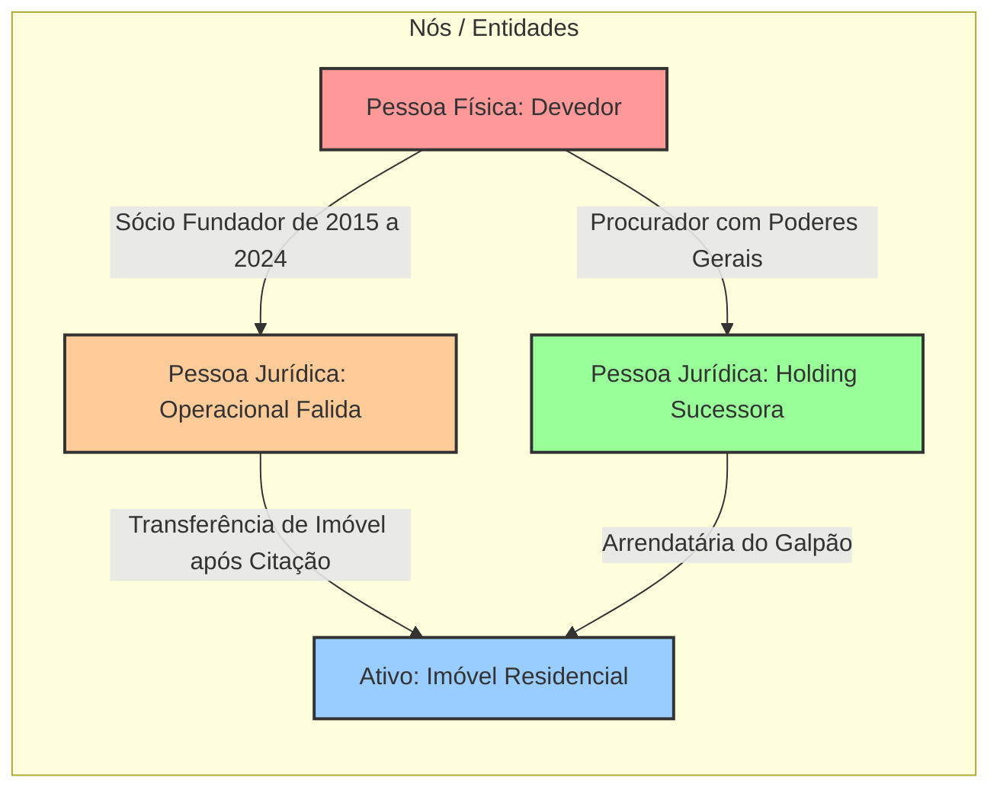

# Capítulo 15: Análise de Vínculos e Grafos: Mapeando Relações Complexas entre Indivíduos, Empresas e Bens

## 1. A Teoria dos Grafos Aplicada à Investigação Forense

Em investigações de fraudes sofisticadas, ocultação patrimonial e corrupção, o principal obstáculo para o julgador não é a ausência de elementos probatórios, mas a **dificuldade cognitiva de compreender a teia de relações cruzadas** descrita em dezenas de laudas de petições.

A mente humana processa representações visuais com velocidade 60.000 vezes superior ao texto escrito. A aplicação da **Teoria dos Grafos e Análise de Redes de Vínculos** (*Link Analysis*) permite transformar centenas de páginas de certidões cartorárias e contratos sociais em um diagrama relacional autoexplicativo, onde juízes e relatores conseguem enxergar instantaneamente o esquema fraudulento.

---

## 2. Elementos Fundamentais do Grafo Forense

Um grafo probatório estrutura-se sobre dois componentes essenciais:

1. **Vértices ou Nós (*Nodes*)**: Representam as entidades investigadas:
   - Pessoas Físicas (devedor, cônjuge, herdeiros, procuradores, sócios de fachada);
   - Pessoas Jurídicas (empresas operacionais, holdings patrimoniais, offshores);
   - Ativos Reais (imóveis, frotas de veículos, aeronaves, marcas registradas);
   - Identificadores Técnicos (domínios na web, contas bancárias, telefones compartilhados).
2. **Arestas ou Conexões (*Edges*)**: Representam as relações jurídicas ou fáticas entre as entidades, sempre rotuladas com a sua natureza jurídica e data:
   - *"É administrador com procuração pública desde 2024"*;
   - *"Doou imóvel para descendente em 10/11/2025"*;
   - *"Compartilha o mesmo endereço residencial e linha telefônica"*.

---

## 3. Tipologias Visuais Clássicas de Fraude e Ocultação

### 3.1. A Estrutura em "Polvo" ou Radial (*Hub and Spoke*)
Uma figura central (o devedor oculto) não possui formalmente nenhuma cota social, mas figura como o "eixo central" (*Hub*) que outorga e recebe procurações cruzadas de dezenas de empresas periféricas (*Spokes*), coordenando a movimentação financeira de todo o ecossistema.

### 3.2. A Estrutura em "Carrossel" ou Circular (*Circular Laundering*)
Operações contratuais circulares simuladas para conferir aparência de legitimidade à circulação de recursos:
- A Empresa 1 celebra contrato de prestação de serviços com a Empresa 2;
- A Empresa 2 transfere recursos para a Empresa 3 a título de "mútuo financeiro";
- A Empresa 3 adquire bens imóveis e os cede em "comodato gratuito" para o devedor originário da Empresa 1.

### 3.3. O Sócio "Corrente" ou "Laranja Serial"
Indivíduo de baixa renda que aparece como titular de dezenas de empresas em ramos completamente díspares (construção pesada, panificação, consultoria de TI e comércio de carnes), todas constituídas no mesmo cartório e sob a mesma assessoria contábil.

---

## 4. Boas Práticas na Inserção de Grafos em Peças Judiciais

Para que o grafo tenha eficácia persuasiva perante o magistrado:
1. **Evite o Efeito "Teia de Aranha Ilegível"**: Não coloque 200 nós em um único diagrama minúsculo. Quebre a investigação em grafos parciais por núcleo temático (Núcleo Familiar, Núcleo Societário, Núcleo Imobiliário);
2. **Utilize Cores Padronizadas**: Adote cores intuitivas (ex.: Vermelho para o devedor e empresas insolventes; Verde para as holdings solventes e bens localizados; Azul para terceiros intervenientes);
3. **Amarre Cada Vínculo a uma Prova Documental**: Toda aresta do grafo deve conter entre parênteses a indicação da prova (ex.: *"[Doc. 04: Certidão JUCESP fls. 32]"*). O diagrama visual deve funcionar como um mapa de navegação direta para os autos.

---

## 5. Boxes Didáticos do Capítulo

> [!IMPORTANT]
> ### 🚩 Sinal de Atenção: O Procurador Onipresente com Poderes de Gestão Plena
> Ao analisar o QSA de empresas de um grupo devedor, atente para o instrumento de procuração pública arquivado na Junta Comercial. A existência de um administrador formal sem bens aparentes que outorga **procuração pública com cláusula em causa própria e poderes para abrir contas, emitir cheques e alienar imóveis** em favor do devedor real comprova a gestão fática e a fraude contra credores.

> [!WARNING]
> ### ⚖️ Limite Jurídico: A Proteção de Terceiros Inocentes no Grafo
> A inclusão imprudente de parentes colaterais (irmãos, tios) ou parceiros comerciais legítimos em diagramas de fraude sem qualquer liame de causalidade com o ilícito gera dever de indenizar por dano moral. O grafo deve circunscrever-se estritamente às pessoas físicas e jurídicas que participaram dos atos de esvaziamento patrimonial ou confusão de ativos.

> [!TIP]
> ### 🔎 Pivô: A Identificação da "Empresa Irmã" por Endereço de IP e E-mail
> Ao conectar os nós de duas empresas distintas em um grafo, procure arestas tecnológicas: se ambas operam no mesmo servidor de e-mail corporativo ou possuem o mesmo desenvolvedor de site cadastrado no Registro.br, o vínculo fático está estabelecido para fins de desconsideração da personalidade jurídica.
