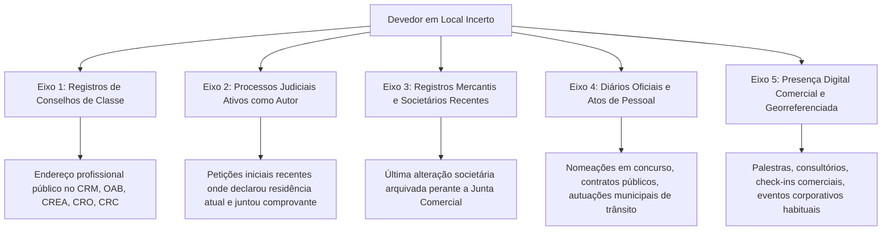

# Capítulo 16: Localização de Devedores e Efetividade da Execução: Métodos de Rastreamento Lícito e Precedentes dos Tribunais Superiores

## 1. O Gargalo da Execução Cível no Brasil e a Função Probatória de OSINT

De acordo com os relatórios anuais *Justiça em Números* do Conselho Nacional de Justiça (CNJ), a fase de execução é o maior estrangulamento do Poder Judiciário brasileiro, respondendo historicamente por mais de 50% da taxa de congestionamento processual. Centenas de milhares de processos de cobrança, execuções de títulos extrajudiciais e cumprimentos de sentença permanecem paralisados durante anos por um motivo primário e recorrente: **o devedor não é localizado para citação pessoal ou não são encontrados bens livres para penhora**.

Na praxe forense tradicional, a atuação da advocacia credora costuma restringir-se a uma postura passiva e burocrática: peticionar genericamente requerendo sucessivas expedições de ofícios aos sistemas judiciais conveniados (SISBAJUD, INFOJUD, RENAJUD e SIEL). Contudo, essa via estatal enfrenta um limite estrutural evidente: os bancos de dados públicos dependem predominantemente de **declarações espontâneas dos próprios devedores** (como o endereço informado na última Declaração de Ajuste Anual do Imposto de Renda ou o cadastro eleitoral), as quais, em devedores contumazes, estão deliberadamente desatualizadas há anos.

A aplicação metodológica de OSINT subverte essa inércia: permite ao credor **rastrear ativamente o domicílio fático e profissional contemporâneo do executado**, instruir os autos com certidões e fontes verificáveis, viabilizar a citação pessoal ou por hora certa (CPC, art. 252), fundamentar pedidos de arresto prévio de bens (CPC, art. 830) e, em casos de ocultação contumaz, justificar a aplicação subsidiária de **medidas executivas atípicas** (CPC, art. 139, IV), conforme delimitado pela jurisprudência vinculante do Superior Tribunal de Justiça (STJ) e do Supremo Tribunal Federal (STF).

---

## 2. A Cadeia Metodológica de Rastreamento de Domicílio Contemporâneo

A localização do devedor em fontes abertas não decorre de uma busca aleatória em mecanismos de pesquisa, mas de uma sequência estruturada em 5 eixos sucessivos de pivoteamento cadastral, documental e fático:



### 2.1. Eixo 1: Cadastros Abertos de Conselhos de Fiscalização Profissional
Médicos, dentistas, engenheiros, corretores de imóveis, contadores e advogados possuem obrigação legal e regulamentar de manter seus dados cadastrais e domicílio profissional estritamente atualizados perante os respectivos conselhos de fiscalização (CRM, CRO, CREA, CRECI, CRC, CNA/OAB). As plataformas de busca pública desses órgãos fornecem com precisão o endereço do consultório, clínica ou escritório onde a citação pode ser efetivada pessoalmente em dias úteis e horário de expediente comercial.

### 2.2. Eixo 2: Processos Judiciais Ativos em que o Devedor Litiga como Autor
Um dos fenômenos mais comuns na prática investigativa é a assimetria comportamental do devedor: enquanto ele se furta a receber oficiais de justiça nas ações em que figura como réu ou executado, atua com extrema diligência como **autor** em demandas consumeristas, indenizatórias ou comerciais (ex.: ações contra companhias aéreas por cancelamento de voo, demandas indenizatórias contra planos de saúde ou execuções de honorários).
- *Técnica Operacional*: A busca do nome completo e CPF do devedor nos portais unificados de consulta processual (PJe, e-SAJ, Eproc, Projudi) revela processos distribuídos recentemente. As petições iniciais e procurações juntadas pelo alvo consignam sua qualificação residencial atualizada e, invariavelmente, trazem anexas faturas recentes de energia elétrica, água, telefonia ou cartões de crédito.

### 2.3. Eixo 3: Alterações Contratuais Recentes nas Juntas Comerciais
Mesmo que a pessoa jurídica executada esteja inoperante ou abandonada, os sócios podem ter constituído nova empresa ou ingressado como cotistas em sociedades situadas em outras comarcas ou estados. A consulta às fichas cadastrais das Juntas Comerciais (JUCESP, JUCERJA, JUCEMG, etc.) revela o endereço residencial informado pelos sócios sob responsabilidade civil e criminal na última alteração arquivada.

### 2.4. Eixo 4: Compras Públicas, Licitações e Atos de Pessoal em Diários Oficiais
A busca indexada do nome e CPF em diários oficiais da União, Estados e Municípios (via Jusbrasil, Querido Diário ou portais de transparência) frequentemente identifica a nomeação do devedor para cargos comissionados, aprovação em concursos públicos, celebração de contratos de prestação de serviços com o Poder Público ou inscrições em cadastros imobiliários municipais para lançamento de IPTU.

### 2.5. Eixo 5: Presença Digital Comercial e Evidências Georreferenciadas
Quando o devedor atua no mercado informal ou no comércio de bens de alto valor sem registro celetista, suas atividades promocionais em redes sociais (LinkedIn, Instagram, Google Meu Negócio) revelam o local físico onde atende habitualmente clientes, ministra aulas, realiza consultorias ou participa de feiras comerciais.

---

## 3. Citação Frustrada, Suspeita Fundada de Ocultação e Citação com Hora Certa

O Código de Processo Civil estabelece no art. 252 o procedimento mandatório para a superação do embaraço à citação:

> *"Quando, por 2 (duas) vezes, o oficial de justiça houver procurado o citando em seu domicílio ou residência sem o encontrar, deverá, havendo suspeita de ocultação, intimar qualquer pessoa da família ou, em sua falta, qualquer vizinho de que, no dia útil imediato, voltará a fim de efetuar a citação, da hora que designar."*

O relatório de inteligência em fontes abertas atua como a **peça probatória chave para a configuração da suspeita fundada de ocultação**. Em vez de aceitar passivamente a certidão negativa de citação na qual o oficial consigna genericamente que "o réu não reside no local", o advogado junta o dossiê OSINT demonstrando:
1. Fotografias contemporâneas do alvo saindo do prédio ou utilizando áreas comuns do condomínio;
2. Menção expressa do condomínio em cadastros públicos recentes;
3. Depoimento informal ou manifestação em redes de funcionários e portaria atestando a presença habitual;
4. Requerimento de ordem judicial expressa para cumprimento de mandado em **horários especiais** (início da manhã, período noturno ou finais de semana, com autorização do art. 212, § 2º, do CPC) ou **citação com hora certa**, advertindo-se o síndico e os porteiros quanto ao crime de desobediência e ato atentatório à dignidade da justiça (art. 77, IV, do CPC).

---

## 4. Citação e Intimação Eletrônica por Redes Sociais e Mensageiros (WhatsApp)

A evolução tecnológica das comunicações processuais culminou na aceitação jurisprudencial da citação e intimação por meios eletrônicos, reforçada pela Lei nº 14.195/2021 (que alterou o art. 246 do CPC).

No entanto, o Superior Tribunal de Justiça firmou balizas rigorosas para impedir nulidades processuais e proteger o contraditório substancial. A 3ª Turma do STJ, no julgamento paradigmático do **REsp 2.026.925/SP** (Rel. Min. Nancy Andrighi), consolidou que a citação por aplicativo de mensagens exige a demonstração inequívoca de **três elementos cumulativos**:
1. Confirmação documental de que o número de telefone pertence efetivamente ao citando;
2. Confirmação visual da identidade do citando (foto nítida de perfil correlacionada com registros oficiais);
3. Interação contemporânea na qual o citando confirme expressamente a sua identidade e a ciência dos termos processuais.

---

## 5. Medidas Executivas Atípicas (Art. 139, IV do CPC): O Tema 1137 do STJ e a ADI 5941 do STF

Quando todas as tentativas típicas de localização de bens e devedores restam frustradas, surge a via das **medidas indutivas, coercitivas e mandamentais atípicas** autorizadas pelo art. 139, IV, do CPC (ex.: apreensão de Carteira Nacional de Habilitação, retenção de passaporte, suspensão de cartões de crédito e proibição de participação em licitações públicas).

A matéria foi definitivamente pacificada pelas cortes de cúpula:
- O **Supremo Tribunal Federal**, no julgamento da **ADI 5941/DF** (Rel. Min. Luiz Fux, Tribunal Pleno), declarou a **constitucionalidade** do art. 139, IV, do CPC, desde que a adoção das medidas respeite os direitos fundamentais, a proporcionalidade e a razoabilidade.
- O **Superior Tribunal de Justiça**, em sede de recursos repetitivos, fixou a tese vinculante do **Tema 1137** (REsp 1.955.539/SP e REsp 1.955.574/SP, Rel. Min. Marco Buzzi, Corte Especial), delimitando com clareza dogmática os requisitos cumulativos para o deferimento de tais providências.

A investigação OSINT é o instrumento que viabiliza na prática a aplicação do Tema 1137: ao comprovar por fotos em redes sociais, viagens internacionais frequentes e eventos sociais que o executado ostenta padrão de vida luxuoso enquanto oculta patrimônio formal, o credor demonstra o requisito do **sinal exterior de riqueza incompatível com a inadimplência**, afastando a alegação de hipossuficiência do devedor.

---

## 6. Boxes Metodológicos e Jurisprudência Aplicada

> [!NOTE]
> ### ⚖️ Validade Jurídica e Jurisprudência: Tema Repetitivo 1137 do STJ e Medidas Atípicas
> 
> **Ficha Técnica do Precedente:**
> - **Tribunal**: Superior Tribunal de Justiça (STJ) - Corte Especial
> - **Recurso**: REsp 1.955.539/SP (vinculado ao REsp 1.955.574/SP) - Tema 1137 dos Recursos Repetitivos
> - **Relator**: Ministro Marco Buzzi
> - **Data de Julgamento**: 03/05/2023 | Publicação no DJe: 15/05/2023
> - **Tese Fixada (STJ - Tema 1137)**:
>   > *"Em primeiro lugar, deve o juiz se certificar de que foram esgotados os meios tradicionais de localização de bens e devedores. Em segundo lugar, a decisão deve ser devidamente fundamentada, demonstrando a adequação, razoabilidade e proporcionalidade da medida coativa em relação às circunstâncias do caso concreto. Em terceiro lugar, a medida não pode ofender direitos e garantias fundamentais protegidos pela Constituição Federal, devendo ser mantida apenas pelo tempo estritamente necessário para alcançar a finalidade coercitiva."*
> 
> **Modelo de Parágrafo para Petição (Aplicação Prática com Dossiê OSINT):**
> ```text
> "Conforme se extrai do relatório de inteligência investigativa instruído com as evidências documentais anexas (EVD-001 a EVD-004), restaram esgotados todos os meios típicos de localização de bens penhoráveis, não tendo os sistemas SISBAJUD e RENAJUD localizado ativos suficientes. Todavia, a prova coligida em fontes abertas atesta que o executado mantém viagens internacionais recorrentes, frequenta camarotes e restaurantes de alto padrão e conduz automóveis de luxo registrados em nome de terceiros. Tal disparidade ostensiva entre a insolvência formal certificada nos autos e a riqueza exteriorizada preenche com precisão os requisitos fixados pela Corte Especial do STJ no Tema Repetitivo 1137 (REsp 1.955.539/SP) e chancelados pelo STF na ADI 5941, justificando plenamente a decretação subsidiária da medida atípica de suspensão do passaporte e da CNH do devedor (art. 139, IV, do CPC), com o propósito de compelir o executado a indicar os bens ocultados para satisfação do crédito exequendo."
> ```

> [!NOTE]
> ### ⚖️ Validade Jurídica e Jurisprudência: Citação Eletrônica via Aplicativo de Mensagens (WhatsApp)
> 
> **Ficha Técnica do Precedente:**
> - **Tribunal**: Superior Tribunal de Justiça (STJ) - 3ª Turma
> - **Recurso**: REsp 2.026.925/SP
> - **Relatora**: Ministra Nancy Andrighi
> - **Data de Julgamento**: 09/05/2023 | Publicação no DJe: 12/05/2023
> - **Ementa Síntese**: A citação por aplicativo de mensagens sem previsão legal expressa em ato normativo local exige a presença cumulativa de elementos seguros que atestem a identidade do citando: (i) número de telefone comprovadamente vinculado ao executado em bancos oficiais; (ii) foto de perfil contemporânea e compatível com documento de identidade; e (iii) confirmação de leitura e resposta que demonstre a efetiva tomada de conhecimento da ação.
> 
> **Dica de Peticionamento**: Ao pleitear citação por WhatsApp, nunca junte apenas um print isolado da tela do celular. Instrua a petição com certidão de cruzamento cadastral provando que a linha telefônica está formalmente associada ao CPF do alvo (via processos anteriores, cadastros comerciais abertos ou fatura de telecomunicação juntada aos autos) e requeira a expedição do mandado com instruções pormenorizadas para a secretaria do juízo.

> [!TIP]
> ### 🔎 Pivô: A Consulta ao Cadastro de Fornecedores do Estado e Município
> Se o devedor presta serviços como pessoa física autônoma ou MEI, consulte o Cadastro de Fornecedores do Estado (ex.: CAUFESP em São Paulo, SIGA no Rio de Janeiro, Cadfor em Minas Gerais). O credenciamento para licitações e contratos administrativos exige a juntada periódica de comprovante de residência contemporâneo, certidão negativa de débitos e alvará de funcionamento, constituindo prova documental de fé pública.

> [!CAUTION]
> ### ⚠️ Não Conclua Ainda: Endereço de Coworking ou Escritório Virtual
> Ao encontrar um endereço comercial para o devedor, verifique no Google Street View, no site do edifício ou na Receita Federal se a sala corresponde a um *coworking* ou prestador de *domicílio fiscal / escritório virtual*. Caso positivo, o oficial de justiça comparecerá ao local e certificará que a empresa "não possui funcionários ou sócios físicos ali sediados". Busque sempre o endereço onde ocorre o atendimento real aos clientes ou a residência pessoal.

> [!IMPORTANT]
> ### 🛑 Onde OSINT Para e Entra a Medida Judicial: O Arresto Executivo (Art. 830 do CPC)
> Se o oficial de justiça comparecer ao endereço rastreado via OSINT e certificar que o devedor não foi encontrado, mas a residência é manifestamente habitada pelo alvo, não requeira nova citação postal. Requeira imediatamente o **arresto executivo prévio de bens (pré-penhora)** com base no art. 830 do CPC, seguido da citação por edital ou com hora certa, garantindo a constrição de automóveis ou ativos existentes no local antes que o devedor os transfira.
