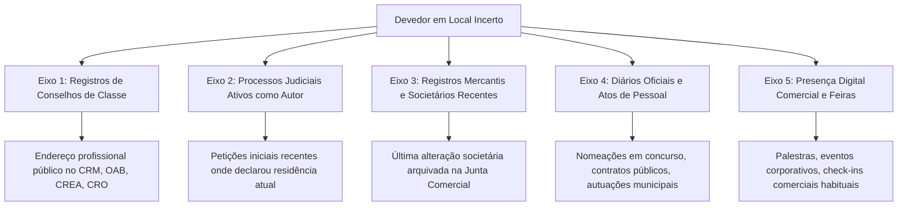

# Capítulo 16: Localização de Devedores e Citação Frustrada: Métodos de Rastreamento Lícito

## 1. O Gargalo da Execução Cível no Brasil

De acordo com os relatórios anuais *Justiça em Números* do Conselho Nacional de Justiça (CNJ), a fase de execução é o maior gargalo do Poder Judiciário brasileiro, respondendo por mais de 50% da taxa de congestionamento processual. Centenas de milhares de processos permanecem paralisados durante anos simplesmente porque o devedor **não foi localizado para citação ou penhora**.

O procedimento ordinário dos escritórios resume-se a pedir sucessivas expedições de ofícios pelo juiz aos sistemas conveniados (SISBAJUD, INFOJUD, RENAJUD e SIEL). Contudo, esses sistemas estatais dependem de declarações espontâneas dos próprios devedores (como a última DIRPF ou o endereço cadastrado no título de eleitor), que frequentemente estão defasadas há anos.

A aplicação de OSINT permite ao credor **rastrear o domicílio fático e profissional contemporâneo do devedor**, viabilizando a citação por oficial de justiça e o arresto prévio de bens (art. 830 do CPC).

---

## 2. A Cadeia de Rastreamento de Domicílio Contemporâneo

A busca por endereços contemporâneos organiza-se em 5 eixos sucessivos de pesquisa:

### 2.1. Eixo 1: A Busca em Conselhos de Classe Profissional
Médicos, dentistas, engenheiros, corretores de imóveis e advogados são legalmente obrigados a manter seu domicílio profissional atualizado perante seus respectivos conselhos regionais. A consulta pública aos cadastros online do CRM, CRO, CREA, CRECI ou CNA/OAB fornece o endereço atualizado do consultório ou escritório onde a citação pode ser consumada pessoalmente durante o horário comercial.

### 2.2. Eixo 2: Processos Judiciais Concorrentes como Autor
Muitas vezes, o devedor que se esquiva de oficiais de justiça na execução está litigando ativamente como autor em outros juízos (ex.: ação de indenização contra companhia aérea por atraso de voo, cobrança de honorários, ação declaratória contra concessionária de telefonia). 
- *Como Operar*: Consulte o nome completo do devedor nos portais unificados de pesquisa processual (PJe, e-SAJ, Projudi, Eproc). As petições iniciais distribuídas recentemente contêm procuração pública ou particular com a **qualificação residencial contemporânea e comprovante de endereço recente juntado aos autos**.

### 2.3. Eixo 3: Contratos Sociais e Filiais Recentes
Mesmo que a empresa executada esteja inativa, o devedor pode ter ingressado em sociedade recente em outro estado da federação. A consulta à base de CNPJs ou fichas cadastrais de Juntas Comerciais revela o endereço informado na última alteração arquivada sob as penas da lei.

---

## 3. A Citação por Hora Certa e a Demonstração de Ocultação

O art. 252 do Código de Processo Civil prevê:
> *"Quando, por 2 (duas) vezes, o oficial de justiça houver procurado o citando em seu domicílio ou residência sem o encontrar, deverá, havendo suspeita de ocultação, intimar qualquer pessoa da família ou, em sua falta, qualquer vizinho de que, no dia útil imediato, voltará a fim de efetuar a citação, da hora que designar."*

O relatório de inteligência OSINT é o instrumento probatório perfeito para demonstrar ao juiz e ao oficial de justiça a **suspeita fundada de ocultação**:
- Apresentar postagens recentes do alvo mostrando que ele se encontra habitualmente no edifício;
- Apresentar declarações de vizinhos ou funcionários em redes sociais abertas;
- Requerer ao juízo que determine expressamente ao oficial de justiça o cumprimento da diligência em horários especiais (início da manhã ou finais de semana - art. 212, § 2º, CPC) ou a realização de **citação com hora certa**.

---

## 4. Boxes Didáticos do Capítulo

> [!TIP]
> ### 🔎 Pivô: A Consulta ao Cadastro de Fornecedores do Estado e Município
> Se o devedor presta serviços como pessoa física autônoma ou MEI, consulte o Cadastro de Fornecedores do Estado (ex.: CAUFESP em São Paulo, SIGA no Rio de Janeiro). O credenciamento exige a juntada periódica de comprovante de residência e alvará de funcionamento recente.

> [!CAUTION]
> ### ⚠️ Não Conclua Ainda: Endereço de Coworking ou Escritório Virtual
> Ao encontrar um endereço comercial para o devedor, verifique no Google Street View ou no site do condomínio se o local é um *coworking* ou provedor de *domicílio fiscal / escritório virtual*. Se for, o oficial de justiça comparecerá ao local e certificará que a empresa "não possui funcionários ou sócios físicos ali sediados". Busque sempre o endereço onde ocorre o atendimento real ou a residência pessoal.

> [!IMPORTANT]
> ### 🏛️ Medida Judicial: Arresto Executivo Prévio (Art. 830 do CPC)
> Se o oficial de justiça certificar que o devedor não foi encontrado, mas há indícios de patrimônio no local ou contas bancárias ativas, requeira imediatamente o **arresto executivo (pré-penhora)** de tantos bens quantos bastem para garantir a execução, antes mesmo de consumada a citação definitiva.
