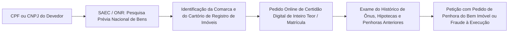

# Capítulo 17: Investigação Patrimonial: Imóveis, Veículos, Participações Societárias e Ativos Intangíveis

## 1. O Conceito de Patrimônio Executável na Prática

Na dogmática do Direito Processual Civil (CPC, art. 789), o devedor responde com todos os seus bens presentes e futuros para o cumprimento de suas obrigações, salvo as restrições expressamente estabelecidas em lei (impenhorabilidades).

Contudo, a execução patrimonial moderna deparou-se com a sofisticação das estratégias de blindagem: devedores profissionais raramente mantêm saldos elevados em contas correntes sujeitas ao "bloqueio teimosinha" do SISBAJUD. O patrimônio real reside em **imóveis, participações em sociedades lucrativas, marcas registradas, frotas veiculares e créditos a receber de terceiros**.

A investigação patrimonial em fontes abertas busca mapear esses ativos antes que o devedor tome ciência da execução e promova a sua alienação fraudulenta.

---

## 2. Rastreamento Imobiliário Unificado: O Sistema ONR / SAEC

No Brasil, a propriedade imobiliária só se transfere mediante o registro formal do título translativo no Cartório de Registro de Imóveis competente (art. 1.245 do Código Civil).

Com a consolidação do **Operador Nacional do Sistema de Registro de Imóveis (ONR)** e sua plataforma centralizada — o **Serviço de Atendimento Eletrônico Compartilhado (SAEC)** em `registradores.onr.org.br` —, o advogado não precisa mais enviar ofícios a centenas de cartórios individuais:

### O Que Analisar na Certidão de Matrícula Imobiliária:
- **Descrição do Imóvel**: Área total, confrontações e benfeitorias construídas (para evitar alegar impenhorabilidade de bem de família se houver desmembramento ou imóveis múltiplos);
- **Registros (R.)**: Histórico de alienações, compras e vendas, doações e partilhas;
- **Averbações (Av.)**: Existência de penhoras judiciais pretéritas, usufrutos vitalícios, cláusulas de inalienabilidade ou averbações premonitórias (CPC, art. 828).

---

## 3. Rastreamento de Veículos e Ativos Especiais

### 3.1. Veículos Automotores Terrestres
A consulta nos portais dos DETRANs estaduais com base na placa e RENAVAM permite verificar o município de registro, ano de fabricação, multas e restrições financeiras (alienação fiduciária em garantia).
- *Dica Operacional*: Quando o veículo está alienado fiduciariamente a um banco, o devedor não é proprietário pleno, mas detém os **direitos aquisitivos decorrentes do contrato de financiamento**, os quais são plenamente penhoráveis em juízo (CPC, art. 835, XII).

### 3.2. Aeronaves Civis (Registro Aeronáutico Brasileiro - RAB / ANAC)
A Agência Nacional de Aviação Civil disponibiliza consulta aberta e irrestrita em seu portal (`sistemas.anac.gov.br/aeronaves/cons_rab.asp`). 
- A busca por CPF, CNPJ ou Nome revela a propriedade de aeronaves executivas, helicópteros e aviões agrícolas, indicando o proprietário formal e o operador da aeronave.

### 3.3. Embarcações Náuticas (Marinha do Brasil / Capitania dos Portos)
Iates, lanchas e veleiros de alto padrão são cadastrados no Sistema de Embarcações (SisEmb) das Capitanias dos Portos. Embora o sistema não seja 100% aberto na web, o advogado pode comprovar a posse direta por fotos em marinas privadas e requerer ofício judicial específico à capitania competente.

---

## 4. Penhora de Cotas Sociais e Ativos Intangíveis

### 4.1. Penhora de Cotas de Sociedades Limitadas (CPC, Art. 861)
Mesmo que o devedor não possua imóveis, ele pode ser sócio titular de 50% de uma sociedade limitada comercial em plena atividade.
- O CPC autoriza expressamente a penhora das cotas sociais do devedor. De posse da Certidão da Junta Comercial comprovando a titularidade das quotas, o credor requer a penhora, intimando a sociedade para não repassar lucros e dividendos ao sócio e apresentando balanço especial de apuração de haveres.

### 4.2. Penhora de Marcas e Patentes Registradas no INPI
Marcas comerciais famosas possuem valor econômico autônomo apreciável. A consulta ao portal do Instituto Nacional da Propriedade Industrial (**INPI** - `inpi.gov.br`) por Nome ou CNPJ lista todas as marcas registradas em nome do alvo.
- *Aplicação Forense*: Requeira a penhora da marca registrada e de eventuais royalties de licenciamento, ou a sua adjudicação e leilão judicial para satisfação do débito.

---

## 5. Boxes Didáticos do Capítulo

> [!TIP]
> ### 🇧🇷 Fonte Brasileira: O Sistema Nacional de Informações Territoriais (SINTER)
> Instituído pelo Decreto nº 8.764/2016 e gerenciado pela Receita Federal, o SINTER integra dados espaciais, cadastrais e registrais de imóveis urbanos e rurais de todo o país. O advogado pode consultar a interface pública e requerer em juízo o cruzamento com a base cartográfica da Receita para localizar fazendas e glebas registradas.

> [!TIP]
> ### 🔎 Pivô: Da Nota Fiscal Eletrônica à Penhora de Recebíveis
> Se a empresa devedora presta serviços contínuos a clientes de grande porte (shoppings, construtoras, redes de varejo), pesquise editais públicos e portais de notícias para identificar seus maiores clientes. Em vez de esperar pelo SISBAJUD, peça ao juiz a **expedição de ofício à empresa tomadora para que deposite judicialmente os pagamentos devidos à devedora (penhora de créditos - CPC, art. 855)**.

> [!WARNING]
> ### ⚖️ Limite Jurídico: A Proteção do Bem de Família (Lei 8.009/1990)
> Não desperdice tempo postulando a penhora do único imóvel residencial onde o devedor reside com sua família, salvo nas hipóteses taxativas de exceção legal (dívida de pensão alimentícia, financiamento do próprio bem ou débitos de IPTU/condomínio do próprio imóvel). Concentre as diligências de inteligência na localização de segundos imóveis, terrenos, imóveis de veraneio ou imóveis locados a terceiros.
