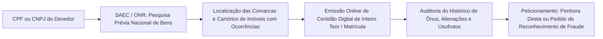

# Capítulo 17: Investigação Patrimonial: Imóveis, Veículos, Participações Societárias e Ativos Intangíveis

## 1. O Conceito de Patrimônio Executável e a Superação da Penhora Tradicional

Na dogmática do Direito Processual Civil brasileiro, a execução patrimonial é regida pelo princípio da responsabilidade patrimonial (CPC, art. 789), segundo o qual o devedor responde com todos os seus bens presentes e futuros para o cumprimento de suas obrigações, ressalvadas as restrições expressamente estatuídas em lei (hipóteses de impenhorabilidade do art. 833 do CPC e da Lei nº 8.009/1990).

Entretanto, a prática forense contemporânea deparou-se com a rápida sofisticação das práticas de blindagem: devedores profissionais e empresas insolventes raramente mantêm saldos expressivos em contas correntes passíveis de constrição imediata pelo sistema SISBAJUD. O patrimônio econômico real encontra-se descolado da titularidade bancária tradicional e estruturado em:
1. **Participações societárias em sociedades limitadas e anônimas lucrativas**;
2. **Recebíveis de cartão de crédito e fluxos contínuos de faturamento**;
3. **Imóveis registrados em comarcas diversas ou sob formas condominiais desmembradas**;
4. **Frotas de veículos e direitos aquisitivos decorrentes de contratos de alienação fiduciária**;
5. **Ativos intangíveis de elevado valor comercial, tais como marcas registradas, softwares e criptoativos**.

A investigação patrimonial em fontes abertas atua precisamente no mapeamento desse ecossistema econômico antes que o devedor, advertido pelo ajuizamento da execução, promova a dissipação fraudulenta de seus ativos.

---

## 2. Rastreamento Imobiliário Centralizado: O Ecossistema SAEC / ONR

No ordenamento jurídico brasileiro, a aquisição da propriedade imobiliária entre vivos é ato solene e constitutivo que somente se aperfeiçoa com o registro do título translativo perante o Cartório de Registro de Imóveis competente (Código Civil, art. 1.245). A posse física ou o mero contrato particular de promessa de compra e venda ("contrato de gaveta") não transferem o domínio, gerando efeitos meramente obrigacionais entre as partes.

Com a implantação do **Operador Nacional do Sistema de Registro de Imóveis (ONR)** e de seu portal unificado — o **Serviço de Atendimento Eletrônico Compartilhado (SAEC)** em `registradores.onr.org.br` —, a advocacia dispõe de acesso direto e centralizado a todos os cartórios de registro de imóveis do país:



### 2.1. Anatomia Forense da Certidão de Matrícula Imobiliária:
Ao analisar a certidão de inteiro teor do imóvel localizado, o advogado deve realizar a auditoria analítica de três camadas documentais:
- **Descrição do Imóvel no Cabeçalho**: Delimitação exata da metragem quadrada, confrontações e acessões artificiais (construções e edificações). *Utilidade Forense*: Identificar desmembramentos de fato, construções de alto padrão não averbadas na matrícula (que justificam reavaliação pericial) ou existência de unidades autônomas que descaracterizam a tese de bem de família sobre a totalidade da área.
- **Registros (R.)**: Atos translativos de domínio (compra e venda, permuta, dação em pagamento, doação e partilha de bens). Permite rastrear a cronologia exata das alienações e identificar negócios gratuitos simulados em prol de herdeiros ou holdings familiares.
- **Averbações (Av.)**: Modificações circunstanciais da matrícula e da situação jurídica do imóvel (penhoras judiciais pretéritas, servidões, usufruto vitalício, cláusulas de inalienabilidade e ajuizamento de execuções averbadas na forma do art. 828 do CPC).

---

## 3. Rastreamento de Veículos Automotores, Aeronaves e Embarcações

### 3.1. Veículos Automotores e a Penhora de Direitos Aquisitivos (CPC, Art. 835, XII)
A consulta aos sistemas integrados dos DETRANs estaduais a partir da placa do veículo e código RENAVAM permite averiguar o município de emplacamento, ano de fabricação, histórico de infrações e restrições financeiras.
- *Estratégia Processual*: Quando o veículo está gravado com cláusula de **alienação fiduciária em garantia**, a propriedade fiduciária pertence à instituição financeira credora, não podendo a penhora recair diretamente sobre o casco do automóvel. Todavia, a jurisprudência pacífica do STJ (REsp 1.884.286/SP) estabelece que a constrição judicial pode recair licitamente sobre os **direitos aquisitivos derivados do contrato de financiamento** (CPC, art. 835, XII). De posse do contrato ou do extrato de financiamento, o juiz intima o banco fiduciário para que, após a quitação do saldo devedor, o saldo remanescente ou a transferência do domínio seja vertida aos autos da execução.

### 3.2. Aeronaves Civis: O Registro Aeronáutico Brasileiro (RAB / ANAC)
A Agência Nacional de Aviação Civil (ANAC) mantém pública e irrestrita a base de dados do Registro Aeronáutico Brasileiro em seu portal eletrônico (`sistemas.anac.gov.br/aeronaves/cons_rab.asp`). A busca por nome completo, CPF ou CNPJ do proprietário ou operador revela instantaneamente a titularidade de jatos executivos, turboélices, helicópteros e aeronaves agrícolas, exibindo dados como fabricante, modelo, número de série, situação do certificado de navegabilidade e ônus reais registrados.

### 3.3. Embarcações Náuticas: Marinha do Brasil e Capitanias dos Portos
Iates, lanchas, veleiros e motos aquáticas (jet-skis) são matriculados perante as Capitanias dos Portos subordinadas à Diretoria de Portos e Costas (DPC) da Marinha do Brasil. Embora não haja uma consulta web aberta por CPF em nível nacional, o cruzamento de postagens em redes sociais geolocalizadas em marinas, fotos da proa contendo o nome e número de inscrição da embarcação e registros em clubes náuticos viabiliza a expedição de ofício judicial direcionado à Capitania competente para penhora do bem náutico.

---

## 4. Penhora de Quotas de Sociedade Limitada: O Art. 861 do CPC e o Precedente do STJ

Um dos erros mais comuns na execução é admitir a insolvência do devedor pessoa física que não possui contas bancárias ativas nem imóveis registrados em seu nome próprio, ignorando que ele é titular de expressiva participação no capital social de sociedades empresárias lucrativas.

O Código de Processo Civil prevê expressamente no art. 835, IX, a **penhora de quotas ou ações de sociedades empresárias**. Durante décadas, advogados de devedores alegaram a intangibilidade das quotas com base no princípio da *affectio societatis* (a recusa dos demais sócios em conviver com um terceiro credor estranho ao quadro societário).

Essa controvérsia foi definitivamente superada pelo Superior Tribunal de Justiça e pelo art. 861 do CPC de 2015. O STJ assentou que a *affectio societatis* não pode servir de escudo para inadimplência, estabelecendo o art. 861 um procedimento harmônico em três etapas sucessivas:
1. O juiz determina a penhora das quotas e intima a sociedade;
2. É assegurado o direito de preferência aos sócios remanescentes para aquisição das quotas penhoradas pelo valor apurado;
3. Se nenhum sócio manifestar interesse na compra e a sociedade não adquirir as quotas para mantê-las em tesouraria, procede-se à **apuração de haveres por balanço especial**, depositando a sociedade em juízo o valor em dinheiro correspondente à quota liquidada.

---

## 5. Penhora sobre o Faturamento da Empresa e Bloqueio de Recebíveis: O Tema Repetitivo 769 do STJ

Quando o devedor é uma pessoa jurídica em funcionamento que frustra as ordens de bloqueio do SISBAJUD mediante a utilização de contas bancárias secundárias ou esvaziamento diário de caixas, a via executiva adequada é a **penhora sobre o faturamento** (CPC, art. 866) e o **bloqueio de recebíveis de cartão de crédito perante as adquirentes e subadquirentes (gateways de pagamento)**.

A 1ª Seção do Superior Tribunal de Justiça pacificou a matéria sob o rito dos recursos repetitivos no **Tema 769** (REsp 1.666.542/SP e REsp 1.666.543/SP, Rel. Min. Herman Benjamin), fixando balizas mandatórias para que a penhora de faturamento não comprometa a subsistência da atividade econômica.

A investigação OSINT atua como elemento probatório essencial para viabilizar o Tema 769: mediante a análise de compras-teste em sites de e-commerce da empresa, checagem do CNPJ do emissor em cupons fiscais e inspeção de maquininhas de cartão nos pontos físicos de venda, o credor identifica exatamente quais são as adquirentes (ex.: Cielo, Rede, Stone, PagSeguro, Mercado Pago) e requer a constrição judicial direta sobre os repasses devidos pelas operadoras.

---

## 6. Rastreamento e Penhora de Criptoativos e Ativos Virtuais

A popularização do Bitcoin, Ethereum, stablecoins (USDT, USDC) e outros criptoativos fez surgir um novo canal de blindagem patrimonial digital.

No ordenamento processual civil, os criptoativos ostentam a natureza jurídica de **bens móveis incorpóreos dotados de expressão econômica**, sendo plenamente passíveis de penhora com esteio no art. 835, XIII, do CPC ("outros direitos").

A atuação executiva divide-se em dois cenários técnicos:
1. **Criptoativos sob Custódia de Exchanges Nacionais**: Corretoras sediadas no Brasil (ex.: Mercado Bitcoin, Foxbit, Binance Brasil) sujeitam-se à jurisdição brasileira, à disciplina da Lei nº 14.478/2022 (Marco Legal dos Criptoativos) e às obrigações de reporte da Instrução Normativa RFB nº 1888/2019. O juiz da execução pode expedir ofício judicial determinando a localização de contas, o bloqueio do saldo e a liquidação em moeda fiduciária nacional para depósito em conta judicial.
2. **Criptoativos em Carteiras de Autocustódia (Cold Wallets / Hardwallets)**: Quando o executado mantém seus ativos em chaves privadas fora das corretoras centralizadas, a constrição técnica direta sem a chave privada é impossível pela própria arquitetura da criptografia descentralizada. Nesse caso, a demonstração por fontes abertas (declarações em redes sociais, movimentações em transações públicas na blockchain associadas à identidade do alvo) legitima o requerimento de intimação pessoal do devedor sob pena de multa diária (art. 536, § 1º, CPC), caracterização de ato atentatório à dignidade da justiça (art. 774, III, CPC) e aplicação de medidas atípicas (art. 139, IV, CPC).

---

## 7. Boxes Metodológicos e Jurisprudência Aplicada

> [!NOTE]
> ### ⚖️ Validade Jurídica e Jurisprudência: Penhora sobre Faturamento e Recebíveis de Cartão (Tema 769 do STJ)
> 
> **Ficha Técnica do Precedente:**
> - **Tribunal**: Superior Tribunal de Justiça (STJ) - 1ª Seção
> - **Recurso**: REsp 1.666.542/SP e REsp 1.666.543/SP - Tema 769 dos Recursos Repetitivos
> - **Relator**: Ministro Herman Benjamin
> - **Data de Julgamento**: 09/12/2020 | Publicação no DJe: 04/02/2021
> - **Tese Fixada (STJ - Tema 769)**:
>   > *"A penhora sobre o faturamento é medida excepcional, que depende do preenchimento concomitante dos seguintes requisitos: (i) inexistência de bens penhoráveis ou, se existentes, forem de difícil liquidação; (ii) nomeação de administrador-depositário, que deverá apresentar a forma de administração e o plano de pagamento; e (iii) fixação de percentual que não inviabilize a continuidade das atividades da empresa."*
> 
> **Modelo de Parágrafo para Petição (Bloqueio de Recebíveis em Operadoras de Maquininha):**
> ```text
> "Restando negativas as tentativas de constrição via SISBAJUD e não tendo o devedor indicado bens à penhora, comprova o exequente, através do relatório operacional de inteligência em anexo, que a pessoa jurídica executada permanece em plena operação comercial, auferindo receitas substanciais mediante pagamentos por cartão de débito e crédito intermediados pelas adquirentes Stone Pagamentos e Mercado Pago (conforme comprovam os cupons fiscais e notas de compra acostadas, EVD-001 a EVD-003). Demonstrada a frustração dos meios típicos e a manutenção da higidez operacional da empresa, requer-se, com fundamento no art. 866 do CPC e na tese vinculante do Tema Repetitivo 769 do STJ (REsp 1.666.542/SP), a expedição urgente de ofício às adquirentes supra para que procedam à penhora e retenção de 10% (dez por cento) do faturamento bruto liquidado em favor da devedora, depositando os respectivos valores em conta judicial vinculada a este juízo, nomeando-se o representante legal da executada como depositário dos valores retidos."
> ```

> [!NOTE]
> ### ⚖️ Validade Jurídica e Jurisprudência: Penhora de Quotas Sociais de Sociedade Limitada (STJ e CPC, Art. 861)
> 
> **Ficha Técnica do Precedente:**
> - **Tribunal**: Superior Tribunal de Justiça (STJ) - 3ª Turma
> - **Recurso**: REsp 1.877.339/SP
> - **Relator**: Ministro Ricardo Villas Bôas Cueva
> - **Data de Julgamento**: 24/08/2021 | Publicação no DJe: 31/08/2021
> - **Ementa Síntese**: O princípio da *affectio societatis* não é oponível à satisfação de dívida particular de sócio. É legítima a penhora das quotas sociais pertencentes ao executado em sociedade limitada, devendo o juízo observar o rito procedimental estabelecido no art. 861 do Código de Processo Civil de 2015, assegurando aos demais sócios e à sociedade o direito de preferência e, em não havendo manifestação de interesse, determinando a liquidação das quotas mediante balanço especial de apuração de haveres.
> 
> **Modelo de Parágrafo para Petição:**
> ```text
> "Instruída a presente manifestação com a Certidão de Inteiro Teor expedida pela Junta Comercial do Estado de São Paulo (JUCESP), verifica-se que o executado é titular de 50.000 quotas sociais da sociedade Delta Serviços Médicos Ltda., correspondentes a 50% de seu capital social subscrito e integralizado. Conforme assentado pela 3ª Turma do STJ no REsp 1.877.339/SP e expressamente positivado no art. 861 do CPC, a affectio societatis não impede a penhora de quotas por dívida pessoal do titular. Requer-se a decretação de penhora sobre a totalidade das quotas sociais do executado, intimando-se a sociedade e os demais sócios no endereço contratual para que exerçam o direito de preferência ou procedam à apuração de haveres por balanço especial com depósito do valor liquidado perante este juízo."
> ```

> [!TIP]
> ### 🔎 Pivô: Da Marca no INPI à Penhora de Royalties e Adjudicação Comercial
> Se a empresa executada não possui bens tangíveis em seu nome, pesquise o nome comercial ou denominação fantasia na base pública do Instituto Nacional da Propriedade Industrial (**INPI** - `inpi.gov.br`). O registro de uma marca confere exclusividade e possui valor econômico autônomo apreciável (CPC, art. 835, XIII). Uma vez penhorada a marca, o credor pode requerer o arresto de royalties pagos por franqueados ou a sua adjudicação judicial e leilão.

> [!TIP]
> ### 🇧🇷 Fonte Brasileira: O Sistema Nacional de Informações Territoriais (SINTER)
> Instituído pelo Decreto nº 8.764/2016 e sob coordenação da Secretaria da Receita Federal, o SINTER integra cadastros fundiários, fiscais e geoespaciais de imóveis rurais e urbanos de todo o país. A base permite correlacionar o Cadastro Nacional de Imóveis Rurais (CNIR) e o Cadastro Ambiental Rural (CAR), possibilitando identificar glebas, fazendas e propriedades rurais que constam nos órgãos ambientais mas que ainda não foram regularizadas nos cartórios de imóveis tradicionais.

> [!WARNING]
> ### ⚖️ Limite Jurídico: A Proteção do Bem de Família (Lei 8.009/1990) e suas Exceções
> A impenhorabilidade do bem de família instituída pela Lei nº 8.009/1990 é matéria de ordem pública cognoscível de ofício, mas encontra exceções legais rígidas no seu art. 3º: débitos decorrentes do próprio financiamento imobiliário, débitos de IPTU ou taxa condominial do próprio bem, e execução de dívida de pensão alimentícia. Não disperse recursos investigativos tentando penhorar o único imóvel residencial modesto do devedor em execuções de dívidas comuns; direcione o esforço para imóveis locados a terceiros, terrenos baldios, casas de campo ou bens adquiridos em fraude manifesta.
