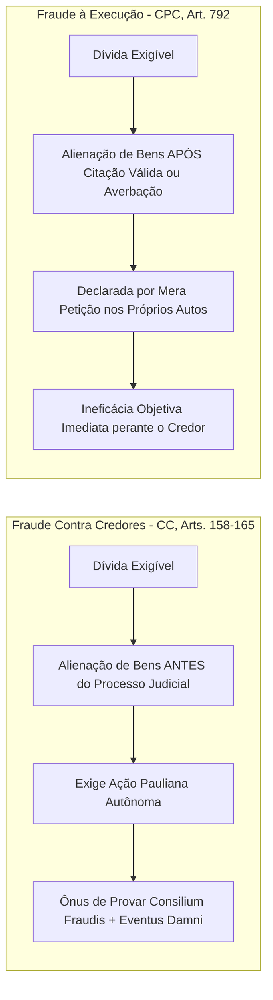

# Capítulo 18: Desvendando a Ocultação Patrimonial: Laranjas, Grupos de Fachada e Sucessão Fraudulenta

## 1. A Fronteira entre Planejamento Patrimonial Lícito e Fraude

O planejamento patrimonial e sucessório é uma prática jurídica legítima amparada pela ordem constitucional e societária brasileira. Famílias e empresários possuem a faculdade de organizar seus ativos em holdings patrimoniais, estruturar doações em adiantamento de legítima e estipular governança corporativa visando a eficiência tributária e a prevenção de litígios hereditários.

Contudo, a fronteira entre a estruturação lícita e a **ocultação patrimonial fraudulenta** é demarcada por um elemento temporal e objetivo claríssimo: **a existência de passivo exigível prévio e a redução proposital do devedor ao estado de insolvência**.

Quando a transferência de bens é operada com o propósito exclusivo de frustrar credores e esvaziar a garantia de execuções futuras, a ordem jurídica reage com a nulidade ou ineficácia dos atos praticados (art. 158 do Código Civil e art. 792 do CPC).

---

## 2. Fraude Contra Credores vs. Fraude à Execução

A correta qualificação da fraude dita o remédio processual cabível:

---

## 3. As Quatro Tipologias Clássicas de Blindagem Fraudulenta no Brasil

### 3.1. A Doação com Reserva de Usufruto para Descendentes
O devedor transfere a nua-propriedade de todos os seus imóveis para os filhos (muitas vezes menores de idade ou recém-emancipados), gravando os bens com cláusulas de incomunicabilidade, impenhorabilidade e reserva de usufruto vitalício em seu favor.
- *Desfazimento Probatório*: Demonstre na matrícula que a doação foi realizada a título gratuito após a constituição do título executivo. Tratando-se de negócio gratuito, a fraude dispensa a prova de conluio subjetivo (*consilium fraudis*), bastando a comprovação de que o ato reduziu o devedor à insolvência (art. 158 do CC).

### 3.2. O Divórcio Simulado com Partilha Desigual de Bens
O casal, diante do avanço de execuções contra o cônjuge empresário, ajuíza divórcio consensual ou lavra escritura pública de partilha onde **100% dos bens imóveis e investimentos livres são atribuídos com exclusividade ao cônjuge virago**, enquanto o devedor fica unicamente com as cotas de empresas insolventes ou dívidas impagáveis.
- *Desfazimento Probatório*: A jurisprudência consolidada do STJ proclama a nulidade da partilha fraudulenta quando evidente o propósito de blindagem familiar, autorizando a penhora da meação atribuída ao outro cônjuge (STJ, REsp 1.745.312/SP). Prove em redes sociais que o casal continua coabitando e mantendo vida conjugal ostensiva após o suposto divórcio.

### 3.3. A Interposição Fraudulenta de Pessoa ("Laranja")
Inserção de parentes distantes, secretárias, motoristas ou empregados subalternos como titulares formais de cotas sociais ou proprietários de veículos de alto luxo utilizados privativamente pelo devedor.
- *Desfazimento Probatório*: Confronte a renda real e o padrão de vida do titular formal (beneficiários de programas sociais, moradia em bairros periféricos) com o valor milionário do ativo registrado em seu nome.

### 3.4. A Sucessão Empresarial Fraudulenta de Fato
A empresa A (endividada) encerra faticamente suas operações sem quitação do passivo e, no mesmo endereço ou galpão, surge a empresa B, com nova razão social, novo CNPJ, mas operando com o mesmo maquinário, mesmos clientes, mesmos telefones e mesmo corpo gerencial.
- *Desfazimento Probatório*: Reúna fotografias do local, notas fiscais, depoimentos em processos trabalhistas e registros de DNS comprovando a continuidade da atividade econômica (Súmula 435 do STJ e art. 133 do CTN).

---

## 4. Boxes Didáticos do Capítulo

> [!IMPORTANT]
> ### 🚩 Sinal de Atenção: A Criação da Holding no Trimestre da Sentença
> Ao consultar o histórico na Junta Comercial, verifique a data de constituição da holding patrimonial da família. Se a holding foi aberta exatamente no intervalo entre a prolação da sentença condenatória e o início do cumprimento de sentença, há **presunção veemente de blindagem intencional de ativos**, autorizando a instauração de incidente de desconsideração da personalidade jurídica (art. 133 do CPC).

> [!CAUTION]
> ### ⚠️ Não Conclua Ainda: Doação Lícita vs. Doação Inoficiosa
> Pais podem fazer doações de bens para filhos, desde que a doação não exceda a parte disponível da herança (art. 549 do CC) e que o doador reserve bens suficientes para a sua subsistência e pagamento de suas dívidas conhecidas. A fraude só se caracteriza se, ao doar, o patrimônio remanescente for insuficiente para saldar a execução em curso.

> [!WARNING]
> ### ⚖️ Limite Jurídico: A Súmula 375 do STJ e a Boa-Fé do Terceiro Adquirente
> A Súmula 375 do Superior Tribunal de Justiça enuncia: *"O reconhecimento da fraude à execução depende do registro da penhora do bem alienado ou da prova de má-fé do terceiro adquirente"*. Para anular a venda de imóvel feita a terceiro estranho à lide, o credor deve provar que averbou a certidão da execução na matrícula (CPC, art. 828) ou que o comprador dispensou expressamente as certidões cíveis e de protesto de praxe, assumindo o risco da evicção.
