# Capítulo 18: Desvendando a Ocultação Patrimonial: Laranjas, Grupos de Fachada e Sucessão Fraudulenta

## 1. A Fronteira Jurídica entre Planejamento Patrimonial Lícito e Fraude

O planejamento patrimonial, tributário e sucessório é uma prática jurídica plenamente legítima, amparada pela ordem constitucional da livre iniciativa (CF, art. 170) e pela liberdade contratual e de estruturação corporativa (Lei nº 13.874/2019 - Declaração de Direitos de Liberdade Econômica). Famílias e grupos empresariais dispõem da faculdade de organizar seus ativos imobiliários e societários em sociedades *holding*, disciplinar a governança através de acordos de sócios e realizar doações com adiantamento de legítima, com o propósito de mitigar custos fiscais e prevenir disputas sucessórias.

Contudo, a fronteira entre a estruturação preventiva lícita e a **ocultação patrimonial fraudulenta** é demarcada por um critério temporal, teleológico e fático inequívoco: **a preexistência de obrigações inadimplidas ou litígios em curso e a redução intencional do devedor ao estado de insolvência real ou aparente**.

Quando atos de alienação, doação, integralização ou reorganização societária são praticados com o desígnio de esvaziar a garantia genérica dos credores e frustrar a satisfação forçada do crédito, o ordenamento jurídico sanciona a conduta com a nulidade do ato ou a sua **ineficácia relativa perante o credor exequente** (Código Civil, arts. 158 a 165, e Código de Processo Civil, arts. 790, 792 e 831).

---

## 2. Fraude Contra Credores vs. Fraude à Execução: Distinções Dogmáticas e Consequências Processuais

A correta identificação da espécie de fraude delimita o remédio processual cabível e o respectivo ônus probatório:

```mermaid
flowchart TD
    subgraph Fraude_Contra_Credores [Fraude Contra Credores - CC, Arts. 158 a 165]
        A1[Dívida Exigível Preexistente] --> B1[Alienação de Bens Ocorrida ANTES da Demanda Judicial]
        B1 --> C1[Exigência de Ação Anulatória Autônoma: Ação Pauliana]
        C1 --> D1[Necessidade de Provar o Consilium Fraudis conluio e o Eventus Damni insolvência]
        D1 --> E1[Sentença Desconstitutiva Anula o Negócio Jurídico]
    end
    
    subgraph Fraude_a_Execucao [Fraude à Execução - CPC, Art. 792]
        A2[Ação Condenatória ou Execução em Curso] --> B2[Alienação de Bens APÓS Citação Válida ou Averbação Premonitória]
        B2 --> C2[Requerimento por Mera Petição nos Próprios Autos da Execução]
        C2 --> D2[Aplicação da Súmula 375 do STJ e Tema Repetitivo 243]
        D2 --> E2[Decisão Interlocutória Declara a Ineficácia Relativa do Negócio]
    end
```



### 2.1. O Princípio da Ineficácia Relativa na Fraude à Execução
Enquanto a fraude contra credores atenta primariamente contra o interesse privado do credor (gerando a anulação do ato via Ação Pauliana), a **fraude à execução atenta contra a própria dignidade da jurisdição e a autoridade do Poder Judiciário** (art. 774, I, do CPC). Por essa razão, a alienação operada em fraude à execução é válida entre os contratantes, mas é **absolutamente ineficaz perante o credor exequente**, permitindo que o oficial de justiça penhore o bem diretamente em mãos do terceiro adquirente, como se a alienação jamais houvesse ocorrido.

---

## 3. A Súmula 375 do STJ e o Tema Repetitivo 243: A Prova da Má-Fé via OSINT

Durante anos, discutiu-se nos tribunais pátrios se a caracterização da fraude à execução exigiria ou não a comprovação de que o terceiro adquirente tinha ciência da existência do processo contra o alienante.

A matéria foi pacificada pela Corte Especial do Superior Tribunal de Justiça mediante a edição da **Súmula 375**:
> *"O reconhecimento da fraude à execução depende do registro da penhora do bem alienado ou da prova de má-fé do terceiro adquirente."*

Ao julgar o **Tema Repetitivo 243** (REsp 956.943/PR, Rel. p/ acórdão Min. João Otávio de Noronha), o STJ firmou duas diretrizes estruturantes:
1. **Presunção Absoluta de Fraude**: Se o credor providenciou a averbação premonitória da execução na matrícula do imóvel (CPC, art. 828) ou o registro formal da penhora (CPC, art. 844), milita em seu favor a presunção absoluta de fraude, tornando irrelevante qualquer discussão sobre a boa ou má-fé do adquirente;
2. **Ônus Probatório da Má-Fé**: Na ausência de registro da penhora ou averbação premonitória, **o ônus de provar a má-fé do terceiro adquirente recai integralmente sobre o credor exequente**.

É exatamente no cumprimento desse encargo probatório que as técnicas de inteligência em fontes abertas (OSINT) revelam sua máxima potência prática. O credor não precisa de confissão formal do adquirente; o STJ admite expressamente a **prova indiciária consistente e concatenada de má-fé**, a qual é produzida via OSINT através de quatro vetores:
- **Demonstração de Vínculo de Parentesco Oculto**: Cruzamento genealógico em redes sociais, inventários e obituários provando que o adquirente é cunhado, genro, sobrinho ou companheiro em união estável não formalizada do devedor;
- **Demonstração de Relação Societária ou Empregatícia**: Comprovação de que o adquirente era funcionário subalterno, procurador formal ou sócio minoritário em outras empresas controladas pelo devedor;
- **Preço Vil ou Simulação de Pagamento**: Comparação do valor constante na escritura com o valor venal de referência fiscal (ITBI) e anúncios de mercado na mesma rua, revelando subfaturamento artificial;
- **Dispensa Expressa de Certidões Forenses Obrigatórias**: Demonstração de que o adquirente, na escritura pública de compra e venda, dispensou voluntariamente a apresentação das certidões de distribuição de ações cíveis e de protesto da comarca do domicílio do vendedor, assumindo conscientemente o risco deliberado da evicção e afastando a presunção de boa-fé objetiva.

---

## 4. As Quatro Tipologias Clássicas de Ocultação Patrimonial no Brasil

### 4.1. Doação com Reserva de Usufruto para Herdeiros e Fraude Objetiva
O devedor transfere a nua-propriedade de todo o seu acervo imobiliário para os filhos (frequentemente menores impúberes ou jovens estudantes), gravando os bens com cláusula de inalienabilidade, incomunicabilidade e reserva de usufruto vitalício em seu favor.
- *Desfazimento Probatório*: Tratando-se de negócio jurídico a título **gratuito** (doação pura e simples), a jurisprudência pacífica do STJ e o art. 158 do Código Civil **dispensam a prova de má-fé ou conluio subjetivo (consilium fraudis)**. Basta demonstrar a anterioridade da dívida e que a doação reduziu o devedor à insolvência, autorizando a anulação imediata do ato ou a sua declaração de ineficácia nos próprios autos da execução.

### 4.2. Divórcio Simulado com Partilha Fraudulenta de Bens
Diante do acúmulo de cobranças e execuções fiscais ou bancárias, o devedor ajuíza divórcio consensual ou lavra escritura pública de dissolução de sociedade conjugal, estabelecendo uma partilha manifestamente desigual: **100% dos bens imóveis livres, veículos de alto luxo e investimentos financeiros são atribuídos com exclusividade ao cônjuge**, enquanto o devedor fica unicamente com empresas endividadas ou obrigações pecuniárias.
- *Desfazimento Probatório*: O Superior Tribunal de Justiça proclama a ineficácia e nulidade da partilha quando evidente a finalidade de blindagem patrimonial (STJ, REsp 1.745.312/SP). O relatório OSINT comprova por publicações geolocalizadas em redes sociais, compras conjuntas e registros em portarias de condomínios que o casal permanece em plena coabitação e vida conjugal aparente após o suposto divórcio, desmontando a fraude fática.

### 4.3. Interposição Fraudulenta de Pessoas Físicas ("Laranjas")
Utilização de familiares idosos, ex-empregados, motoristas ou secretárias como sócios nominais ou titulares formais de imóveis e automóveis de alto luxo utilizados privativamente pelo devedor.
- *Desfazimento Probatório*: Confrontar o perfil socioeconômico real do titular formal (beneficiário de auxílios assistenciais governamentais, ausência de declaração de IRPF, residência em bairros periféricos) com a capacidade financeira necessária para adquirir patrimônio multimilionário, demonstrando a interposição fraudulenta.

### 4.4. Sucessão Empresarial Fraudulenta de Fato e Confusão Operacional
A empresa A (endividada) cessa formalmente suas operações sem quitar o passivo trabalhista e tributário. Simultaneamente, no mesmo endereço ou galpão, surge a empresa B, com novo CNPJ e nova razão social, mas mantendo o mesmo parque industrial, os mesmos empregados, a mesma clientela, as mesmas marcas e o mesmo controle gerencial de fato.
- *Desfazimento Probatório*: Reunir registros fotográficos comparativos da fachada, notas fiscais de clientes idênticos, registros de domínio na internet (mesmo titular no Registro.br ou servidores DNS idênticos) e certidões de processos trabalhistas onde testemunhas confirmam que nunca houve descontinuidade do trabalho (Súmula 435 do STJ e art. 133 do CTN).

---

## 5. Incidente de Desconsideração da Personalidade Jurídica (IDPJ): O Art. 50 do Código Civil após a Lei 13.874/2019

A disciplina da desconsideração da personalidade jurídica no direito comum brasileiro sofreu profunda reformulação com a promulgação da **Lei da Liberdade Econômica (Lei nº 13.874/2019)**, que conferiu nova redação ao art. 50 do Código Civil.

O STJ (REsp 1.729.554/SP, 4ª Turma, Rel. Min. Luis Felipe Salomão; REsp 1.860.334/SP) reiterou que o sistema brasileiro adota, como regra geral no direito civil e empresarial, a **Teoria Maior da Desconsideração**, repelindo expressamente a aplicação analógica da Teoria Menor do Código de Defesa do Consumidor (art. 28, § 5º, CDC) às relações interempresariais e civis comuns.

Dessa forma, a mera inexistência de bens penhoráveis ou o encerramento irregular da sociedade **não autorizam, por si sós, a desconsideração da personalidade jurídica**. É imprescindível a demonstração cabal de:
1. **Desvio de Finalidade** (art. 50, § 1º, CC): a utilização dolosa da pessoa jurídica com o propósito manifesto de lesar credores ou praticar atos ilícitos; ou
2. **Confusão Patrimonial** (art. 50, § 2º, CC): caracterizada pelo cumprimento reiterado pela sociedade de obrigações do sócio (ou vice-versa), transferência de ativos sem efetiva contraprestação ou esvaziamento patrimonial entre sociedades coligadas.

O relatório OSINT é o instrumento que viabiliza o preenchimento dos pressupostos estritos da Lei 13.874/2019: a elaboração de grafos de relacionamento societário, a comprovação de sedes compartilhadas, o uso de funcionários em comum e o compartilhamento de marcas e websites provam a ocorrência de confusão patrimonial e grupo econômico fraudulento de fato.

---

## 6. Boxes Metodológicos e Jurisprudência Aplicada

> [!NOTE]
> ### ⚖️ Validade Jurídica e Jurisprudência: Fraude à Execução e Súmula 375 do STJ (Tema Repetitivo 243)
> 
> **Ficha Técnica do Precedente:**
> - **Tribunal**: Superior Tribunal de Justiça (STJ) - Corte Especial
> - **Recurso**: REsp 956.943/PR - Tema 243 dos Recursos Repetitivos
> - **Relatora Originária**: Min. Nancy Andrighi | Relator p/ Acórdão: Min. João Otávio de Noronha
> - **Data de Julgamento**: 20/08/2014 | Publicação no DJe: 01/12/2014
> - **Tese Fixada (STJ - Tema 243 / Súmula 375)**:
>   > *"O reconhecimento da fraude à execução depende do registro da penhora do bem alienado ou da prova de má-fé do terceiro adquirente (Súmula n. 375/STJ). A presunção de boa-fé do adquirente é princípio geral de direito admitido em nosso ordenamento, cabendo ao credor o ônus de provar que o terceiro tinha ciência da demanda contra o alienante capaz de reduzi-lo à insolvência."*
> 
> **Modelo de Parágrafo para Petição (Comprovação da Má-Fé com Dossiê OSINT):**
> ```text
> "Não obstante a ausência de averbação premonitória prévia na matrícula do imóvel nº 84.120 do 2º RGI, afasta-se de forma inequívoca a presunção de boa-fé do adquirente nos termos da Súmula 375 e do Tema Repetitivo 243 do STJ (REsp 956.943/PR). Restou cabalmente demonstrado pelo relatório investigativo em anexo (EVD-001 a EVD-005) que o terceiro adquirente é sobrinho carnal do executado e atua como seu procurador formal na sociedade Delta Participações. Ademais, conforme certidão lavrada na própria escritura pública de compra e venda, o adquirente dispensou expressamente a apresentação das certidões negativas de feitos ajuizados na comarca do domicílio do alienante, adquirindo o bem por valor equivalente a apenas 30% da avaliação fiscal do ITBI contemporâneo. Evidenciada a ciência prévia da insolvência e a má-fé subjetiva dos partícipes, requer-se o reconhecimento da fraude à execução com esteio no art. 792, IV, do CPC, declarando-se a ineficácia da alienação perante o credor exequente e determinando-se a imediata penhora do imóvel."
> ```

> [!NOTE]
> ### ⚖️ Validade Jurídica e Jurisprudência: Desconsideração da Personalidade Jurídica e Lei 13.874/2019
> 
> **Ficha Técnica do Precedente:**
> - **Tribunal**: Superior Tribunal de Justiça (STJ) - 4ª Turma
> - **Recurso**: REsp 1.729.554/SP
> - **Relator**: Ministro Luis Felipe Salomão
> - **Data de Julgamento**: 08/05/2018 | Publicação no DJe: 12/06/2018
> - **Ementa Síntese**: A teoria maior da desconsideração da personalidade jurídica, encampada pelo art. 50 do Código Civil, exige a comprovação inequívoca do desvio de finalidade ou da confusão patrimonial, sendo insuficiente a mera insolvência da pessoa jurídica ou a ausência de bens penhoráveis. A existência de grupo econômico de fato, com identidade de sócios, confusão de sedes e desvio coordenado de faturamento, configura confusão patrimonial apta a legitimar a extensão dos efeitos da execução aos patrimônios das coligadas e administradores.
> 
> **Modelo de Parágrafo para Petição (Instauração de IDPJ):**
> ```text
> "Com fundamento nos arts. 133 a 137 do CPC e no art. 50, § 2º, do Código Civil (com a redação dada pela Lei nº 13.874/2019), requer-se a instauração do Incidente de Desconsideração da Personalidade Jurídica. Conforme demonstra o diagrama relacional e as fichas da Junta Comercial acostadas ao relatório de inteligência forense, a empresa executada teve seu faturamento completamente esvaziado enquanto a sociedade coligada Alpha Logística Ltda., constituída pelos mesmos sócios e sediada no mesmo galpão industrial, passou a receber os créditos e a emitir faturas para a carteira de clientes originária. Demonstrada a confusão patrimonial objetiva e o desvio coordenado de finalidade econômica nos termos estritos firmados pelo STJ no REsp 1.729.554/SP, requer-se a citação da empresa coligada e dos sócios controladores para que integrem o polo passivo da execução, respondendo seus patrimônios pessoais pela totalidade do crédito exequendo."
> ```

> [!IMPORTANT]
> ### 🚩 Sinal de Atenção: A Constituição da Holding no Trimestre da Sentença Condenatória
> Ao examinar o histórico societário na Junta Comercial, confronte a data de constituição da holding patrimonial com a linha do tempo do processo de conhecimento. Se a holding foi aberta exatamente no intervalo entre a prolação da sentença condenatória e o trânsito em julgado, com a imediata integralização de capital social mediante transferência de todos os imóveis da família, há **presunção veemente de fraude à execução** (CPC, art. 792, IV, e STJ, REsp 1.879.467/SP), justificando a penhora incidental direta dos bens integralizados.

> [!CAUTION]
> ### ⚠️ Não Conclua Ainda: Doação Lícita em Vida vs. Doação em Fraude
> Pais e mães têm a faculdade de doar bens aos descendentes como adiantamento de legítima (CC, art. 544), desde que respeitada a fração indisponível dos herdeiros necessários (CC, art. 549) e mantidos bens suficientes para o adimplemento de suas obrigações preexistentes. A fraude só se aperfeiçoa se o acervo patrimonial remanescente sob a titularidade do doador for insuficiente para satisfazer os débitos em cobrança.

> [!IMPORTANT]
> ### 🛑 Onde OSINT Para e Entra a Medida Judicial: Quebra de Sigilo Bancário e Fiscal via SISBAJUD / SNIPER
> A investigação em fontes abertas atinge seu limite ao demonstrar a existência da confusão operacional e a interposição de sócios laranjas. Contudo, a prova cabal do fluxo financeiro interno (transferências bancárias entre contas de pessoas físicas e jurídicas do grupo) depende da tutela jurisdicional. Uma vez admitido o IDPJ com base nos indícios de OSINT, requeira a utilização do módulo **SIMBA / CCS (Cadastro de Clientes do Sistema Financeiro Nacional)** e do **SNIPER** para mapear a movimentação bancária cruzada entre os investigados.
