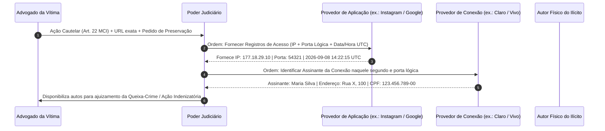

# Capítulo 20: Ilícitos Cibernéticos e Crimes Contra a Honra: Atribuição OSINT vs. Requisitos Judiciais do Marco Civil

## 1. A Ilusão do Anonimato e os Desafios da Persecução Digital

A disseminação de perfis apócrifos (*fakes*) e o uso de redes sociais e mensageiros instantâneos para a prática de crimes contra a honra (calúnia, difamação, injúria - arts. 138 a 140 do CP), perseguição continuada (*stalking* - art. 147-A do CP) e concorrência desleal (Lei nº 9.279/96) fomentam a falsa crença de que a internet brasileira opera em regime de anonimato absoluto.

Para a advocacia de vítimas de ilícitos cibernéticos, o maior perigo reside na precipitação investigativa: apontar a autoria de uma infração com esteio exclusivo em indícios preliminares coligidos em fontes abertas (como a semelhança de pseudônimos, fotografias genéricas de banco de imagens ou final de número de telefone celular em cadastros de recuperação) expõe o constituinte e o próprio advogado a graves repercussões jurídicas, tais como **ações de indenização por danos morais e persecução penal por denunciação caluniosa (art. 339 do CP)**.

A atuação jurídica estratégica e ética exige a integração metódica entre duas fases complementares e inconfundíveis:
1. **Fase Extrajudicial (OSINT)**: Coleta técnica imediata e preservação da materialidade do ilícito (URLs, metadados, espelhamentos, código-fonte e hashes de integridade), servindo para subsidiar a elaboração de hipóteses investigativas sólidas;
2. **Fase Judicial Coercitiva (Marco Civil da Internet)**: Instauração de procedimento jurisdicional sob a égide da Lei nº 12.965/2014 para a quebra legal de sigilo telemático, obtenção dos registros de acesso e requisição pericial do assinante perante as concessionárias de telecomunicações.

---

## 2. O Regime Jurídico de Guarda e Sigilo no Marco Civil da Internet

A Constituição Federal de 1988 veda terminantemente o anonimato (art. 5º, IV) e tutela a inviolabilidade da intimidade, da vida privada e do sigilo das comunicações (art. 5º, X e XII). O Marco Civil da Internet (Lei nº 12.965/2014) positivou a arquitetura jurídica de salvaguarda desses valores, estruturando regras claras para os agentes de rede:

- **Art. 10**: Consagra a **inviolabilidade e o sigilo do fluxo das comunicações pela internet** e dos registros de conexão e de acesso a aplicações. A disponibilização desses registros somente pode ocorrer mediante **expressa ordem judicial**, sob pena de responsabilização civil, criminal e administrativa dos provedores;
- **Art. 15**: Impõe aos provedores de aplicação de internet (redes sociais, plataformas de e-mail, mensageiros) o **dever legal de guarda dos registros de acesso pelo prazo mínimo de 6 (seis) meses**, em ambiente controlado e sob rigoroso sigilo. Além disso, o **art. 15, § 3º**, disciplina a **tutela cautelar de preservação prévia**: havendo iminência de decurso do prazo semestral, a parte juridicamente interessada ou autoridade competente pode postular ao juízo a ordem cautelar imediata de congelamento dos logs, evitando o perecimento probatório definitivo;
- **Distinção Dogmática entre Dados Cadastrais e Registros Telemáticos (STJ REsp 1.566.444/SP)**: A 3ª Turma do Superior Tribunal de Justiça (Rel. Min. Moura Ribeiro, j. 08/03/2016, DJe 15/03/2016) demarcou a fronteira jurídica entre os dados meramente cadastrais do usuário e os registros telemáticos de navegação. Enquanto os **dados cadastrais** (nome completo, estado civil, filiação, endereço residencial e CPF) qualificam a pessoa na vida civil e não demandam reserva absoluta de jurisdição probatória quando regulamentados em legislação setorial específica, os **registros de conexão e de acesso a aplicações** (IPs, portas lógicas, datas e horários de tráfego) refletem a privacidade e a intimidade comportamental do usuário, exigindo **estrita e fundamentada ordem judicial para sua quebra**, nos termos dos arts. 10 e 22 do Marco Civil.

O fluxo de individualização do ofensor cibernético estrutura-se no seguinte procedimento bifásico:



---

## 3. Os Requisitos Legais Inegociáveis do Pedido Judicial (Art. 22 do MCI)

Para coibir aventuras processuais e buscas indiscriminadas de dados informáticos (*fishing expeditions*), o art. 22, parágrafo único, do Marco Civil da Internet estipula três pressupostos cumulativos que vinculam a admissibilidade da ordem judicial de exibição de registros:

1. **Fundados Indícios da Ocorrência do Ilícito (Inciso I)**: O requerente deve anexar aos autos elementos de convicção materiais prévios — materializados em relatórios técnicos de investigação OSINT, arquivos preservados com integridade comprovada ou atas notariais circunstanciadas — atestando a prática de ato ilícito indenizável ou crime contra a honra;
2. **Justificativa Motivada da Utilidade dos Registros Solicitados (Inciso II)**: Demonstração clara e articulada de que a quebra do sigilo dos endereços IP e das portas lógicas de conexão é medida estritamente necessária, útil e indispensável para a identificação da autoria lesiva, inexistindo meio alternativo menos gravoso;
3. **Período ao Qual se Referem os Registros (Inciso III)**: **Requisito da delimitação temporal estrita**. É expressamente vedado o requerimento de ordem genérica para fornecimento de "todos os IPs utilizados pela conta desde a sua criação". O pedido deve balizar estritamente o dia, a hora e o intervalo temporal correspondente à prática dos atos lesivos ou postagens sob litígio, sob pena de violação à privacidade e indeferimento de plano.

---

## 4. O Papel Crucial da Porta Lógica de Origem na Era do IPv4 (CGNAT) e a Tese do STJ

Com o esgotamento mundial do protocolo IPv4 (endereçamento de 32 bits) e a transição gradual para o IPv6 (128 bits), as operadoras de telecomunicações no Brasil implementaram massivamente a arquitetura tecnológica de **CGNAT (Carrier-Grade Network Address Translation)**.

Sob o mecanismo de CGNAT, as prestadoras de serviços de conexão de internet compartilham um **único endereço IPv4 público entre dezenas ou centenas de usuários residenciais e móveis simultâneos**, distinguindo cada um desses assinantes apenas pela **porta lógica de origem (Source Port)** utilizada em cada requisição de pacote de dados.

Diante dessa realidade técnica, a jurisprudência brasileira fixou um paradigma decisivo no julgamento do **STJ REsp 1.784.156/SP** (3ª Turma, Rel. Min. Marco Aurélio Bellizze, j. 27/08/2019, DJe 30/08/2019):
- **A Tese da Obrigatoriedade de Fornecimento da Porta Lógica**: A Corte Superior pacificou que os provedores de aplicação de internet têm a **obrigação jurídica de armazenar e fornecer aos juízos não apenas o endereço IP, data e hora da conexão, mas também a respectiva porta lógica de origem**;
- **Consequência Prática**: O fornecimento exclusivo do endereço IP pelo provedor de aplicação (como Instagram, Facebook ou Google) inviabiliza tecnicamente a identificação unívoca do usuário pela operadora de conexão, haja vista que a operadora atestará a impossibilidade de individualizar qual de seus 500 assinantes realizou a postagem criminosa naquele exato segundo sem o dado da porta lógica. Portanto, a ordem judicial e o requerimento inicial do advogado devem exigir peremptoriamente a tríade: **Endereço IP + Porta Lógica de Origem + Data, Hora e Fuso Horário de Referência UTC**.

---

## 5. Cadeia de Custódia em Aplicativos de Mensagens (WhatsApp) e o Precedente RHC 99.735/SC do STJ

O uso generalizado de mensageiros instantâneos (WhatsApp, Telegram, Signal) nas relações civis e empresariais transformou essas plataformas no principal palco de produção de vestígios digitais. Paralelamente, instaurou-se nos tribunais intenso debate sobre a higidez e a admissibilidade probatória de conversas eletrônicas.

### 5.1. A Fragilidade Intrínseca dos Prints de Tela (*Screenshots*)
A praxe informal de capturar telas do celular (*printscreens*) e encartá-las em petições iniciais revela profunda fragilidade técnica e vulnerabilidade jurídica:
- O aplicativo WhatsApp permite a **exclusão unilateral de mensagens** a qualquer tempo ("apagar para todos" dentro da janela autorizada ou "apagar para mim" a qualquer instante no dispositivo ou via WhatsApp Web), sem que tal ato deixe rastro identificável na imagem de tela gerada pelo interlocutor;
- Existem na atualidade dezenas de ferramentas web e aplicativos gratuitos que geram interfaces falsas e simuladas com perfeita reprodução gráfica de conversas, incluindo foto de perfil, balões de texto, horários e ícones de confirmação de entrega;
- A mera imagem estática não possui metadados de cabeçalho, logs de tráfego de rede ou garantia de integridade criptográfica.

### 5.2. O Precedente Paradigmático do STJ: RHC 99.735/SC
Diante dessa suscetibilidade à manipulação, a 6ª Turma do Superior Tribunal de Justiça, no julgamento histórico do **RHC 99.735/SC** (Rel. Min. Nefi Cordeiro, j. 27/11/2018, DJe 04/12/2018), assentou a **ilicitude e imprestabilidade probatória de conversas de WhatsApp** obtidas por mero espelhamento via WhatsApp Web ou capturas de tela desprovidas de preservação pericial e verificação de integridade:

> *"É ilícita a prova obtida mediante espelhamento de conversas do aplicativo WhatsApp (via WhatsApp Web) ou por simples capturas de tela desprovidas de procedimento pericial de verificação e integridade, ante a vulnerabilidade da plataforma que permite o envio, a exclusão unilateral e a edição de mensagens sem deixar vestígios. A validação de diálogos telemáticos exige estrita observância da cadeia de custódia e garantia da integridade probatória."* (STJ, RHC 99.735/SC).

### 5.3. A Aplicação das Regras de Cadeia de Custódia (CPP e CPC)
A preservação idônea de diálogos telemáticos exige a incidência das normas de cadeia de custódia instituídas pelo Pacote Anticrime (CPP, arts. 158-A a 158-F) e aplicadas subsidiariamente ao processo civil (CPC, arts. 369 e 411):
1. **Garantia da Mesmidade**: O vestígio digital apresentado perante o juízo deve ser demonstrado como rigorosamente idêntico ao extraído da fonte original;
2. **Procedimentos Técnicos Recomendados**:
   - Lavratura de **ata notarial circunstanciada** com inspeção direta do dispositivo físico original pelo tabelião, descrevendo o aparelho, número da linha, conexão e histórico ininterrupto;
   - Realização de **extração pericial forense** em formato de arquivo completo, gerando arquivo de dados e relatório acompanhado de cálculo de **hash criptográfico SHA-256 de 64 caracteres hexadecimais** no momento da extração;
   - Registro de data e horário com identificação expressa do fuso oficial de referência (`BRT` ou `UTC-3`).

---

## 6. Boxes Metodológicos e Jurisprudência Aplicada

> [!NOTE]
> ### ⚖️ Validade Jurídica e Jurisprudência: Obrigação de Fornecimento de Porta Lógica em Conexões CGNAT (STJ REsp 1.784.156/SP)
> 
> **Ficha Técnica do Precedente:**
> - **Tribunal**: Superior Tribunal de Justiça (STJ) - 3ª Turma
> - **Recurso**: REsp 1.784.156/SP
> - **Relator**: Ministro Marco Aurélio Bellizze
> - **Data de Julgamento**: 27/08/2019 | Publicação no DJe: 30/08/2019
> - **Tese Fixada / Ementa Síntese**:
>   > *"A identificação de usuário de serviço de internet sob a tecnologia CGNAT (IPv4 compartilhado) exige, necessariamente, o fornecimento pelo provedor de aplicação não apenas do endereço IP, data e hora da conexão, mas também da porta lógica de origem. O provedor de aplicação que deixa de armazenar ou fornecer a porta lógica descumpre o dever legal de guarda e colaboração processual do Marco Civil da Internet (art. 15 e 22), inviabilizando a identificação da conexão unívoca pela operadora de telecomunicações."*
> 
> **Modelo de Parágrafo para Petição (Ordem Judicial Liminar de Quebra de Sigilo):**
> ```text
> "Com fulcro nos arts. 10, 15 e 22 da Lei nº 12.965/2014 (Marco Civil da Internet) e em estrita consonância com a tese fixada pela Terceira Turma do Superior Tribunal de Justiça no REsp 1.784.156/SP, requer-se a expedição de ordem judicial liminar determinando ao provedor de aplicação que forneça, no prazo improrrogável de 5 (cinco) dias, os registros eletrônicos de acesso à aplicação referentes às URLs ofensivas individualizadas no relatório em anexo (EVD-001 a EVD-003), compreendendo obrigatoriamente: (i) os endereços de protocolo de internet (IP) de origem; (ii) as respectivas portas lógicas de origem das conexões utilizadas para a postagem e criação do perfil; e (iii) os registros de data, hora e fuso horário de referência UTC. Ressalta-se a imprescindibilidade técnica da ordem expressa de fornecimento da porta lógica de origem, dado que, em face da vigência da tecnologia CGNAT na infraestrutura de telecomunicações nacional, a mera disponibilização do IP desprovido da respectiva porta lógica inviabiliza a identificação unívoca do assinante perante o provedor de conexão, frustrando a eficácia da tutela jurisdicional."
> ```

> [!NOTE]
> ### ⚖️ Validade Jurídica e Jurisprudência: Cadeia de Custódia em Conversas de WhatsApp e Nulidade de Prints (STJ RHC 99.735/SC)
> 
> **Ficha Técnica do Precedente:**
> - **Tribunal**: Superior Tribunal de Justiça (STJ) - 6ª Turma
> - **Recurso**: RHC 99.735/SC
> - **Relator**: Ministro Nefi Cordeiro
> - **Data de Julgamento**: 27/11/2018 | Publicação no DJe: 04/12/2018
> - **Tese Fixada / Ementa Síntese**:
>   > *"É ilícita a prova obtida mediante espelhamento de conversas do aplicativo WhatsApp (via WhatsApp Web) ou por simples capturas de tela desprovidas de procedimento pericial de verificação e integridade, ante a vulnerabilidade da plataforma que permite o envio, a exclusão unilateral e a edição de mensagens sem deixar vestígios. A validação de diálogos telemáticos exige estrita observância da cadeia de custódia e garantia da integridade probatória."*
> 
> **Modelo de Parágrafo para Petição (Impugnação de Provas Telemáticas Apócrifas):**
> ```text
> "Impugna-se a juntada dos pretensos diálogos de aplicativo acostados pelo autor, consistentes em meras capturas de tela ('printscreens') desprovidas de qualquer procedimento técnico de autenticação ou preservação forense. Conforme pacificado pelo Superior Tribunal de Justiça no julgamento do RHC 99.735/SC (Rel. Min. Nefi Cordeiro), meras imagens de telas de WhatsApp revelam-se juridicamente imprestáveis e nulas como elemento de convicção em virtude da flagrante quebra da cadeia de custódia, haja vista a viabilidade operacional de exclusão e adulteração unilateral de textos e mídias sem vestígios perceptíveis em cópias estáticas. Ausente a ata notarial circunstanciada com verificação do dispositivo físico ou a extração forense acompanhada de código hash SHA-256 e arquivos metadados, requer-se o imediato desentranhamento dos referidos documentos digitais apócrifos, nos termos dos arts. 369 e 411 do CPC."
> ```

> [!WARNING]
> ### ⚖️ Limite Jurídico: A Vedação do Art. 19, § 1º (URL Específica)
> O Superior Tribunal de Justiça (STJ) firmou jurisprudência vinculante no sentido de que a ordem de remoção de conteúdo ilícito na internet **deve conter a URL específica (*link direto*) da publicação ofensiva**. Não basta indicar o nome do canal ou o perfil geral da empresa ofensora. A indicação genérica torna a ordem judicial inexequível perante o provedor de aplicação.

> [!IMPORTANT]
> ### 🏛️ Medida Judicial: O Pedido de Preservação Cautelar Prévia (Art. 15, § 3º)
> As redes sociais e aplicações de internet são obrigadas por lei a guardar os registros de acesso pelo prazo de apenas **6 meses** (art. 15 do MCI). Como o trâmite de uma ação judicial pode ultrapassar esse prazo, o advogado da vítima deve formular requerimento urgente ao juiz (ou notificação formal ao provedor com pedido de guarda provisória) para que os registros sejam congelados e não eliminados por decurso de prazo.

> [!NOTE]
> ### 🧪 Verificação: A Conferência do Fuso Horário Oficial (UTC vs. Horário de Brasília)
> Todos os servidores mundiais de redes sociais operam sob o padrão de tempo universal coordenado (**UTC** - *Universal Time Coordinated*). O horário de Brasília (BRT) opera com defasagem de 3 horas em relação ao UTC (UTC-3). Ao cruzar os logs fornecidos pelo provedor com os registros da operadora de telecomunicações, certifique-se de converter os fusos horários com exatidão matemática, sob pena de apontar um assinante inocente que estava navegando 3 horas antes ou depois do fato.
