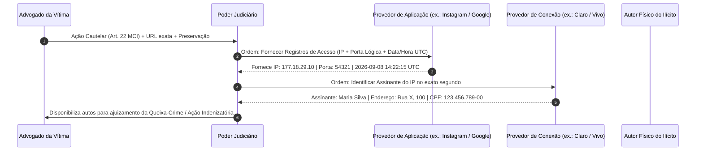

# Capítulo 20: Ilícitos Cibernéticos e Crimes Contra a Honra: Atribuição OSINT vs. Requisitos Judiciais do Marco Civil

## 1. A Ilusão do Anonimato e os Desafios da Persecução Digital

A disseminação de perfis apócrifos (*fakes*) e o uso de redes sociais para a prática de crimes contra a honra (calúnia, difamação, injúria), perseguição reiterada (*stalking* - art. 147-A do CP) e concorrência desleal geram a falsa sensação de que a internet brasileira é uma "terra sem leis".

Para a advocacia de vítimas de ataques digitais, o maior risco reside na precipitação: imputar a autoria de um crime a um suspeito com base unicamente em indícios preliminares de fontes abertas (ex.: semelhança de nome ou telefone com final idêntico) expõe o cliente a **ação indenizatória por danos morais e denúncia caluniosa (art. 339 do CP)**.

A atuação jurídica profissional opera com a articulação precisa entre duas fases complementares:
1. **Fase Extrajudicial (OSINT)**: Coleta e preservação imediata da materialidade do ilícito e formulação de hipóteses técnicas fundamentadas;
2. **Fase Judicial Coercitiva (Marco Civil da Internet)**: Instauração de procedimento sob a Lei nº 12.965/2014 para obtenção pericial dos registros de conexão e identificação inequívoca do assinante do circuito de telecomunicações.

---

## 2. A Trilha Obrigatória de Identificação sob o Marco Civil da Internet

O ordenamento jurídico brasileiro veda o anonimato (art. 5º, IV, da CF/88) e estabelece um procedimento bifásico e rigoroso para a quebra judicial de sigilo informático:

---

## 3. Os Requisitos Legais Inegociáveis do Pedido Judicial (Art. 22 do MCI)

Para evitar que a petição de quebra de sigilo seja indeferida pelo juiz com fundamento em generalidade ou "pescaria de provas" (*fishing expedition*), o advogado deve preencher cumulativamente os três incisos do art. 22, parágrafo único, do Marco Civil:

1. **Fundados Indícios da Ocorrência do Ilícito (Inciso I)**: Juntada da ata notarial ou relatório técnico pericial com código hash SHA-256 demonstrando o teor ofensivo, a difamação manifesta ou a concorrência predatória.
2. **Justificativa Motivada da Utilidade dos Registros Solicitados (Inciso II)**: Demonstração de que a revelação dos IPs de conexão é o único meio viável para identificar o responsável civil e penal pela conduta apócrifa.
3. **Período ao Qual se Referem os Registros (Inciso III)**: **Requisito temporal estrito**. Jamais peça *"todos os IPs do usuário desde a criação da conta"*. O pedido deve delimitar o dia e o intervalo horário específico em que as postagens criminosas foram publicadas (ex.: *"registros de acesso dos dias 14 e 15 de maio de 2026"*), sob pena de violação à privacidade e indeferimento.

---

## 4. O Papel Crucial da Porta Lógica de Origem na Era do IPv4 (CGNAT)

Com o esgotamento mundial dos endereços IP padrão versão 4 (IPv4), as operadoras de telecomunicações no Brasil adotaram a tecnologia de **CGNAT (Carrier-Grade NAT)**: um único endereço IP público é compartilhado simultaneamente por centenas de clientes residenciais e móveis distintos.

> [!IMPORTANT]
> **A Falácia do "IP sem Porta Lógica"**: Requerer ao provedor de aplicação apenas o "endereço IP" é inútil. Se o Instagram fornecer apenas o IP `177.18.29.10` sem a **porta lógica de origem**, a operadora de telefonia responderá em juízo que é tecnicamente impossível identificar qual dos 500 clientes conectados naquele IP no mesmo segundo foi o autor da postagem. A ordem judicial deve exigir expressamente: **Endereço IP + Porta Lógica de Origem + Data, Hora e Fuso Horário UTC**.

---

## 5. Boxes Didáticos do Capítulo

> [!WARNING]
> ### ⚖️ Limite Jurídico: A Vedação do Art. 19, § 1º (URL Específica)
> O Superior Tribunal de Justiça (STJ) firmou jurisprudência vinculante no sentido de que a ordem de remoção de conteúdo ilícito na internet **deve conter a URL específica (*link direto*) da publicação ofensiva**. Não basta indicar o nome do canal ou o perfil geral da empresa ofensora. A indicação genérica torna a ordem judicial inexequível perante o provedor de aplicação.

> [!IMPORTANT]
> ### 🏛️ Medida Judicial: O Pedido de Preservação Cautelar Prévia (Art. 15, § 3º)
> As redes sociais e aplicações de internet são obrigadas por lei a guardar os registros de acesso pelo prazo de apenas **6 meses** (art. 15 do MCI). Como o trâmite de uma ação judicial pode ultrapassar esse prazo, o advogado da vítima deve formular requerimento urgente ao juiz (ou notificação formal ao provedor com pedido de guarda provisória) para que os registros sejam congelados e não eliminados por decurso de prazo.

> [!NOTE]
> ### 🧪 Verificação: A Conferência do Fuso Horário Oficial (UTC vs. Horário de Brasília)
> Todos os servidores mundiais de redes sociais operam sob o padrão de tempo universal coordenado (**UTC** - *Universal Time Coordinated*). O horário de Brasília (BRT) opera com defasagem de 3 horas em relação ao UTC (UTC-3). Ao cruzar os logs fornecidos pelo Instagram com os registros da operadora de telecomunicações, certifique-se de converter os fusos horários com exatidão matemática, sob pena de apontar um assinante inocente que estava navegando 3 horas antes ou depois do fato.
