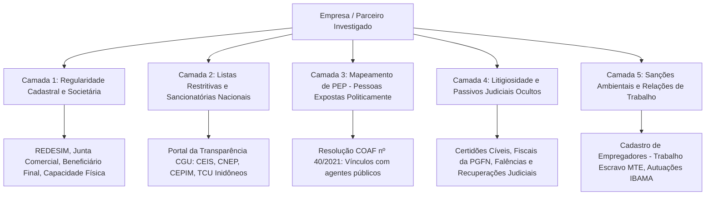

# Capítulo 21: Due Diligence, Compliance e Prevenção a Fraudes: Triagem de Fornecedores, Sócios e M&A

## 1. O Imperativo da Integridade Corporativa no Brasil

A promulgação da **Lei Anticorrupção (Lei nº 12.846/2013)** introduziu no ordenamento jurídico brasileiro a **responsabilidade objetiva administrativa e civil** das pessoas jurídicas pela prática de atos lesivos contra a administração pública nacional ou estrangeira. 

Isso significa que uma empresa responde pelas infrações de corrupção, fraudes em licitações e pagamentos de propinas perpetrados por seus prepostos, fornecedores terceirizados, despachantes aduaneiros ou parceiros comerciais, independentemente de culpa ou dolo da diretoria estatutária.

Nesse cenário de alto risco regulatório, a realização de auditorias prévias de integridade (**Due Diligence de Integridade / Compliance OSINT**) deixou de ser uma faculdade gerencial para tornar-se uma **obrigação de governança corporativa indeclinável**, capaz de atenuar sanções administrativas e afastar a responsabilidade pessoal de administradores em operações de fusões e aquisições (M&A) e contratação de fornecedores críticos.

---

## 2. A Matriz de Triagem em 5 Camadas de Integridade

Uma investigação corporativa sólida estrutura-se em 5 etapas sucessivas de auditoria:



---

## 3. Fontes Oficiais Primárias de Consulta Governamental

### 3.1. Bases Sancionatórias da Controladoria-Geral da União (CGU)
O Portal da Transparência do Governo Federal disponibiliza os bancos de dados públicos de empresas sancionadas em todo o país:
- **CEIS (Cadastro Nacional de Empresas Inidôneas e Suspensas)**: Empresas que cometeram fraudes em contratos administrativos e estão proibidas de licitar ou contratar com a Administração Pública;
- **CNEP (Cadastro Nacional de Empresas Punidas)**: Lista de sociedades punidas diretamente com base na Lei Anticorrupção (Lei nº 12.846/13);
- **CEPIM (Cadastro de Entidades Privadas Sem Fins Lucrativos Impedidas)**: ONGs e entidades impedidas de firmar parcerias com o poder público;
- **Lista de Inidôneos do Tribunal de Contas da União (TCU)**: Gestores e empresas declarados inidôneos por decisão colegiada transitada em julgado no TCU.

### 3.2. Pessoas Expostas Politicamente (PEP - Resolução COAF nº 40/2021)
A contratação de empresas que possuam sócios enquadrados como **Pessoas Politicamente Expostas (PEP)** ou seus familiares de primeiro e segundo grau (pais, filhos, cônjuges, enteados) impõe procedimentos de diligência reforçada (*Enhanced Due Diligence*):
- *Onde Consultar*: O Portal da Transparência da CGU disponibiliza o arquivo público consolidado de agentes públicos federais, estaduais e municipais enquadrados como PEP nos termos da Resolução COAF nº 40/2021.

### 3.3. Relações Trabalhistas e o Cadastro de Empregadores (MTE)
A chamada **"Lista Suja do Trabalho Escravo"**, mantida pelo Ministério do Trabalho e Emprego (MTE), relaciona empregadores que submeteram trabalhadores a condições análogas à escravidão. A contratação de fornecedores constantes dessa base acarreta severo dano reputacional imediato e bloqueio de financiamentos junto a instituições financeiras públicas (BNDES, Banco do Brasil, Caixa Econômica Federal).

---

## 4. Fronteiras da LGPD e Background Check de Pessoas Naturais (Art. 7º da LGPD)

A coleta e o processamento de informações de pessoas físicas em processos de triagem cadastral e investigações corporativas (*background check*) subordinam-se integralmente à **Lei Geral de Proteção de Dados Pessoais (Lei nº 13.709/2018 - LGPD)**.

O tratamento de dados pessoais em investigações de conformidade prescinde de consentimento do titular, desde que estritamente ancorado em bases legais expressas do art. 7º da LGPD:
- **Art. 7º, II — Cumprimento de Obrigação Legal ou Regulatória**: Aplicável quando a investigação decorre de deveres normativos cogentes, tais como as regras de prevenção à lavagem de dinheiro e financiamento do terrorismo impostas pelo COAF (Resolução nº 40/2021), as normas de integridade da Lei Anticorrupção (Lei nº 12.846/2013 e Decreto nº 11.129/2022) e as resoluções da CVM (Resolução CVM nº 30/2021);
- **Art. 7º, VI — Exercício Regular de Direitos em Processos**: Justifica o tratamento de dados para a salvaguarda de interesses em processos judiciais, administrativos ou procedimentos arbitrais;
- **Art. 7º, IX — Legítimo Interesse do Controlador ou de Terceiro**: Base legal comumente invocada para auditorias preventivas contra fraudes e proteção patrimonial. Exige a prévia elaboração de **Relatório de Impacto à Proteção de Dados (RIPD)** e a realização do teste de ponderação e proporcionalidade (*Legitimate Interests Assessment* - LIA), assegurando que os interesses legítimos da empresa não sobreponham direitos e liberdades fundamentais do investigado.

Além da base legal, a investigação corporativa deve respeitar com rigor os princípios gerais da LGPD (art. 6º):
1. **Princípio da Necessidade e Minimização (Art. 6º, III)**: A pesquisa deve abranger apenas os dados estritamente indispensáveis para mensurar o risco da contratação pretendida. É vedada a devassa desnecessária de aspectos íntimos da vida privada;
2. **Princípio da Não Discriminação (Art. 6º, IX)**: Proibição terminante de tratamento de dados para fins discriminatórios, ilícitos ou abusivos, repudiando a utilização de dados sensíveis (origem racial, convicções religiosas, posicionamento político ou filiação sindical) como critério de veto comercial.

---

## 5. Antecedentes Criminais em Seleção e a Jurisprudência Trabalhista (IRR Tema 01 e Súmula 440 do TST)

Um dos erros mais graves e onerosos cometidos em rotinas de *background check* corporativo reside na exigência indiscriminada de certidões de antecedentes criminais em processos seletivos de emprego.

### 5.1. A Tese Vinculante do TST: IRR Tema 01
O Tribunal Pleno do Tribunal Superior do Trabalho, ao julgar o **Incidente de Recursos de Revista Repetitivos nº IRR-1309-61.2012.5.05.0002 (Tema 0001)**, sob relatoria do Ministro Márcio Eurico Vitral Amaro (j. 21/09/2017, DEJT 27/10/2017), fixou tese vinculante com força obrigatória para toda a Justiça do Trabalho:
- **Regra Geral**: A exigência de certidão de antecedentes criminais de candidato a emprego é **ilegítima quando não justificada pela natureza da atividade a ser desempenhada**, configurando violação a direito da personalidade e acarretando **dano moral presumido (*in re ipsa*)**;
- **Exceções Legítimas**: A requisição de certidões criminais somente é válida quando:
  1. Amparada em expressa previsão em lei (ex.: vigilantes sob a Lei nº 7.102/1983; empregados domésticos com esteio na preservação da intimidade do lar); ou
  2. Decorrer da **natureza do ofício ou de grau especial de fidúcia exigido**, tais como cuidadores de menores, idosos ou enfermos; motoristas rodoviários de carga sensível; profissionais do transporte de valores; trabalhadores com acesso a armas, munições ou entorpecentes; e operadores que manuseiam segredos industriais estratégicos ou informações bancárias sigilosas.

### 5.2. A Aplicação da Súmula 440 do TST e Proteção de Dados Sensíveis
A realização de investigações pré-contratuais sobre a saúde de candidatos ou o levantamento de processos indenizatórios ajuizados contra ex-empregadores afronta diretamente a jurisprudência trabalhista consolidada. A **Súmula nº 440 do TST** presume discriminatória a dispensa de empregado portador de doença grave ou estigmatizante, entendimento que se estende à fase pré-contratual: a triagem abusiva que afasta candidatos com histórico médico ou registros em bancos de dados de processos trabalhistas constitui ilícito patronal gerador de indenização e fiscalização pelo Ministério Público do Trabalho (MPT).

---

## 6. Due Diligence em M&A e Sucessão Empresarial: Responsabilidade Civil (CC, art. 1.146) e Tributária (CTN, art. 133)

Nas operações de compra e venda de empresas, transferências de controle acionário e aquisições de ativos (M&A), a investigação OSINT desempenha papel fulcral na identificação de passivos ocultos e fraudes de sucessão empresarial.

### 6.1. A Responsabilidade Civil no Trespasse (Código Civil, Art. 1.146)
Na alienação do estabelecimento empresarial (trespasse), a regra do art. 1.146 do Código Civil determina:
- O adquirente do estabelecimento responde pelo pagamento de todos os débitos anteriores à transferência, **desde que regularmente contabilizados nos livros mercantis obrigatórios**;
- O alienante primitivo continua **solidariamente obrigado pelo prazo de 1 (um) ano** perante os credores (prazo contado a partir da publicação do arquivamento do ato na Junta Comercial para as obrigações já vencidas, ou da data de seus respectivos vencimentos para as obrigações vincendas).

### 6.2. A Responsabilidade Tributária na Sucessão Comercial (CTN, Art. 133)
Sob a ótica do direito tributário, o art. 133 do CTN estabelece regime de responsabilização patrimonial direta do adquirente de fundo de comércio ou estabelecimento:
- **Responsabilidade Integral**: O adquirente responde integralmente pelos tributos devidos pela empresa sucedida até a data do ato de transferência, caso o alienante cesse por completo a exploração comercial;
- **Responsabilidade Subsidiária**: O adquirente responde subsidiariamente com o alienante, caso este prossiga na atividade ou reinicie novo negócio no mesmo ou em outro ramo no prazo de 6 (seis) meses a contar da alienação.

### 6.3. Identificação de Sucessão Empresarial de Fato via OSINT (STJ REsp 1.937.989/SP)
Na prática forense, devedores fraudulentos não formalizam contratos de trespasse na Junta Comercial: simplesmente abandonam a empresa endividada e transferem seus ativos materiais e clientela para uma nova pessoa jurídica constituída em nome de terceiros (*sucessão de fato*).

A 3ª Turma do Superior Tribunal de Justiça, no paradigmático **REsp 1.937.989/SP** (Rel. Min. Nancy Andrighi, j. 08/03/2022, DJe 11/03/2022), chancelou a possibilidade de reconhecimento judicial da **sucessão empresarial de fato com redirecionamento da execução**, autorizando a constrição patrimonial contra a nova sociedade adquirente a partir da convergência de indícios materiais:
- **Mesmo Endereço Físico**: Funcionamento no mesmo imóvel ou galpão industrial, verificado por vistorias georreferenciadas e registros cadastrais;
- **Identidade de Objeto Social e Continuidade Operacional**: Atuação no mesmo nicho de mercado, comercialização dos mesmos produtos e prestação dos mesmos serviços;
- **Aproveitamento de Recursos Humanos e Materiais**: Absorção substancial dos mesmos empregados, maquinários, frotas de transporte e fornecedores;
- **Confusão Comercial e Digital**: Uso das mesmas marcas, linhas telefônicas idênticas, redes sociais compartilhadas e direcionamento da antiga carteira de clientes para a nova sociedade.

---

## 7. Superando a Decisão Binária Simplista: O Parecer de Risco

Muitas ferramentas comerciais de conformidade utilizam algoritmos ingênuos que rotulam uma empresa como *"Reprovada"* simplesmente porque ela possui uma ação trabalhista em andamento ou um homônimo em lista internacional.

O diferencial do parecer jurídico de integridade é a **análise qualitativa e proporcional do risco**:
- **Risco Inaceitável (Veto Absoluto)**: Empresa com condenação na Lei Anticorrupção, ausência total de capacidade operacional (sociedade fantasma), registro na Lista Suja do Trabalho Escravo ou sócio que atua como operador confesso de fraudes a licitações;
- **Risco Moderado Mitigável**: Empresa com passivos tributários com exigibilidade suspensa em parcelamento ordinário ou litígios comerciais proporcionais ao seu volume operacional.
  - *Remédio Contratual*: Em vez de vetar sumariamente a operação, a assessoria jurídica recomenda a adoção de **cláusulas de blindagem contratual**: cláusula resolutiva expressa por violação a normas anticorrupção, retenção de percentual da fatura como garantia trabalhista (*escrow account*), exigência de seguro-garantia e estipulação do **direito de auditoria irrestrita *in loco* (*Right to Audit*)**.

---

## 8. Boxes Metodológicos e Jurisprudência Aplicada

> [!NOTE]
> ### ⚖️ Validade Jurídica e Jurisprudência: Exigência de Antecedentes Criminais em Background Check (TST - Tema Repetitivo 01 e Súmula 440)
> 
> **Ficha Técnica do Precedente:**
> - **Tribunal**: Tribunal Superior do Trabalho (TST) - Tribunal Pleno
> - **Processo**: IRR-1309-61.2012.5.05.0002 - Tema Repetitivo 0001
> - **Relator**: Ministro Márcio Eurico Vitral Amaro
> - **Data de Julgamento**: 21/09/2017 | Publicação no DEJT: 27/10/2017
> - **Tese Fixada (TST - Tema 0001)**:
>   > *"1. Não é legítima a exigência de certidão de antecedentes criminais de candidato a emprego quando não justificada pela natureza da atividade a ser desempenhada pelo empregado, hipótese em que a exigência caracteriza lesão a direito da personalidade e dano moral in re ipsa. 2. A exigência de certidão de antecedentes criminais de candidato a emprego é legítima e não caracteriza lesão moral quando amparada em expressa previsão de lei ou decorrer da natureza do ofício ou do grau especial de fidúcia exigido..."*
> 
> **Modelo de Parecer de Compliance (Governança Preventiva em Contratações):**
> ```text
> "Em parecer de auditoria preventiva de integridade e triagem pré-contratual de pessoal (background check), orienta-se a exclusão imediata da exigência generalizada de certidões de antecedentes criminais para cargos operacionais genéricos. Com fundamento na tese vinculante fixada pelo Tribunal Pleno do TST no Tema Repetitivo 01 (IRR-1309-61.2012.5.05.0002) e no princípio da não discriminação do art. 6º, IX, da LGPD, a requisição de certidões criminais somente deve ser implementada para funções que envolvam expressa previsão legal ou grau qualificado de fidúcia (tais como manipuladores de informações bancárias sensíveis, controladores de tesouraria e transporte de valores). Para as demais posições corporativas, a exigência constitui ato ilícito com presunção de dano moral in re ipsa, impondo severo passivo indenizatório trabalhista à companhia."
> ```

> [!NOTE]
> ### ⚖️ Validade Jurídica e Jurisprudência: Sucessão Empresarial de Fato em M&A e Redirecionamento da Execução (STJ REsp 1.937.989/SP, CC art. 1.146 e CTN art. 133)
> 
> **Ficha Técnica do Precedente:**
> - **Tribunal**: Superior Tribunal de Justiça (STJ) - 3ª Turma
> - **Recurso**: REsp 1.937.989/SP
> - **Relatora**: Ministra Nancy Andrighi
> - **Data de Julgamento**: 08/03/2022 | Publicação no DJe: 11/03/2022
> - **Tese Fixada / Ementa Síntese**:
>   > *"Na alienação do estabelecimento empresarial (trespasse), a eficácia da transferência perante terceiros e a assunção de débitos pelo adquirente subordinam-se à regular contabilização das obrigações nos livros mercantis (CC, art. 1.146). Todavia, constatada a sucessão empresarial de fato com desvio de clientela, identidade de endereço e confusão operacional visando fraudar credores, impõe-se a solidariedade irrestrita entre alienante e adquirente, aplicando-se os influxos do art. 133 do CTN e a teoria da desconsideração da personalidade jurídica."*
> 
> **Modelo de Parágrafo para Petição (Redirecionamento de Execução por Sucessão de Fato com Dossiê OSINT):**
> ```text
> "Com fundamento no art. 1.146 do Código Civil, no art. 133 do CTN e no art. 109, § 3º, do CPC, requer-se o redirecionamento da presente execução em face da adquirente sucessora. Conforme demonstrado no minucioso relatório investigativo OSINT acostado aos autos (EVD-001 a EVD-005), a sociedade executada originária cessou abruptamente suas atividades operacionais no galpão industrial de sua sede, tendo a nova empresa adquirente assumido incontinenti o mesmo ponto comercial, absorvido mais de 80% da mão de obra preexistente e passado a atender aos mesmos contratos comerciais de distribuição com veículos idênticos. Configurada a transferência do fundo de comércio e a sucessão empresarial de fato com assunção integral do estabelecimento, responde a sucessora pelas dívidas tributárias e civis originárias da antecessora, nos termos da jurisprudência assentada pelo Superior Tribunal de Justiça no REsp 1.937.989/SP, pugnando-se pelo deferimento das constrições cautelares pleiteadas."
> ```

> [!WARNING]
> ### ⚖️ Limite Jurídico: A Proibição de Listas Negras Trabalhistas
> É terminantemente ilícito e enseja indenização por danos morais coletivos a utilização de técnicas de OSINT para criar ou alimentar "listas negras" de trabalhadores que ajuizaram ações trabalhistas contra empresas do mesmo setor. A pesquisa de idoneidade deve focar em empresas e fornecedores corporativos, nunca em cercear o direito de ação constitucional do trabalhador (art. 5º, XXXV, CF).

> [!IMPORTANT]
> ### 🚩 Sinal de Atenção: O Contrato Social sem Qualquer Alteração há 20 Anos
> Enquanto alterações muito frequentes de sócios acendem o alerta de instabilidade, uma empresa que atua em setor dinâmico e movimenta milhões de reais mas mantém o mesmo capital social de "Cr$ 10.000,00" registrado nos anos 1990 sem atualização contábil indica abandono administrativo severo e alta probabilidade de desconsideração da personalidade jurídica por insolvência.

> [!TIP]
> ### 🔎 Pivô: A Consulta ao Banco Nacional de Devedores Trabalhistas (BNDT)
> A Certidão Negativa de Débitos Trabalhistas (**CNDT**), emitida pelo Tribunal Superior do Trabalho (TST), atesta se a empresa possui execuções trabalhistas definitivas pendentes de pagamento. Uma empresa com CNDT positiva não pode transacionar com o poder público nem celebrar contratos com empresas signatárias de códigos de conduta do Pacto Global da ONU.
