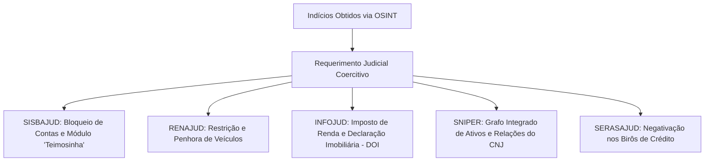

# Capítulo 22: Quando o OSINT Não Basta: O Ponto de Transição para Medidas Judiciais Típicas e Atípicas

## 1. O Ponto de Saturação da Investigação em Fontes Abertas

Nenhum método investigativo é onipotente. A inteligência em fontes abertas possui limites jurídicos intransponíveis fixados pela Constituição Federal de 1988: o postulado da **reserva de jurisdição** reserva com exclusividade ao Poder Judiciário a competência para afastar o sigilo bancário (LC 105/2001), o sigilo fiscal (CTN, art. 198) e a quebra de dados telemáticos e telefônicos (CF, art. 5º, XII).

O advogado experiente não perde tempo tentando "hackear" contas bancárias ou contratar serviços clandestinos de interceptação. Ele reconhece com exatidão **o ponto de saturação do OSINT**: o momento em que a pesquisa em fontes abertas reuniu indícios suficientes para conferir plausibilidade jurídica (*fumus boni iuris*) ao pedido de providência judicial coercitiva.

O OSINT, portanto, não substitui o juiz; ele **qualifica, fundamenta e direciona o pedido judicial**, impedindo que a pretensão seja rechaçada como genérica ou desproporcional.

---

## 2. O Arsenal de Sistemas Conveniados do Poder Judiciário

Uma vez demonstrada a inadimplência e a frustração das vias ordinárias, o advogado deve requerer a ativação dos sistemas de inteligência integrados à disposição dos magistrados:

### 2.1. SISBAJUD e o Módulo de Repetição Programada ("Teimosinha")
O Sistema de Busca de Ativos do Poder Judiciário conecta o tribunal a todas as instituições financeiras, cooperativas de crédito e fintechs reguladas pelo Banco Central:
- **Ordem Pontual vs. "Teimosinha"**: O bloqueio pontual vigora apenas durante algumas horas do dia da ordem. Devedores habituais retiram saldos imediatamente. O credor deve requerer expressamente o acionamento do **módulo de reiteração automática ("Teimosinha")**, que mantém a ordem ativa por **30 dias ininterruptos**, capturando qualquer depósito ou repasse que ingresse na conta do executado.
- **Investimentos e Fundos**: O SISBAJUD abrange não apenas saldos em conta-corrente e poupança, mas cotas de fundos de investimento, títulos de renda fixa (CDB, LCI, LCA) e valores depositados em corretoras de valores mobiliários.

### 2.2. SNIPER (Sistema Nacional de Investigação Patrimonial do CNJ)
Desenvolvido pelo Programa Justiça 4.0 do CNJ, o **SNIPER** é a ferramenta mais revolucionária de investigação patrimonial à disposição do juiz brasileiro. Em segundos, o sistema cruza bases da Receita Federal, Tribunal Superior Eleitoral, ANAC e Tribunal Marítimo, gerando um **grafo interativo unificado** de todos os vínculos societários, aeronaves, embarcações e bens do devedor e de seus sócios coligados.

### 2.3. INFOJUD e a Declaração de Operações Imobiliárias (DOI)
A consulta ao INFOJUD revela as últimas 5 declarações de IRPF/DIRPJ do alvo e, mais importante, a **Declaração de Operações Imobiliárias (DOI)**, pela qual os cartórios de notas de todo o país são obrigados a informar à Receita Federal qualquer escritura pública de compra e venda ou doação de imóveis, independentemente de o adquirente ter levado o título a registro no RGI.

---

## 3. Medidas Executivas Atípicas (Art. 139, IV, do CPC) e a ADI 5941 do STF

O art. 139, IV, do CPC confere ao magistrado o poder de:
> *"Determinar todas as medidas indutivas, coercitivas, mandamentais ou sub-rogatórias necessárias para assegurar a efetivação da decisão judicial, inclusive nas ações que tenham por objeto prestação pecuniária."*

No julgamento histórico da **ADI nº 5941 (Rel. Min. Edson Fachin)**, o Supremo Tribunal Federal declarou a **plena constitucionalidade das medidas atípicas**, tais como:
1. **Apreensão de Passaporte**: Restrição do direito de deixar o território nacional;
2. **Suspensão da Carteira Nacional de Habilitação (CNH)**: Proibição de conduzir veículos automotores;
3. **Cancelamento / Bloqueio de Cartões de Crédito**: Restrição de linhas de financiamento de consumo pessoal.

### O Papel Decisivo do OSINT na Concessão das Medidas Atípicas:
O STF fixou a tese de que a aplicação de medidas atípicas exige **fundamentação concreta, proporcionalidade e demonstração de sinais de solvência disfarçada**.
- Se o credor formula o pedido de apreensão de passaporte de forma genérica, o juiz indefere;
- Se o credor apresenta **relatório de inteligência OSINT comprovando que o executado viajou 4 vezes para o exterior nos últimos 12 meses ostentando voos em classe executiva e hotéis de luxo enquanto alega em juízo que não tem dinheiro para pagar o credor**, o magistrado defere imediatamente a apreensão do passaporte e da CNH como medida coercitiva legítima.

---

## 4. Boxes Didáticos do Capítulo

> [!IMPORTANT]
> ### 🏛️ Medida Judicial: A Penhora de Faturamento de Filiais (CPC, Art. 866)
> Quando o devedor não possui saldo em dinheiro, mas mantém estabelecimentos comerciais em funcionamento com grande fluxo diário de clientes (supermercados, restaurantes, clínicas), requeira ao juízo a **penhora sobre percentual do faturamento diário da empresa** (geralmente entre 5% e 15%), com a nomeação de administrador-depositário judicial para recolhimento semanal dos valores em conta vinculada ao processo.

> [!WARNING]
> ### ⚖️ Limite Jurídico: O Princípio da Menor Onerosidade (Art. 805 do CPC)
> Toda execução processa-se no interesse do credor, mas deve observar a menor onerosidade possível para o devedor. Medidas coercitivas atípicas não podem servir como mero instrumento de punição ou humilhação pública. O advogado deve demonstrar que as medidas ordinárias de penhora foram esgotadas e que o devedor adota comportamento deliberado de esquiva e blindagem.

> [!TIP]
> ### 🔎 Pivô: Do SISBAJUD Infrutífero à Penhora de Maquininhas de Cartão
> Quando as contas correntes bancárias do devedor retornam zeradas no SISBAJUD, investigue nos estabelecimentos físicos e virtuais do alvo quais credenciadoras de cartão de crédito e terminais POS ele utiliza (Cielo, Rede, Stone, PagBank). Requeira ao juízo **expedição de ofício diretamente às empresas adquirentes e subadquirentes para penhora na fonte dos recebíveis futuros de vendas no cartão de crédito**.
