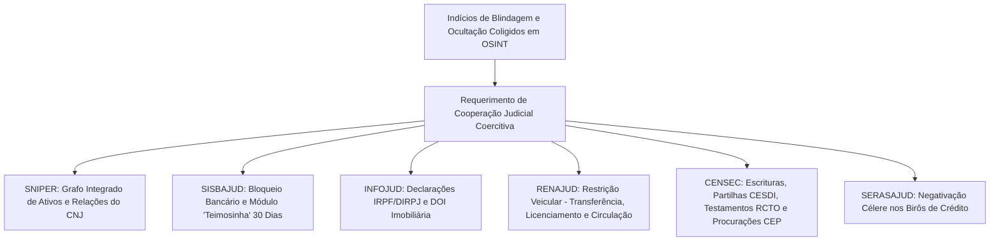

# Capítulo 22: Quando o OSINT Não Basta: O Ponto de Transição para Medidas Judiciais Típicas e Atípicas

## 1. O Ponto de Saturação da Investigação em Fontes Abertas

Nenhum método investigativo é onipotente. A inteligência em fontes abertas possui limites jurídicos intransponíveis fixados pela Constituição Federal de 1988: o postulado da **reserva de jurisdição** reserva com exclusividade ao Poder Judiciário a competência para afastar o sigilo bancário (LC 105/2001), o sigilo fiscal (CTN, art. 198) e a quebra de dados telemáticos e telefônicos (CF, art. 5º, XII).

O advogado experiente não perde tempo tentando "hackear" contas bancárias ou contratar serviços clandestinos de interceptação. Ele reconhece com exatidão **o ponto de saturação do OSINT**: o momento em que a pesquisa em fontes abertas reuniu indícios suficientes para conferir plausibilidade jurídica (*fumus boni iuris*) ao pedido de providência judicial coercitiva.

O OSINT, portanto, não substitui o juiz; ele **qualifica, fundamenta e direciona o pedido judicial**, impedindo que a pretensão seja rechaçada como genérica ou desproporcional.

---

## 2. Produção Antecipada de Provas (Art. 381 do CPC) e a Preservação de Evidências Digitais

Quando os indícios coligidos em fontes abertas apontam para a iminência de dissipação de registros eletrônicos ou quando a complexidade fática recomenda apuração pericial antes do litígio, a **Ação de Produção Antecipada de Provas** (CPC, arts. 381 a 383) constitui o instrumento processual mais potente e célere à disposição da advocacia.

O CPC de 2015 desvinculou a produção antecipada do caráter exclusivamente cautelar-urgente do direito revogado, consagrando o **direito autônomo à prova** sob três hipóteses independentes:

1. **Inciso I (Perecimento Probatório e Volatilidade Extrema)**: Quando *haja fundado receio de que venha a tornar-se impossível ou muito difícil a verificação de certos fatos na pendência da ação*. No ambiente digital, aplica-se à iminente exclusão de dados em servidores em nuvem, expiração do prazo de guarda obrigatória de logs de 6 meses do Marco Civil da Internet (Lei nº 12.965/2014, art. 15), cancelamento de contas corporativas fraudulentas ou reformatação deliberada de estações de trabalho e dispositivos móveis por fraudadores e operadores de esquemas ilegais;
2. **Inciso II (Viabilização da Autocomposição)**: Quando *a prova a ser produzida seja suscetível de viabilizar a autocomposição ou outro meio adequado de solução de conflito*. Ao fixar com rigor pericial a autoria de ilícito cibernético, a existência de patrimônio dissimulado ou o passivo oculto de uma sociedade, a prova pericial antecipada constrange as partes a uma transação amigável prévia, mitigando o custo financeiro e temporal de demandas judiciais prolongadas;
3. **Inciso III (Prevenção de Demandas Temerárias e Justificação Fática)**: Quando *o prévio conhecimento dos fatos possa justificar ou evitar o ajuizamento de ação*. A produção antecipada resguarda o autor contra o risco de condenação por litigância de má-fé ou sucumbência expressiva em ações indenizatórias ou executivas de grande vulto, permitindo constatar preventivamente se determinado alvo identificado em OSINT atuou efetivamente como operador financeiro da fraude.

### A Autonomia do Direito à Prova e a Vedação de Valoração de Mérito no STJ:
A Terceira Turma do Superior Tribunal de Justiça, no julgamento histórico do **REsp 1.774.913/SP (Rel. Min. Nancy Andrighi)**, assentou que na ação probatória autônoma descabe ao magistrado formular qualquer juízo prévio de valor quanto à ocorrência material do fato alegado ou pronunciar-se sobre suas consequências jurídicas. O papel jurisdicional limita-se a assegurar a higidez técnica da colheita, o contraditório formal e a higidez da cadeia de custódia (CPP, art. 158-A e CPC, arts. 369 e 411), sendo a valoração reservada com exclusividade ao juiz da futura ação de mérito.

---

## 3. Tutela Cautelar Antecedente (Arts. 300 e 305 do CPC): Arresto e Busca e Apreensão

Quando a investigação OSINT revela perigo concreto de dano iminente ou risco ao resultado útil da demanda, a via da tutela de urgência cautelar requerida em caráter antecedente (CPC, arts. 300 e 305) viabiliza medidas constritivas fulminantes antes mesmo da citação do devedor (*inaudita altera parte*):

### 3.1. Requisitos Indissociáveis:
- ***Fumus Boni Iuris* (Probabilidade do Direito)**: Não se confunde com mera alegação retórica. É respaldado pelo relatório de inteligência forense instruído com dados brutos certificados, certidões públicas de juntas comerciais, registros imobiliários e evidências preservadas com carimbo de tempo e hash criptográfico;
- ***Periculum in Mora* (Perigo de Dano ou Risco ao Resultado Útil)**: Caracterizado pela constatação empírica de dilapidação acelerada de patrimônio, desmobilização de galpões operacionais, transferência de veículos de luxo para interpostas pessoas, remessa atípica de fundos ao exterior ou indícios de destruição física de acervos documentais e digitais.

### 3.2. Medidas Cautelares Assecuratórias Típicas e Atípicas:
- **Arresto Cautelar de Ativos e Recebíveis (CPC, art. 301)**: Apreensão judicial preventiva de bens móveis, saldos bancários, recebíveis futuros de adquirentes de cartão de crédito e cotas societárias para garantir a satisfação de futura execução por quantia certa, obstando a consolidação da insolvência fraudulenta;
- **Busca e Apreensão de Documentos Contábeis e Dispositivos Eletrônicos (CPC, art. 301)**: Mandado cumprido por oficial de justiça acompanhado de perito forense computacional para apreensão física de computadores, servidores locais, discos rígidos (*hard disks*), smartphones funcionais e livros fiscais. A concessão liminar *inaudita altera parte* é crucial para impedir que o fraudador, ao tomar ciência da demanda, acione rotinas de destruição remota de dados (*remote wipe*), criptografia irreversível de pastas ou fragmentação física de mídias magnéticas.

### 3.3. Dinâmica Procedimental da Tutela Antecedente:
De acordo com o rito do art. 305 do CPC, efetivada a medida cautelar de constrição ou apreensão, o réu será citado para contestar em 5 dias. O autor deverá aditar a petição para formular o **pedido principal no prazo decadencial de 30 dias** (CPC, art. 308), sob pena de cessação imediata da eficácia da medida protetiva (art. 309, I).

---

## 4. Sistemas Restritos do Judiciário e o Princípio da Cooperação Processual

A transição entre a inteligência em fontes abertas e as ferramentas estatais coercitivas opera-se pela ativação articulada dos sistemas conveniados mantidos pelo Conselho Nacional de Justiça (CNJ) e tribunais superiores:



### 4.1. SNIPER (Sistema Nacional de Investigação Patrimonial e Recuperação de Ativos)
Desenvolvido sob a governança do Programa Justiça 4.0 do CNJ, o **SNIPER** representa o salto tecnológico mais avançado da investigação patrimonial judicial. Em segundos, a ferramenta realiza varredura cruzada automatizada entre diversas bases governamentais e de registros:
- **Bases Integradas**: Receita Federal do Brasil (quadros societários, filiais, histórico cadastral), Tribunal Superior Eleitoral (bens declarados em candidaturas), Registro Aeronáutico Brasileiro da ANAC (propriedade e operação de aeronaves civis), Tribunal Marítimo (embarcações náuticas registradas) e cadastros de sanções e condenações por improbidade administrativa (CEIS e CNEP);
- **Grafo Relacional Interativo**: Gera diagramas relacionais intuitivos de vínculos entre pessoas físicas e jurídicas, revelando sócios ocultos, empresas coligadas, laranjas com participações cruzadas e patrimônio móvel e aéreo de alto valor registrado em nome de pessoas jurídicas de fachada.

### 4.2. SISBAJUD e o Módulo de Repetição Programada ("Teimosinha")
O Sistema de Busca de Ativos do Poder Judiciário conecta as varas judiciais a todas as instituições financeiras, cooperativas de crédito, corretoras de valores (DTVMs) e instituições de pagamento (fintechs) reguladas pelo Banco Central do Brasil:
- **Ordem Pontual vs. "Teimosinha"**: O bloqueio pontual vigora apenas durante a grade horária bancária do dia do protocolo. Devedores habituais esvaziam contas diariamente via transferências automáticas ou Pix programado. O credor deve requerer expressamente o acionamento do **módulo de reiteração automática ("Teimosinha")**, que mantém a ordem de varredura ativa por **30 dias ininterruptos**, capturando qualquer recurso que transite pelas contas e aplicações do devedor;
- **Abrangência de Investimentos e Fundos**: O sistema alcança saldos de depósitos à vista e poupança, cotas de fundos de investimento abertos e fechados, títulos públicos e privados de renda fixa (CDB, LCI, LCA, debêntures) e custódia de ações depositadas em corretoras de valores mobiliários.

### 4.3. INFOJUD e a Declaração de Operações Imobiliárias (DOI)
A consulta ao sistema INFOJUD possibilita o acesso sigiloso às últimas 5 declarações fiscais do devedor (IRPF para pessoas físicas e DIRPJ/ECF para pessoas jurídicas), evidenciando mutações patrimoniais abruptas e participações societárias declaradas. O elemento mais precioso, contudo, é a **Declaração de Operações Imobiliárias (DOI)**:
- Por força de lei, os Cartórios de Notas e Registro de Imóveis de todo o território nacional são obrigados a comunicar à Receita Federal todas as operações de alienação, compra e venda ou doação de imóveis formalizadas por escritura pública;
- Permite identificar imóveis de elevado valor adquiridos pelo devedor que jamais foram levados a registro no Registro Geral de Imóveis (RGI) competente — manobra rotineira para ocultar o domínio formal e evitar averbação de penhoras.

### 4.4. RENAJUD: Restrições Veiculares Graduadas
O convênio eletrônico interliga o Judiciário ao Registro Nacional de Veículos Automotores (RENAVAM / SENATRAN), permitindo a consulta em tempo real da frota registrada em nome do devedor e a inserção imediata de gravames judiciais graduados:
1. **Restrição de Transferência**: Impede a alienação registral do veículo a terceiros;
2. **Restrição de Licenciamento**: Impede a emissão do Certificado de Registro e Licenciamento de Veículo (CRLV), obstando sua regularidade administrativa;
3. **Restrição de Circulação (Penhora e Apreensão)**: Bloqueia a circulação viária do bem em âmbito nacional, autorizando as autoridades policiais e agentes de trânsito a recolherem o automóvel ao pátio público imediatamente quando interceptado em fiscalizações de trânsito ou radares inteligentes.

### 4.5. CENSEC (Central Notarial de Serviços Eletrônicos Compartilhados)
Instituída pelo Conselho Nacional de Justiça por meio do Provimento CNJ nº 18/2012 e regulamentada pelo Provimento CNJ nº 100/2020, a **CENSEC** é administrada pelo Colégio Notarial do Brasil (CNB-CF) e reúne os atos notariais lavrados em todos os tabelionatos de notas do território nacional. A consulta judicial aos módulos da CENSEC é decisiva para desarticular fraudes familiares e interposição de pessoas:
- **CESDI (Central de Escrituras de Separações, Divórcios e Inventários)**: Permite localizar partilhas amigáveis, doações graciosas e renúncias transativas de herança lavradas por escritura pública em prol de familiares para esvaziar a meação ou o patrimônio do devedor;
- **RCTO (Registro Central de Testamentos On-Line)**: Identifica disposições testamentárias de última vontade e concessão de legados vinculados ao investigado;
- **CEP (Central de Escrituras e Procurações)**: O módulo mais estratégico para investigações de blindagem. Permite rastrear todas as procurações públicas outorgadas ou substabelecidas pelo devedor ou a ele destinadas. É o instrumento forense definitivo para demonstrar que o devedor, embora formalmente destituído de bens, atua como procurador com amplos poderes de gestão, movimentação bancária e alienação patrimonial irrestrita das contas e bens de empresas titularizadas por laranjas (genitores idosos ou empregados subordinados).

### 4.6. SERASAJUD: Negativação Coercitiva nos Birôs de Crédito
O sistema SERASAJUD conecta os juízos cíveis e trabalhistas diretamente à Serasa Experian, permitindo a inscrição automatizada do nome do devedor no rol de inadimplentes (CPC, art. 782, § 3º), bem como o cancelamento da restrição mediante quitação ou acordo. Essa medida retira a capacidade de crédito do executado no mercado e complementa a pressão psicológica legítima de cobrança.

### 4.7. O Dever de Cooperação Processual e Judiciária (CPC, Arts. 6º e 67 a 69)
Uma das maiores resistências enfrentadas pelo advogado na fase de execução é o despacho judicial padronizado indeferindo a consulta aos sistemas conveniados sob o argumento de que "cabe ao credor diligenciar em busca de bens penhoráveis".

Essa postura judicial é manifestamente superada à luz do ordenamento processual vigente:
- **O Princípio da Cooperação (CPC, art. 6º)**: Todos os sujeitos do processo devem cooperar entre si para que se obtenha, em tempo razoável, decisão de mérito justa e efetiva. O magistrado não é um espectador inerte, incumbindo-lhe empregar os meios estatais exclusivos colocados à sua disposição para conferir efetividade à tutela executiva (CF, art. 5º, LXXVIII e CPC, art. 4º);
- **A Cooperação Judiciária Nacional (CPC, arts. 67 a 69)**: Os órgãos jurisdicionais têm o dever funcional de prestar auxílio mútuo e intercâmbio de informações e dados cadastrais. A consulta ao SNIPER, SISBAJUD, CENSEC e INFOJUD não constitui prerrogativa arbitrária ou favor concedido pelo juízo, mas imperativo da função jurisdicional executiva, máxime quando o credor instrui seu requerimento com relatório investigativo de fontes abertas demonstrando o esgotamento dos meios ordinários e os indícios convergentes de ocultação patrimonial.

---

## 5. Medidas Executivas Atípicas (Art. 139, IV, do CPC) e a ADI 5941 do STF

O art. 139, IV, do CPC confere ao magistrado o poder de:
> *"Determinar todas as medidas indutivas, coercitivas, mandamentais ou sub-rogatórias necessárias para assegurar a efetivação da decisão judicial, inclusive nas ações que tenham por objeto prestação pecuniária."*

No julgamento histórico da **ADI nº 5941 (Rel. Min. Luiz Fux, Redator do acórdão Min. Edson Fachin)**, o Plenário do Supremo Tribunal Federal declarou a **constitucionalidade das medidas executivas atípicas**, tais como:
1. **Apreensão e Retenção do Passaporte**: Restrição do direito de deixar o território nacional;
2. **Suspensão da Carteira Nacional de Habilitação (CNH)**: Proibição de conduzir veículos automotores;
3. **Cancelamento e Bloqueio de Cartões de Crédito**: Restrição de linhas de financiamento de consumo pessoal;
4. **Proibição de Participação em Licitações Públicas e Concursos**: Restrição negocial de contratação com o poder público.

### O Papel Decisivo do OSINT na Concessão das Medidas Atípicas:
O STF fixou balizas constitucionais vinculantes para a imposição de medidas atípicas:
- **Subsidiariedade e Esgotamento Prévio**: Prévia tentativa frustrada de satisfação da dívida pelos meios executivos típicos (bloqueio bancário ordinário e localização de imóveis ou veículos);
- **Adequação, Necessidade e Proporcionalidade**: A providência deve demonstrar aptidão coercitiva para compelir o devedor a indicar bens, sem vulnerar o núcleo essencial da dignidade da pessoa humana (ex.: resguardo da CNH para motoristas profissionais ou sustento familiar);
- **Fundamentação Concreta e Sinais Exteriores de Riqueza Oculta**: Rechaça-se a aplicação automática de medidas atípicas por mero inadimplemento. A decisão judicial deve estar estritamente respaldada em elementos empíricos dos autos.

É exatamente aqui que o relatório investigativo OSINT se torna indispensável:
- Se o credor postula a apreensão do passaporte de forma genérica, o juiz indefere com fulcro na ausência de fundamentação;
- Se o credor apresenta **relatório forense em fontes abertas instruído com evidências documentais (EVD-001 a EVD-004) comprovando que o executado viajou 4 vezes para o exterior nos últimos 12 meses ostentando voos em classe executiva e hospedagens de alto luxo enquanto alega insolvência em juízo**, o magistrado defere de imediato a retenção do passaporte e da CNH com esteio no art. 139, IV, do CPC e na ADI 5941 do STF.

---

## 6. Boxes Metodológicos e Jurisprudência Aplicada

> [!NOTE]
> ### ⚖️ Validade Jurídica e Jurisprudência: STJ REsp 1.774.913/SP — Produção Antecipada de Provas Digitais e Autonomia Probatória
> 
> **Ficha Técnica do Precedente:**
> - **Tribunal**: Superior Tribunal de Justiça (STJ) - 3ª Turma
> - **Recurso**: REsp 1.774.913/SP
> - **Relatora**: Ministra Nancy Andrighi
> - **Data de Julgamento**: 15/10/2019 | Publicação no DJe: 18/10/2019
> - **Tese Fixada / Ementa Síntese**:
>   > *"O CPC/2015 consagrou a autonomia do direito à prova, permitindo o ajuizamento de ação de produção antecipada com base nos incisos do art. 381, despida do requisito da urgência e sem qualquer vinculação obrigatória a uma futura ação principal. No procedimento da produção antecipada de provas, o juiz não se pronuncia sobre a ocorrência ou a inocorrência do fato, tampouco sobre suas consequências jurídicas, limitando-se a assegurar o contraditório e a higidez técnica da prova a ser colhida."*
> 
> **Modelo de Parágrafo para Petição (Ação Autônoma de Produção Antecipada de Provas Digitais):**
> ```text
> "Com fulcro no art. 381, incisos I e III, do Código de Processo Civil, c/c o art. 15 da Lei nº 12.965/2014 (Marco Civil da Internet) e em estrita consonância com a tese firmada pela 3ª Turma do Superior Tribunal de Justiça no REsp 1.774.913/SP (Rel. Min. Nancy Andrighi), ajuíza-se a presente Ação de Produção Antecipada de Provas em face do provedor de aplicação réu. Conforme demonstrado no Relatório de Inteligência Forense acostado aos autos e corroborado pelas evidências digitais preservadas (EVD-001 a EVD-004), o perfil difamatório e as páginas virtuais apócrifas sob escrutínio exibem extrema volatilidade cibernética, existindo fundado receio de exclusão deliberada de dados e perecimento probatório pelo transcurso do prazo legal semestral de guarda de logs telemáticos. Destarte, com a finalidade de resguardar os elementos fáticos essenciais e conferir higidez à cadeia de custódia para justificar e aparelhar a futura ação indenizatória de mérito, requer-se: (i) a intimação liminar da requerida para depósito judicial de todos os registros de acesso à aplicação, IPs e portas lógicas de origem; e (ii) a realização de perícia técnica digital para validação e extração forense dos dados sob contraditório, abstendo-se este d. Juízo de qualquer exame valorativo sobre o mérito material da contenda."
> ```

> [!NOTE]
> ### ⚖️ Validade Jurídica e Jurisprudência: STF ADI 5941/DF — Ativação de Sistemas Conveniados e Medidas Executivas Atípicas
> 
> **Ficha Técnica do Precedente:**
> - **Tribunal**: Supremo Tribunal Federal (STF) - Tribunal Pleno
> - **Ação**: Ação Direta de Inconstitucionalidade (ADI) 5941/DF
> - **Relator Originário**: Ministro Luiz Fux | Redator p/ Acórdão: Ministro Edson Fachin
> - **Data de Julgamento**: 09/02/2023 | Publicação no DJe: 11/05/2023
> - **Tese Fixada**:
>   > *"É constitucional o art. 139, IV, do Código de Processo Civil, que autoriza o juiz a adotar medidas executivas atípicas indutivas, coercitivas, mandamentais ou sub-rogatórias necessárias para assegurar a efetivação das decisões judiciais, inclusive nas obrigações pecuniárias, desde que observados os direitos fundamentais do devedor, a proporcionalidade, a razoabilidade, o contraditório e o prévio esgotamento dos meios típicos de execução, vedada a imposição de medidas coercitivas desprovidas de fundamentação concreta."*
> 
> **Modelo de Parágrafo para Petição (Ativação de Sistemas Integrados SNIPER/CENSEC e Medidas Atípicas Subsidiárias):**
> ```text
> "Diante da frustração reiterada das vias executivas tradicionais e em face dos contundentes indícios de ocultação dolosa coligidos no Relatório Investigativo OSINT em anexo (EVD-001 a EVD-004) — o qual evidenciou que o devedor usufrui cotidianamente de veículos e imóveis formalmente titularizados por interposta pessoa jurídica —, requer-se, com esteio no dever de cooperação processual (CPC, arts. 6º e 67 a 69): (i) a ativação imediata do Sistema Nacional de Investigação Patrimonial e Recuperação de Ativos (SNIPER) do Conselho Nacional de Justiça, visando ao mapeamento do grafo relacional de participações societárias cruzadas, aeronaves (RAB/ANAC) e embarcações do devedor e coligadas; (ii) a reiteração automática de bloqueio bancário via SISBAJUD ('Teimosinha') pelo período ininterrupto de 30 dias; (iii) a consulta aos módulos CEP e CESDI do sistema CENSEC para identificação de procurações com amplos poderes e escrituras de partilha simuladas; e (iv) na hipótese de manutenção da inadimplência voluntária após a consolidação das buscas, a decretação subsidiária das medidas executivas atípicas do art. 139, IV, do CPC, consistentes na suspensão da CNH e retenção do passaporte do executado, providências expressamente chanceladas pelo Plenário do Supremo Tribunal Federal no julgamento vinculante da ADI 5941/DF."
> ```

> [!IMPORTANT]
> ### 🏛️ Medida Judicial: A Penhora de Faturamento de Filiais (CPC, Art. 866)
> Quando o devedor não possui saldo em dinheiro, mas mantém estabelecimentos comerciais em funcionamento com grande fluxo diário de clientes (supermercados, restaurantes, clínicas), requeira ao juízo a **penhora sobre percentual do faturamento diário da empresa** (geralmente entre 5% e 15%), com a nomeação de administrador-depositário judicial para recolhimento semanal dos valores em conta vinculada ao processo.

> [!WARNING]
> ### ⚖️ Limite Jurídico: O Princípio da Menor Onerosidade (Art. 805 do CPC)
> Toda execução processa-se no interesse do credor, mas deve observar a menor onerosidade possível para o devedor. Medidas coercitivas atípicas não podem servir como mero instrumento de punição ou humilhação pública. O advogado deve demonstrar que as medidas ordinárias de penhora foram esgotadas e que o devedor adota comportamento deliberado de esquiva e blindagem.

> [!TIP]
> ### 🔎 Pivô: Do SISBAJUD Infrutífero à Penhora de Maquininhas de Cartão
> Quando as contas correntes bancárias do devedor retornam zeradas no SISBAJUD, investigue nos estabelecimentos físicos e virtuais do alvo quais credenciadoras de cartão de crédito e terminais POS ele utiliza (Cielo, Rede, Stone, PagBank). Requeira ao juízo **expedição de ofício diretamente às empresas adquirentes e subadquirentes para penhora na fonte dos recebíveis futuros de vendas no cartão de crédito**.
