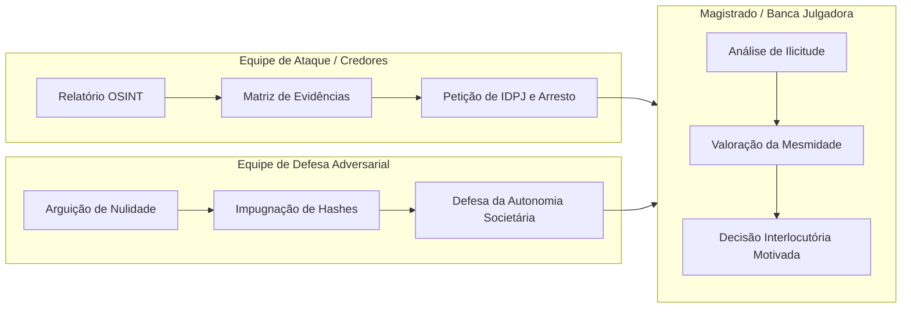

# Capítulo 24: Laboratório Integrado de Investigação: Exercício Prático com Simulação de Contraditório

## 1. O Desafio do Caso Integrado Multivetorial

No [`Estudo de Caso nº 07`](file:///Users/gabrielramos/Developer/personal/osint_advogados/casos_praticos/caso_07_caso_integrado_completo.md), o leitor foi colocado diante de um cenário com apenas três dados iniciais (*seeds*):
1. **Nome**: Valdemar Alcântara Nogueira;
2. **Telefone**: `(11) 97123-4567`;
3. **Empresa Conhecida**: `LogSul Transportes Rodoviários Ltda.`

A partir dessas premissas mínimas, construiu-se a investigação completa que desvendou um grupo econômico de R$ 3,5 milhões, culminando na localização de 42 caminhões pesados e um galpão logístico de 10.000 m² transferidos para terceiros.

Contudo, na vida forense, o processo não se encerra com a elaboração da petição. O verdadeiro teste de fogo de uma prova digital ocorre quando ela é **submetida ao contraditório dialético da parte contrária em juízo** (art. 5º, LV, da CF/88 e art. 9º do CPC).

---

## 2. A Metodologia do "Red Teaming" Probatório (Simulação Adversarial)

Para cursos de pós-graduação, treinamentos corporativos e auditoria interna em escritórios, este manual propõe a dinâmica do **Simulado de Contraditório Judicial**, dividindo os participantes em três bancadas:

---

## 3. As Teses Conflitantes no Simulado

### 3.1. Manifestação da Equipe de Ataque (Credor):
- **Tese Principal**: Sucessão empresarial fraudulenta de fato e confusão patrimonial (art. 50 do CC e art. 448 da CLT);
- **Suporte Probatório**: 
  - Certidão da ANTT atestando a transferência de 42 veículos para a nova empresa sem contraprestação líquida;
  - Consulta WHOIS no Registro.br comprovando que o e-mail do domínio corporativo da sucessora pertence ao devedor originário;
  - Chave Pix comprovando a titularidade contemporânea do número telefônico utilizado no atendimento comercial.

### 3.2. Impugnação da Equipe de Defesa (Devedor e Sucessora):
- **Preliminar 1: Ilicitude da Prova e Violação à LGPD**: Arguição de que a pesquisa realizada sobre as contas bancárias e telefones violou a privacidade e o sigilo de dados (art. 5º, LVI, da CF/88 e art. 14 da LGPD);
- **Preliminar 2: Quebra da Cadeia de Custódia**: Impugnação dos prints de tela sob o fundamento de ausência de ata notarial e possibilidade de manipulação de metadados;
- **Mérito Societário**: Alegação de que a nova empresa pertence à esposa e filho com base em patrimônio próprio e que a utilização do galpão decorre de contrato verbal de locação legítimo, inexistindo grupo econômico (art. 50, § 4º, do Código Civil).

---

## 4. O Julgamento Simulado e Critérios de Decisão do Magistrado

Ao julgar o incidente em sala de aula ou na prática profissional, o juiz/avaliador deve fundamentar sua decisão com base nos seguintes parâmetros técnicos consolidados nos Tribunais Superiores:

1. **Rejeição da preliminar de prova ilícita**: A consulta a chaves Pix públicas e registros WHOIS não configura quebra de sigilo bancário nem invasão de dispositivo (art. 154-A do CP), tratando-se de dados manifestamente públicos tratados para o exercício regular de direitos em processo judicial (art. 7º, VI, da LGPD);
2. **Validação da cadeia de custódia técnica**: A apresentação do código hash SHA-256 e arquivos WARC/HTML originais supre integralmente a ausência de ata notarial, invertendo o ônus da prova da falsidade para a parte impugnante (CPC, art. 429, I);
3. **Acolhimento da desconsideração da personalidade jurídica**: A transferência maciça da frota de caminhões no período crítico anterior ao fechamento da primeira empresa, somada à administração fática pelo mesmo operador, afasta a presunção de autonomia societária e caracteriza a confusão patrimonial ensejadora do bloqueio de bens (art. 50 do CC).

---

## 5. Boxes Didáticos do Capítulo

> [!NOTE]
> ### 🧪 Verificação: A Resistência ao Contraditório como Meta
> Uma investigação só pode ser considerada concluída com êxito quando suas evidências forem capazes de suportar o fogo cerrado da defesa adversarial sem que nenhuma das premissas essenciais seja anulada.

> [!WARNING]
> ### ⚖️ Limite Jurídico: O Risco da Litigância de Má-Fé por Falsa Arguição de Nulidade
> A defesa que argui genericamente que a prova digital "é falsa" ou "foi editada no Photoshop" sem apresentar perícia ou contraprova que demonstre o vício concreto pode ser condenada pelo magistrado por litigância de má-fé e ato atentatório à dignidade da justiça (arts. 80 e 774 do CPC).

> [!TIP]
> ### 🔎 Pivô: A Tréplica Documental na Execução
> Se a parte contrária impugnar suas evidências alegando que a empresa sucessora "adquiriu os caminhões a título oneroso", utilize a tréplica para requerer a **intimação da executada para juntar os comprovantes bancários de transferência do preço da compra**. Se não houver TED/Pix correspondente ao valor de mercado da frota, a simulação estará cabalmente confessada nos autos.
