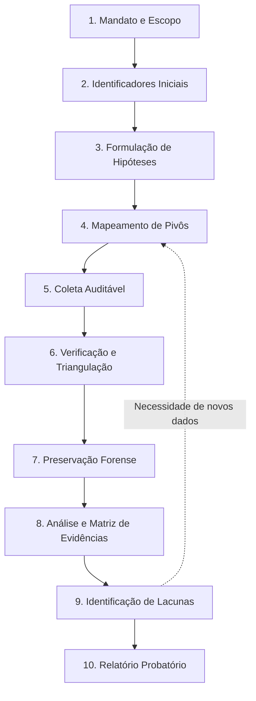

# Metodologia de Investigação OSINT Aplicada ao Direito Brasileiro: O Ciclo em 10 Etapas

## 1. Fundamentação Metodológica

A investigação em fontes abertas no ambiente forense não pode ser conduzida como uma busca desordenada de informações na internet. Sem método, o investigador comete três falhas graves:
1. **Viés de confirmação**: Coleta apenas o que corrobora sua tese inicial, ignorando dados que a refutam.
2. **Fragilidade probatória**: Falha em documentar a rastreabilidade e a integridade do vestígio digital, inviabilizando sua utilização em contraditório judicial.
3. **Violação da legalidade e da LGPD**: Realiza devassas desproporcionais sem nexo causal com a causa de pedir, expondo-se a sanções éticas, civis e criminais.

O modelo proposto estrutura-se em um **ciclo lógico, iterativo e auditável de 10 etapas**.

---

## 2. As 10 Etapas do Ciclo Investigativo

---

### Etapa 1 — Mandato e Escopo Jurídico
- **Definição do Cliente e Legitimidade**: Quem é o cliente? Qual é o seu interesse processual ou material legítimo?
- **Finalidade Específica e Base Legal**: Enquadramento formal na LGPD (ex.: art. 7º, VI — exercício regular de direitos em ação de execução de alimentos).
- **Pergunta Investigativa Principal**: Qual fato controverso precisa ser demonstrado? (Ex.: *"O executado Fulano de Tal aufere renda ou possui bens indiretos mediante interposta pessoa jurídica?"*).
- **Limites Objetivos e Subjetivos**: Fixação do período temporal relevante, áreas geográficas e sujeitos investigados, evitando a coleta de dados de terceiros desvinculados da lide.

---

### Etapa 2 — Registro dos Identificadores Iniciais (*Seeds*)
Inventariação rigorosa dos pontos de partida conhecidos e confirmados documentalmente:
- **Pessoa Física**: Nome civil completo, eventuais variações de grafia, CPF, RG, filiação, data de nascimento, título de eleitor, registros de classe (OAB, CRM, CREA), e-mails, telefones, perfis sociais públicos conhecidos, placas de veículos.
- **Pessoa Jurídica**: Razão social, nome fantasia, CNPJ, NIRE, endereço cadastral, domínios web, administradores e sócios informados em contrato social.
- **Identificadores Digitais e Locacionais**: Endereços físicos, CEPs, números de processos anteriores, matrículas de imóveis, fotografias de referência.

---

### Etapa 3 — Formulação de Hipóteses Fáticas
Adoção do raciocínio analítico estruturado:
- **Hipótese Principal ($H_1$)**: A tese que sustenta a pretensão do cliente (ex.: *"A empresa Alpha é sucessora de fato da executada Beta, havendo identidade de sócios ocultos, endereço e clientela"*).
- **Hipóteses Alternativas ($H_2, H_3$)**: Cenários alternativos que explicam os mesmos fatos sem caracterizar fraude (ex.: *"A empresa Alpha simplesmente adquiriu maquinário em leilão público e alugou o imóvel desocupado"*).
- **Condições de Refutação**: Critérios objetivos que, se identificados, desmontam a tese investigativa. O investigador deve buscar ativamente provas capazes de falsear sua hipótese antes de afirmá-la em juízo.

---

### Etapa 4 — Mapa de Pivôs (*Pivot Mapping*)
Planejamento gráfico e sequencial dos saltos entre entidades de informação. O princípio básico do pivô é: **um retorno confiável de uma fonte torna-se a entrada da próxima consulta**.

> **Exemplo Clássico de Cadeia de Pivô Patrimonial:**
> `Nome do Devedor` $\xrightarrow{\text{Junta Comercial}}$ `CNPJ de Empresa Inativa` $\xrightarrow{\text{Receita Federal/QSA}}$ `Nome do Novo Sócio Administrador` $\xrightarrow{\text{Diário Oficial}}$ `Endereço Residencial Compartilhado` $\xrightarrow{\text{Cartório de Registro de Imóveis (ONR)}}$ `Matrícula do Imóvel de Luxo registrado em nome de Holding Familiar` $\xrightarrow{\text{Redes Sociais}}$ `Fotos do Devedor exercendo a posse direta do bem`.

---

### Etapa 5 — Coleta Auditável e Diário de Buscas
Toda consulta deve ser registrada em um **Diário de Buscas Forense**, contendo:
1. Data, hora exata e fuso horário.
2. Identificação do operador/pesquisador.
3. URL completa ou base de dados consultada.
4. Termo exato de busca (*string*, sintaxe de dork ou parâmetro de consulta).
5. Resultado bruto retornado (incluindo se a busca resultou infrutífera — o "resultado negativo" também é prova relevante).
6. Decisão tomada após o resultado.

---

### Etapa 6 — Verificação, Triangulação e Desambiguação
Antes de qualquer dado ser incorporado ao acervo probatório, ele deve passar pelo crivo dos testes de confiabilidade:
- **Teste de Autenticidade e Proveniência**: A fonte é primária oficial (ex.: certidão da Junta Comercial) ou secundária (ex.: notícia de jornal ou catálogo online de CNPJs)?
- **Teste de Atualidade**: O dado reflete a situação contemporânea ou um estado societário superado há 10 anos?
- **Triangulação Independente**: O fato alegado é corroborado por pelo menos duas fontes autônomas e desvinculadas entre si?
- **Controle de Homonímia**: O nome encontrado coincide em filiação, CPF parcial, município ou faixa etária, ou trata-se de pessoa distinta com nome idêntico?

---

### Etapa 7 — Preservação Técnica e Cadeia de Custódia
O registro do dado deve observar o princípio da **mesmidade** (a prova apresentada ao juiz é idêntica ao vestígio original):
- Captura técnica completa da página web (código HTML, cabeçalhos HTTP de resposta, endereço IP do servidor de destino).
- Cálculo imediato de hash criptográfico unidirecional (**SHA-256**) sobre todos os arquivos gerados.
- Registro de carimbo de tempo (*timestamp*) por autoridade certificadora credenciada (ICP-Brasil) ou sistema de carimbo de tempo distribuído auditável.
- Avaliação da conveniência de lavratura de ata notarial (CPC, art. 384) para fatos de extrema gravidade com risco iminente de exclusão.

---

### Etapa 8 — Análise e Matriz de Evidências
Consolidação dos achados na **Matriz Padronizada de Evidências** (detalhada na Seção 02 deste módulo), classificando cada elemento conforme a sua força probatória:
- Fato diretamente provado.
- Indício circunstancial convergente.
- Inferência lógica sustentável.
- Hipótese em aberto.

---

### Etapa 9 — Identificação de Lacunas e Limites Operacionais
O relatório deve documentar com honestidade intelectual o que **não foi possível encontrar** e o porquê:
- Informação inexistente nos registros públicos.
- Informação protegida por sigilo constitucional (bancário, fiscal, telefônico, telemático).
- Necessidade de requerimento judicial fundamentado (ex.: quebra de sigilo via SISBAJUD, RENAJUD, SNIPER ou expedição de ofício pelo art. 22 do Marco Civil da Internet).

---

### Etapa 10 — Relatório Probatório e Estratégia Jurídica
Elaboração da peça conclusiva:
- Estrutura clara: Mandato, Metodologia, Fatos Verificados, Matriz de Evidências, Análise de Vínculos (Grafos e Linhas do Tempo), Refutação de Hipóteses Alternativas e Conclusão Proporcional.
- Anexos técnicos: Diário de buscas, mídias preservadas com lista de hashes SHA-256 e certidões oficiais.
- Sugestão das medidas processuais cabíveis (ex.: pedido de desconsideração da personalidade jurídica, arresto cautelar, penhora de cotas, busca e apreensão).
