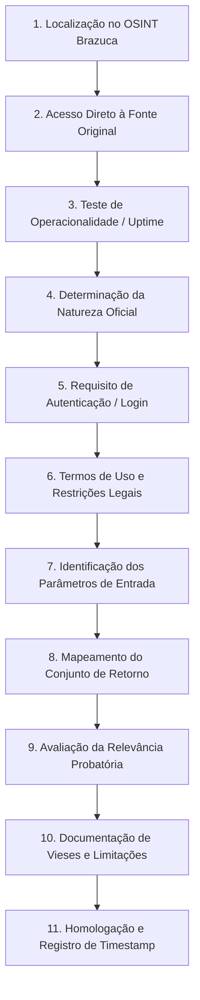

# Protocolo Operacional de 11 Passos para Validação de Fontes

## 1. Princípio da Não-Admissão Automática

O projeto **OSINT Brazuca** constitui um repositório comunitário de referência para o ecossistema brasileiro de fontes abertas. No entanto, na atividade forense e na produção de prova em juízo, **nenhuma fonte catalogada pode ser utilizada de forma ingênua ou reproduzida cegamente**.

Toda fonte de informação, antes de subsidiar relatórios periciais ou peças jurídicas, deve ser submetida ao **Protocolo de Validação em 11 Passos**:

---

## 2. O Protocolo em 11 Passos

### Passo 1 — Localização no Catálogo OSINT Brazuca
Identificar o repositório ou categoria correspondente no dataset do OSINT Brazuca a partir do problema fático investigado (ex.: pessoa física, empresa, veículo, patrimônio imobiliário).

### Passo 2 — Acesso Direto à Fonte Original (*Primary Access*)
Nunca operar por meio de espelhos não autorizados ou sites intermediários suspeitos. Navegar diretamente ao domínio governamental (`.gov.br`), institucional (`.org.br`, `.jus.br`) ou cartorário competente.

### Passo 3 — Teste de Operacionalidade e Disponibilidade
Verificar se o portal está ativo, funcional e com sua base de dados atualizada. Portais desatualizados há anos ou com certificados SSL expirados devem ser marcados com ressalva ou descartados.

### Passo 4 — Determinação da Natureza Jurídica da Fonte
- **Primária Oficial**: Mantida por ente da Administração Pública direta ou indireta (Receita Federal, Juntas Comerciais, Tribunais de Justiça, DETRANs, CVM, ANPD, Cartórios com delegação pública).
- **Secundária / Terciária**: Portais agregadores comerciais, sites de consultas gratuitas, cadastros de birôs privados. A fonte secundária serve para guiar a busca, mas a certidão primária deve ser extraída.

### Passo 5 — Requisito de Autenticação e Nível de Acesso
Classificar o método de acesso exigido:
- Acesso público irrestrito (sem login).
- Acesso mediante cadastro simples (e-mail ou CPF).
- Acesso qualificado via Conta **Gov.br** (níveis Bronze, Prata ou Ouro).
- Acesso com certificado digital padrão ICP-Brasil (e-CPF / e-CNPJ).
- Acesso restrito a advogados credenciados (ex.: PJe, convênio OAB).

### Passo 6 — Análise de Restrições Legais e Termos de Uso
Verificar se a fonte veda raspagem automatizada (*web scraping*), se o acesso é protegido por medidas de segurança tecnológica cuja evasão caracterize crime (art. 154-A do CP) ou se há cobrança legítima de custas cartorárias (emolumentos).

### Passo 7 — Identificação Rigorosa dos Parâmetros de Entrada (*Inputs*)
Mapear com precisão quais identificadores são aceitos pelo formulário de busca:
- CPF completo vs. CPF descaracterizado.
- CNPJ de 14 dígitos vs. Raiz de 8 dígitos.
- Nome exato vs. Busca fonética / curingas.
- Placa Mercosul vs. Chassi / RENAVAM.
- Número de matrícula do imóvel vs. Endereço ou Inscrição Imobiliária (IPTU).

### Passo 8 — Mapeamento dos Dados de Retorno (*Outputs*)
Catalogar exatamente o que a base devolve:
- Devolve dados brutos cadastrais?
- Devolve documentos digitalizados (PDFs, certidões, contratos sociais)?
- Devolve histórico ou apenas a situação cadastral ativa contemporânea?

### Passo 9 — Avaliação de Relevância e Força Probatória
Definir a finalidade probatória: o resultado serve como **prova documental plena** (art. 405 do CPC), como **começo de prova por escrito** ou como mero **indício** para direcionar nova diligência?

### Passo 10 — Documentação de Vieses, Lacunas e Limitações
Anotar eventuais falhas crônicas da fonte:
- Exemplo: Consultas de processos que não indexam feitos em segredo de justiça.
- Exemplo: Consultas de empresas que demoram dias para atualizar alterações societárias ocorridas no cartório de registro civil de pessoas jurídicas (RCPJ).

### Passo 11 — Homologação e Registro da Data de Validação
Gravar a data e hora em que a validação técnica foi realizada, registrando o carimbo no diário de fontes para fins de governança e controle periódico.
