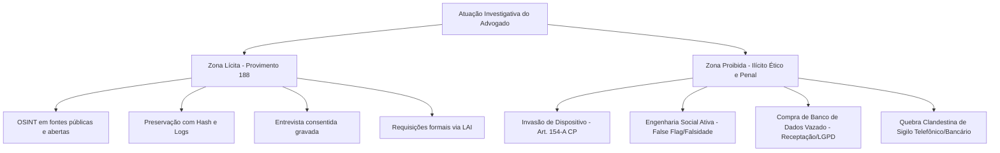

# Relatório de Auditoria: Fase 2 — Auditoria Jurídica Integral

## 1. Introdução e Diagnóstico Jurídico

A prática de OSINT (Open Source Intelligence) no Brasil opera sob um ecossistema normativo complexo. Diferentemente de jurisdições da *Common Law*, a atividade investigativa privada no Brasil encontra limites expressos nos direitos fundamentais à intimidade, vida privada e proteção de dados pessoais (art. 5º, X e LXXIX, CF/88), nas regras do Marco Civil da Internet (Lei 12.965/2014), nas disposições protetivas da LGPD (Lei 13.709/2018) e nos tipos penais protetivos de sistemas informatizados (art. 154-A do Código Penal).

O material original apresentava quatro deficiências centrais que esta auditoria corrige:
1. **Tratamento redutor da LGPD**: Ancorava-se quase exclusivamente nos arts. 7º e 9º, negligenciando a vedação do art. 4º, as salvaguardas dos arts. 6º, 10, 11 e 14, e a falsa premissa de que "dados públicos autorizam qualquer tratamento".
2. **Fragilidade conceitual na prova digital**: Tratamento mecânico de print screen e ata notarial, além de menção equivocada à Portaria CNJ 391/2025 como se fora um padrão pericial vinculante finalizado.
3. **Falta de granularidade no Provimento 188/2018 CFOAB**: Confusão entre atos privativos da autoridade policial e diligências legítimas do advogado defensor.
4. **Ilusão de autoria no Marco Civil da Internet**: Ausência de distinção técnica entre correlação em fontes abertas, IP/porta lógica fornecidos por provedor e prova judicial definitiva de autoria.

---

## 2. Auditoria Temática 1: Matriz de Aplicação da LGPD na Atividade Investigativa

A coleta e o tratamento de dados pessoais em investigações em fontes abertas não constituem atividade imune à LGPD. Mesmo dados tornados públicos pelo próprio titular ou disponíveis em portais de transparência demandam base legal válida e observância estrita aos princípios informadores do art. 6º da Lei 13.709/2018.

### 2.1. O Mito dos "Dados Públicos" (Arts. 7º, §§ 3º e 4º da LGPD)
O fato de uma informação estar indexada no Google, divulgada em rede social aberta ou constante de diário oficial **não a converte em dado de livre disposição**. Conforme a melhor hermenêutica da ANPD e o art. 7º, § 4º, da LGPD, a dispensa de consentimento para dados manifestamente públicos não dispensa a observância dos princípios da **finalidade legítima**, da **necessidade (minimização)**, da **segurança** e da **boa-fé**. É vedada a reutilização para finalidades incompatíveis com o contexto original da publicização.

### 2.2. Matriz de Regimes Jurídicos por Contexto Investigativo

| Contexto Investigativo | Regime Jurídico Aplicável | Bases Legais Principais (Art. 7º) | Pontos Críticos e Salvaguardas Obrigatórias |
| :--- | :--- | :--- | :--- |
| **Contencioso Cível e Trabalhista** | LGPD aplicável integralmente | Art. 7º, VI (exercício regular de direitos em processo judicial) | Minimização estrita: vedado coletar dados de terceiros sem relação com o litígio; salvaguarda de segredo de justiça. |
| **Execução e Busca de Bens** | LGPD aplicável integralmente | Art. 7º, VI (exercício regular de direitos) e art. 7º, IX (legítimo interesse) | Proporcionalidade: investigar patrimônio do devedor não autoriza devassa em familiares sem indício de ocultação. |
| **Due Diligence Pré-Contratual / M&A** | LGPD aplicável integralmente | Art. 7º, V (execução de contrato/procedimentos preliminares) e art. 7º, IX (legítimo interesse) | Teste de Ponderação (LIA): registrar a necessidade comercial, excluir dados excessivos, fixar prazo para descarte de dados de candidatos descartados. |
| **Compliance e Prevenção à Fraude** | LGPD aplicável integralmente | Art. 7º, II (cumprimento de obrigação legal/regulatória) e art. 7º, IX (legítimo interesse) | Vedação à perfilização discriminatória; garantia de sigilo nas apurações de denúncias de canal de ética. |
| **Tratamento de Dados Sensíveis (Saúde, Biometria, Filiação Política/Sindical)** | Regime Protetivo Qualificado | Art. 11, II, "a" (obrigação legal) ou "d" (exercício regular de direitos) | **Vedado o legítimo interesse**. Coleta só é lícita se estritamente indispensável à tese jurídica ou exigida por lei regulatória. |
| **Dados de Crianças e Adolescentes** | Regime de Proteção Integral (Art. 14 LGPD c/c ECA) | Art. 14, § 1º (melhor interesse da criança) | **Regra: vedação da coleta em OSINT**. Exceção estrita: ações de guarda, alimentos e proteção do menor, preservando a intimidade sob sigilo absoluto. |
| **Investigação Defensiva Penal** | Exceção do Art. 4º, III, "d", da LGPD | Regime específico de direito processual penal e Provimento 188/2018 CFOAB | Embora o art. 4º, III, excepcione a LGPD das atividades de persecução penal, a coleta pelo advogado submete-se ao contraditório, à paridade de armas e à vedação de prova ilícita (art. 5º, LVI, CF). |
| **Agregação e Scraping em Massa** | LGPD aplicável integralmente | Exige base legal sólida e teste de proporcionalidade | Raspagem automatizada sem controle de finalidade viola os princípios da adequação e segurança, gerando responsabilidade civil objetiva/subjetiva. |

---

## 3. Auditoria Temática 2: Prova Digital, Cadeia de Custódia e Jurisprudência

### 3.1. A Insuficiência do "Print Screen" Isolado
A captura estática de tela (*screenshot*) desprovida de metadados, código-fonte e verificação de integridade hash não possui presunção de autenticidade no processo judicial brasileiro contemporâneo. A facilidade de manipulação por inspeção de elementos HTML ou simuladores de conversa tornou o print isolado uma "prova frágil", sujeita a pronta impugnação.

### 3.2. A Cadeia de Custódia do CPP (Arts. 158-A a 158-F) e sua Extensão ao Processo Civil
Com a Lei 13.964/2019, o Código de Processo Penal positivou o ciclo da cadeia de custódia:
1. **Reconhecimento**: identificação do vestígio digital.
2. **Isolamento**: preservação do ambiente contra alterações externas.
3. **Fixação**: registro minucioso do estado em que o vestígio se encontra.
4. **Coleta**: captura do dado técnico original.
5. **Acondicionamento**: embalagem/guarda sob parâmetros de segurança.
6. **Transporte**: rastreabilidade da transferência.
7. **Recebimento**: conferência do estado e lacres.
8. **Processamento**: extração e exame técnico pericial.
9. **Armazenamento**: guarda em repositório confiável para viabilizar contraperícia.
10. **Descarte**: eliminação documentada quando exaurido o prazo de retenção.

> [!NOTE]
> Embora os arts. 158-A a 158-F estejam no CPP, o Superior Tribunal de Justiça e os tribunais estaduais vêm estendendo os parâmetros de **auditabilidade, repetibilidade e mesmidade** para as provas digitais juntadas no Processo Civil e Trabalhista (CPC, arts. 369, 422 e 424).

### 3.3. Confronto Técnico-Jurídico: Meios de Fixação e Preservação
- **Ata Notarial (Art. 384 do CPC)**: Instrumento com fé pública dotado de presunção relativa de veracidade (*juris tantum*). Pontos críticos: custo financeiro elevado, dependência de tabelião não perito (frequentemente não registra metadados técnicos, portas de conexão ou código-fonte íntegro) e lentidão em conteúdos voláteis (stories, lives).
- **Ferramentas de Preservação Técnica com Hash e Timestamping**: Softwares e plataformas forenses que realizam a captura automatizada do código-fonte, cabeçalhos HTTP, endereço IP do servidor, geração de hash SHA-256 e carimbo do tempo ICP-Brasil ou blockchain. Possuem custo menor e riqueza pericial superior à ata notarial, devendo ser submetidas ao contraditório pericial.
- **Auto de Constatação Privado (Provimento 188/2018 CFOAB)**: O advogado pode lavrar auto circunstanciado com detalhamento das etapas técnicas executadas, juntando os arquivos de log e hashes gerados.

### 3.4. Jurisprudência Consolidada do STJ e STF
- **STJ - RHC 99.735/SC e AgRg no RHC 143.169/RJ**: A gravação ou print de telas de WhatsApp Web desacompanhados de espelhamento pericial completo ou cadeia de custódia idônea violam a integridade probatória, diante da possibilidade de exclusão unilateral e inserção de mensagens adulteradas.
- **STJ - Nulidade e Prejuízo (Art. 563 do CPP - *Pas de Nullité Sans Grief*)**: O STJ consolidou que a quebra formal da cadeia de custódia não acarreta a nulidade automática da prova, competindo à defesa demonstrar indício efetivo de adulteração ou prejuízo material concreto à higidez do vestígio.
- **Portaria CNJ nº 391/2025**: Instituiu grupo de trabalho para elaborar diretrizes de cadeia de custódia digital para o Poder Judiciário. **Não deve ser citada como lei ou norma pericial finalizada**, mas como evidência do movimento regulatório do Judiciário rumo à padronização obrigatória de custódia digital.

---

## 4. Auditoria Temática 3: Investigação Defensiva (Provimento nº 188/2018 do CFOAB)

O Provimento 188/2018 conferiu amparo normativo à atuação investigativa do advogado, viabilizando a colheita de subsídios para embasar a defesa técnica em sede policial, judicial ou recursal.

### 4.1. Taxonomia das Diligências Autorizadas
1. **Pesquisa em Fontes Abertas**: Levantamento de perfis, registros corporativos, contratos públicos, diários oficiais e plataformas de geolocalização.
2. **Entrevistas Consentidas**: Oitiva informal de testemunhas e informantes, condicionada à anuência voluntária e lavratura de termo circunstanciado.
3. **Obtenção de Documentos Privados e Públicos**: Requerimento com fundamento na LAI ou por autorização do cliente.
4. **Perícias Técnicas e Assistência Pericial**: Contratação de peritos forenses computacionais, grafotécnicos ou contábeis para elaborar parecer técnico independente.
5. **Constatação de Locais e Fatos**: Vistoria em locais públicos para verificar viabilidade de visibilidade, tempo de deslocamento ou existência de câmeras.

### 4.2. Linha Demarcatória: O que é Lícito vs. Condutas Vedadas e Criminosas

- **Limites Éticos**: O advogado não pode criar perfis falsos com falsidade ideológica para enganar alvos, tampouco constranger testemunhas.
- **Limites Penais**: O uso de credenciais vazadas, invasão de computadores (art. 154-A do CP), escuta ambiental não autorizada e compra de relatórios de ferramentas de "painel puxa-tudo" (crime de receptação e violação de sigilo fiscal) contaminam irremediavelmente a prova e sujeitam o profissional a sanções disciplinares e penais.

---

## 5. Auditoria Temática 4: Marco Civil da Internet (Lei 12.965/2014)

### 5.1. A Tríade Epistemológica Fundamental
O livro deve fixar uma regra ontológica e probatória inegociável:

$$\text{Atribuição por OSINT} \neq \text{Identificação Técnica pelo Provedor} \neq \text{Prova Definitiva de Autoria}$$

1. **Atribuição por OSINT**: Estabelece correlação e probabilidade (ex.: username `joaosilva82` usado no Instagram e no GitHub com foto semelhante). É um **indício investigativo**, mas não prova a autoria física.
2. **Identificação Técnica pelo Provedor (MCI)**: Registro de conexão (IP, porta lógica de origem, data, hora e fuso UTC) fornecido pelo provedor de conexão (art. 13) cruzado com os logs de acesso fornecidos pelo provedor de aplicação (art. 15), obtidos mediante ordem judicial prévia (art. 22). Revela o assinante do circuito de telecomunicações no instante do evento.
3. **Prova Definitiva de Autoria**: Demonstração de que o indivíduo específico era o condutor físico do dispositivo no momento do fato (afastando hipóteses de Wi-Fi compartilhado aberto, clonagem de terminal, acesso remoto por malware ou uso por terceiros).

### 5.2. O Papel do OSINT na Estratégia do Marco Civil
O OSINT não substitui a ordem judicial do art. 22 do MCI; ao contrário, ele serve para **instruir e qualificar o pedido judicial**:
- Identifica a URL exata do ilícito (requisito do art. 19, § 1º).
- Demonstra o perigo de perecimento da prova para antecipação cautelar (art. 13, § 2º, e art. 15, § 3º).
- Triangula identidades para reduzir o escopo de requisição, evitando diligências genéricas ou desproporcionais que seriam indeferidas pelo juiz.
